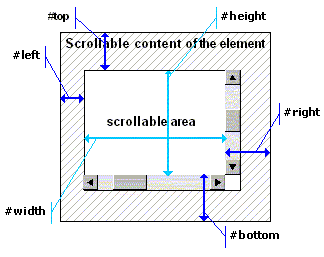

# 元素(Element)对象

代表DOM元素。 拥有子对象(sub-objects): <a href="Attributes.htm">属性(attributes)</a> 和 样式(styles)。

  
元素(Element)类 派生自 节点(Node)类。

  <dl><h2>常量</h2>
    
STATE_LINK

    
STATE_HOVER

    
STATE_ACTIVE

    
STATE_FOCUS

    
STATE_VISITED

    
STATE_CURRENT

    
STATE_CHECKED

    
STATE_DISABLED

    
STATE_READONLY

    
STATE_EXPANDED

    
STATE_COLLAPSED

    
STATE_INCOMPLETE

    
STATE_ANIMATING

    
STATE_FOCUSABLE

    
STATE_ANCHOR

    
STATE_POPUP

    
STATE_OWNS_POPUP

    
STATE_EMPTY

    
STATE_BUSY

    <dd>元素的状态标志位，用于get/setState函数。TBD。</dd>
    <h2>属性</h2>
    <dt>length</dt>
    <dd>只读 - <em>integer</em>, 该元素中的子元素数量。只读属性。</dd>
    <dt>[index]</dt>
    <dd>读写 - <em>Element</em>, 子元素在该元素中的索引<em>index</em>位置，读写属性。索引从0开始。</dd>
    <dt>root</dt>
    <dd>只读 - <em>Element</em>, 该元素所属DOM的根元素。只读属性。</dd>
    <dt>view</dt>
    <dd>只读 - <em>View</em>, 元素的父视图(窗口)。只读属性。注意: 如果元素是从另一个view移过来时，<code>element.view</code>可以与全局的<code>view</code>变量并不相同。</dd>
    <dt>parent</dt>
    <dd>只读 - <em>Element</em>, 该元素的父元素。若该元素是根元素，则值为<em>null</em>。只读属性。</dd>
    <dt>layoutParent</dt>
    <dd>只读 - <em>Element</em>, 该元素的布局父元素。若该元素是根元素，则值为<em>null</em>。只读属性。对于绝对定位(position:absolute)元素，它的layoutParent为该元素用于计算top/left/bottom/right的绝对定位容器(最近的绝对定位父元素)。</dd>
    <dt>owner</dt>
    <dd>只读 - <em>Element</em>, 该元素的拥有元素。若该元素是根元素，则值为<em>null</em>。只读属性。大多数情况下，拥有元素为父元素，但是对于弹出(popup)元素，拥有元素为该弹出功能的拥有者。例如，对于tooltip元素，它的拥有者为引发该tooltip显示的元素。</dd>
    <dt>index</dt>
    <dd>只读 - Integer, 该元素在父容器中的索引。如果该元素未连接到任何父元素，则值为Undefined。</dd>
    <dt>tag</dt>
    <dd>只读 - <em>String</em>, 该元素的标签(tag)名。只读属性。</dd>
    <dt>id</dt>
    <dd>只读 - <em>String</em>, 该元素的<em>id</em>属性值(如果存在)。只读属性。</dd>
    <dt>next</dt>
    <dd>只读 - <em>Element</em>, 该元素的下一个兄弟元素。如果该元素是父容器中的最后一个，则值为<em>null</em>。</dd>
    <dt>prior</dt>
    <dd>只读 - <em>Element</em>, 该元素的上一个兄弟元素。如果该元素是父容器中的第一个，则值为<em>null</em>。</dd>
    <dt>first</dt>
    <dd>只读 - <em>Element</em>, 该元素的第一个子元素。如果没有子元素，则值为<em>null</em>。</dd>
    <dt>last</dt>
    <dd>只读 - <em>Element</em>, 该元素的最后一个子元素。如果没有子元素，则值为<em>null</em>。</dd>
    <dt><u>attributes</u></dt>
    <dd>类 - <a href="Attributes.htm"><em>Attributes</em></a>, 该元素的html属性集合。</dd>
    <dt><u>@</u></dt>
    <dd>类 - 访问<a href="Attributes.htm"><em>Attributes</em></a>属性的简短格式, 该元素的html属性集合。它只是上面的<em>attributes</em>的别名。示例：`this.@[&quot;selected&quot;] = true` // 或者`this.@#selected = true`等价于`this.attributes[&quot;selected&quot;] = true`</dd>
    <dt><u>style</u></dt>
    <dd>类 - <a href="Style.htm">Style</a>, 该DOM元素的CSS样式属性集合。</dd>
    <dt><u>state</u></dt>
    <dd>类 - <a href="States.htm">States</a>, 该DOM元素的运行期状态(标志位)集合。</dd>
    <dt><u>x</u></dt>
    <dd>类 - Extenders, 附加到该元素上的本地行为(behavior)的列表集合:
      <ul>
        <li>element.x.length - 附加到该元素上的本地行为数量；</li>
        <li>element.x[n] - 附加到该元素上的本地行为的第n个行为的名称；</li>
        <li>element.x.<em>函数名(....)</em> - 调用本地行为实现的方法。</li></ul>
      
该接口的主要目的是为单独的名称空间提供调用函数的机制。
</dd>
    <dt>text</dt>
    <dd>读写 - <em>String</em>, 元素的文本。对于符合元素，该属性返回内容的纯文本形式版本。</dd>
    <dt>html</dt>
    <dd>读写 - <em>String</em>, (<em>内HTML</em>) 元素内容的html源码。返回的文本不包含该元素的前后标签。
      
值可以设置字符串和Stream流对象。
</dd>
    <dt>outerHtml</dt>
    <dd>
      
读写 - <em>String</em>, (<em>外HTML</em>) 元素内容的html源码。返回的文本不包含该元素的前后标签。

      
值可以设置字符串和Stream流对象。
</dd>
    <dt>value</dt>
    <dd>读写 - <em>String</em>, 默认情况下，如果元素附加了本地行为，则value值可能为integer, boolean, array等等。例如，&lt;input type=&quot;radio&quot;&gt;若单选框出于&quot;on&quot;状态则返回<em>true</em>。
      
注意: <code>property value(v)</code> 可以在脚本中的behavior类中覆盖。在这种情况下，为了访问本地value值，可以使用<em>Element.state.value</em>属性。
</dd>
    <dt>prototype</dt>
    <dd>读写 - 元素(Element)或行为(Behavior)的实例。Prototype值可以通过CSS(prototype:name_of_global_behavior_variable)或者该属性被设置。</dd>
    <dt>isVisible</dt>
    <dd>只读 - 如果该元素和它的父容器元素处于可见状态(未定义visibility:hidden或display:none)则返回<em>true</em>。</dd>
    <dt>isEnabled</dt>
    <dd>只读 - 如果元素和它的父容器不处在:disabled (setState(Element.STATE_DISABLED))状态时返回<em>true</em>。</dd>
    <dt>ns</dt>
    <dd>读写 - <em>Object</em>, 该元素的名称空间对象。脚本中当前文档定义的所有静态方法和类都属于该名称空间[namespace]的成员。</dd>
    <dt>rows</dt>
    <dd>读写 - <em>integer</em>, 该DOM元素中行(rows)的数量。对于&lt;table&gt;元素返回它里面的行的数量，对于其他元素则返回CSS的<em>flow</em>属性的行的数量。</dd>
    <dt>columns</dt>
    <dd>读写 - <em>integer</em>, 该DOM元素中列(columns)的数量。对于&lt;table&gt;元素返回它里面列的数量，对于其他元素则返回CSS的<em>flow</em>属性的列的数量。</dd>
    <dt>options</dt>
    <dd>读写 - <em>Element</em>, 对于&lt;select&gt;元素返回一个DOM元素，该元素是一个容器元素，使用它可以编程填充选项列表。</dd>
    <dt>contentModel</dt>
    <dd>读写 - <em>标识符</em>, 该元素的当前内容模型，其值为以下值之一：
      <ul><li><strong>#block-inside</strong> - 该元素可以包含块元素(如&lt;div&gt;)。</li>
        <li><strong>#inline-inside</strong> - 该元素包括包含行内元素(如&lt;p&gt;)。</li>
        <li><strong>#transparent</strong> - 内容模型为透明的元素，它的内容模型从它的父元素继承下来(如&lt;a&gt;)。</li>
        <li><strong>#text-only</strong> - 该元素可以包含纯文本(如&lt;title&gt;)。</li>
        <li><strong>#table</strong>, <strong>#table-section</strong>、<strong>#table-row</strong> - &lt;table&gt;、 &lt;tbody&gt;、&lt;tfoot&gt;、&lt;thead&gt;、&lt;tr&gt;元素。</li></ul></dd>
    <dt>selection</dt>
    <dd>只读 - <em>null | Selection</em>, 若该元素支持选择的行为(如htmlarea、richtext)时返回<a href="selection.htm">Selection</a>对象，否则返回<em>null</em></dd>
    <dt>firstCaretPos</dt>
    <dd>只读 - <em>null | bookmark</em><a href="Selection.htm#bookmark">bookmark</a>, 返回元素内第一个插入位置(光标)的书签。</dd>
    <dt>lastCaretPos</dt>
    <dd>只读 - <em>null | bookmark</em><a href="Selection.htm#bookmark">bookmark</a>, 返回元素内最后一个插入位置(光标)的书签。</dd>
    <dt>paintBackground</dt>
    <dd>只写 - <em>null | </em>function(gfx), 设置背景层的绘制函数。该函数能获取到绘制该层的Graphics对象。如果函数返回<em>true</em>时则默认的背景和边框绘制将不会再绘制。背景绘制函数是在本地绘制之<strong>前</strong>调用。</dd>
    <dt>paintContent</dt>
    <dd>只写 - <em>null | </em>function(gfx), 设置内容层的绘制函数。该函数能获取到绘制该层的Graphics对象。如果函数返回<em>true</em>时则默认的内容绘制将不会再绘制。内容绘制函数是在本地绘制之<strong>前</strong>调用。</dd>
    <dt>paintForeground</dt>
    <dd>只写 - <em>null | </em>function(gfx), 设置前景层的绘制函数。该函数能获取到绘制该层的Graphics对象。如果函数返回<em>true</em>时则默认的前景绘制将不会再绘制。前景绘制函数是在本地绘制之<strong>前</strong>调用。</dd>
    <dt>paintOutline</dt>
    <dd>只写 - <em>null | </em>function(gfx), 设置轮廓层的绘制函数。该函数能获取到绘制该层的Graphics对象。如果函数返回<em>true</em>时则默认的前景绘制将不会再绘制。轮廓绘制函数是在本地绘制之<strong>前</strong>调用。</dd>
    <dt>isPointInside</dt>
    <dd>r/w - <em>null | </em>function(x,y), 一个hit测试函数，这个函数根据x,y坐标值判断该坐标点是否在该元素图形区域内，如果在则返回<em>true</em>，这个元素可以是任意形状。</dd>
    <h3>从 Node类 继承的属性 或者 Node 相关的属性</h3>
    <dt>nodeIndex</dt>
    <dd>只读 - Integer, 该节点在父节点容器中的索引位置。</dd>
    <dt>nextNode</dt>
    <dd>只读 - <em>Element 或 Node</em>, 该节点的下一个节点。若该节点是父容器中的最后一个则返回<em>null</em>。</dd>
    <dt>priorNode</dt>
    <dd>只读 - <em>Element 或 Node</em>, 该节点的上一个节点。若该节点是父容器中的第一个则返回<em>null</em>。</dd>
    <dt>firstNode</dt>
    <dd>只读 - <em>Element 或 Node</em>, 该节点的第一个子节点(元素/文本/注释)的引用。</dd>
    <dt>lastNode</dt>
    <dd>只读 - <em>Element 或 Node</em>, 该节点的最后一个子节点(元素/文本/注释)的引用。</dd>
    <dt>isElement</dt>
    <dd>只写 - 如果该节点是元素(Element)时返回<em>true</em>，否则返回<em>false</em>。</dd>
    <dt>isText</dt>
    <dd>只写 - 如果该节点是文本时返回<em>true</em>，否则返回<em>false</em>。</dd>
    <dt>isComment</dt>
    <dd>只写 - 如果该节点是注释时返回<em>true</em>，否则返回<em>false</em>。</dd>
    <h2>枚举/遍历</h2>
    <dt>for ... in</dt>
    <dd>
      
for(var<strong> child</strong> in<strong> element</strong>)<strong> { </strong>/* 循环体 */<strong> }</strong> 或 for(var<strong> (index,child)</strong> in<strong> element</strong>)<strong> { </strong>/* 循环体 */<strong> }</strong>

      
为element元素的每个子元素执行循环体中的代码。

      
示例, 对于html中的<em>p</em>元素的for循环: 
	  <code>&lt;p&gt;Hello &lt;em&gt;wonderfull&lt;/em&gt; world&lt;/p&gt;</code>
	  循环将会执行一次，<em>child</em>变量将是Element(&quot;em&quot;)。
</dd>
    <h2>方法/函数</h2>
    <dt>this</dt>
    <dd>
      
<strong>(tagname[, text])</strong>

      
创建一个新的标签为<em>tagname</em>(字符串/标识符)的元素对象，它的内容为text。使用方法如下：

      <pre v-pre><code>
  var el = new Element(&quot;option&quot;); 
  // 或者
  var el = new Element(#option);
</code></pre>
      
元素创建后处于 未连接 状态。为了连接到DOM中，可以使用父元素的<em>insert</em>方法。
</dd>
    <dt>create</dt>
    <dd>
      
<strong>(tuple)</strong> : <em>Element</em>

      
DOM元素的静态构造函数。这里的<em>tuple</em>是一个用下面的微格式(<a href="#object-template">microformat</a>)定义的字符。

      
示例：下面的代码片段相当于创建一个元素，该元素包含标记：<code>&lt;p&gt;before &lt;button&gt;Hi!&lt;/button&gt; after&lt;/p&gt;</code>:

      <pre v-pre><code>
  var para = Element.create( [p:&quot;paragraph text&quot;] ); 
  //或者文本是变量: 
  var para = Element.create( [p: paragraphText] );
</code></pre></dd>
    <dt>clear</dt>
    <dd>
      
<strong>()</strong> : <em>undefined</em>

      
清除一个元素的内容，移除它的所有子元素。
</dd>
    <dt>toString</dt>
    <dd>
      
<strong>()</strong> : <em>string</em>

      
返回该元素表示的HTML字符串，该字符串是外HTML——包含头和尾标签、内容等同于<em>html</em>的返回值。
</dd>
    <dt>clone</dt>
    <dd>
      
<strong>() </strong>:<em>Element</em>

      
返回元素的一个新拷贝，该方法为深拷贝。 新元素处于 未连接 状态，可以使用insert()方法插入到DOM中。
</dd>
    <dt>select</dt>
    <dd>
      
<strong>(CSSselector</strong>:string<strong> [, argument1 [, argument2, ... ]])</strong> : <em>Element</em>

      
返回满足CSS选择器(<em>CSSselector</em>, string)的第一个元素。CSSSelector可以包含格式化标识(如%d、%s)，这些标识在最终的CSS选择器字符串中可以被<em>argument1</em> ... <em>argumentN</em>替代。该函数的使用规则和Stream.printf方法相同。

      
示例：如果文档包含<code>&lt;input type=&quot;text&quot;/&gt;</code>元素，则下面的语句：

      <pre v-pre><code>var inp = self.select(&quot;input[type='text']&quot;);
</code></pre>
      
将会设置<em><code>inp</code></em>为这个元素的引用。
</dd>
    <dt>$</dt>
    <dd>
      
<strong>( </strong><em>CSSselector</em><strong> )</strong> : <em>Element</em>

      
返回满足CSS选择器的第一个元素。

      
注意：该选择器写的时候不需要用&quot;&quot;括住。

      
示例： 如果文档包含<code>&lt;input type=&quot;text&quot;/&gt;</code>元素，则下面的语句：

      <pre v-pre><code>var inp = self.$( input[type='text'] );</code></pre>
      
将会设置<em><code>inp</code></em>为这个元素的引用。

      
而且下面的代码片段:

      <pre v-pre><code>
  var n = 3;
  var li3 = self.$( ul &gt; li:nth-child({n}) );
      </code></pre>
      
将会找到ul列表元素中第三个列表项。
</dd>
    <dt>select</dt>
    <dd>
      
<strong>(func , CSSselector</strong>: string<strong> [, argument1 [, argument2, ... ]])</strong> returns: <em>integer</em>

      
调用<em>func</em>(函数引用)方法来遍历满足<em>CSSselector</em>选择器的每个元素。<em>func</em>函数接受一个参数，该参数为匹配元素的引用。 <em>func</em>函数可以返回<em>true</em>来停止遍历。

      
示例：下面的代码片段将会打印所有input元素的"name"属性：
	  function printel(el) { stdout.println( el.attributes[&quot;name&quot;] );  }
	  document.select(printel, &quot;input&quot;);
</dd>
    <dt>selectAll</dt>
    <dd>
      
<strong>(CSSselector</strong>: string<strong> [, argument1 [, argument2, ... ]])</strong> returns: <em>Array</em>

      
返回满足CSS选择器(<em>CSSselector</em>, string)的所有元素的数组。CSSSelector可以包含格式化标识(如%d、%s)，这些标识在最终的CSS选择器字符串中可以被<em>argument1</em> ... <em>argumentN</em>替代。该函数的使用规则和Stream.printf方法相同。
</dd>
    <dt>$$</dt>
    <dd>
      
<strong>( </strong><em>CSSselector</em><strong> )</strong> returns: <em>Array</em>

      
返回满足CSS选择器的所有元素的数组。

      
注意：该选择器写的时候不需要用&quot;&quot;括住。
</dd>
    <dt>selectParent</dt>
    <dd>
      
<strong>(CSSselector</strong>: string<strong> [, argument1 [, argument2, ... ]])</strong> returns: <em>Element</em>

      
返回在子/父链上满足CSS选择器的(<em>CSSselector</em>, string)的第一个元素。CSSSelector可以包含格式化标识(如%d、%s)，这些标识在最终的CSS选择器字符串中可以被<em>argument1</em> ... <em>argumentN</em>替代。该函数的使用规则和Stream.printf方法相同。

      
注意：该方法也会检查本元素(<em>this</em>)是否满足CSS条件。
</dd>
    <dt>$p</dt>
    <dd>
      
<strong>( </strong><em>CSSselector</em><strong> )</strong> returns: <em>Element</em>

      
返回在子/父链上满足CSS选择器的的第一个元素。

	  
注意1：该选择器写的时候不需要用&quot;&quot;括住。

      
注意2：该方法也会检查本元素(<em>this</em>)是否满足CSS条件。
</dd>
    <dt>$o</dt>
    <dd>
      
<strong>( </strong><em>CSSselector</em><strong> )</strong> returns: <em>Element</em>

      
返回在子/父链上满足CSS选择器的的第一个拥有者(owner)元素。

      
注意 1: 这是一个字符串器方法 - <em>CSSselector</em>是一个字面值

      
注意 2: 这个方法也会检查<em>this</em>元素
</dd>
      
注意 3: 除了弹出菜单的拥有者是请求弹出的元素外，元素的拥有者大部分时间是它的父元素。
</dd>
    <dt>selectParent</dt>
    <dd>
      
<strong>(func , CSSselector</strong>: string<strong> [, argument1 [, argument2, ... ]])</strong> returns: <em>integer</em>

      
调用<em>func</em>(函数引用)来遍历每个满足<em>CSSselector</em>的元素。<em>func</em>函数接受一个参数，该参数为匹配元素的引用。 <em>func</em>函数可以返回<em>true</em>来停止遍历。

      
示例：下面的代码片段可以打印出所有父div的id属性：

      <pre v-pre><code>
  function printel(el) {  stdout.println( el.attributes[&quot;id&quot;] );  }
  some.selectParent(printel, &quot;div&quot;);
      </code></pre>
      
注意：该方法也会检查本元素(<em>this</em>)是否满足CSS条件。
</dd>
    <dt>$$p</dt>
    <dd>
      
<strong>( </strong><em>CSSselector</em><strong> )</strong> returns: <em>Array of Element</em>s

      
返回在子/父链上满足CSS选择器的的所有元素数组。

      
注意1：该选择器写的时候不需要用&quot;&quot;括住。

      
注意2：该方法也会检查本元素(<em>this</em>)是否满足CSS条件。
</dd>
    <dt>match</dt>
    <dd>
      
<strong>( CSSselector</strong>: string<strong> [, argument1 [, argument2, ... ]])</strong> returns: <em>true | false</em>

      
检查该DOM元素是否满足给定的<em>CSSselector</em>选择器。
</dd>
    <dt>$is</dt>
    <dd>
      
<strong>( </strong><em>CSSselector</em><strong> )</strong> returns: <em>true | false</em>

      
检查该DOM元素是否满足给定的<em>CSSselector</em>选择器。

      
注意：该选择器写的时候不需要用&quot;&quot;括住。
</dd>
    <dt>belongsTo</dt>
    <dd>
      
<strong>(</strong> <strong>parent</strong>: Element [, <strong>useUITree</strong>: true | <em>false</em> [, <strong>includingThis</strong>: true | <em>false</em> ]] <strong>)</strong> : <em>true | false</em>

      
如果在该元素的父链上存在<em>parent</em>元素则返回<em>true</em>。

	  
如果<strong>useUITree</strong>参数提供了且为true，则该函数使用UI关系而不是DOM树上的父/子链关系。例如，弹出元素可以被声明在它的宿主元素之外，但是如果宿主元素创建该弹出元素后使用该函数将返回true。

      
如果<strong>includingThis</strong>参数提供了且为true,则若<em>parent</em>为该元素本身是返回<em>true</em>: el.belongsTo(el,false,true) -&gt; true。<em>includingThis</em>默认为<em>false</em>。
</dd>
    <dt>find</dt>
    <dd>
      
<strong>(x, y)</strong> returns: <em>Element</em>.

      
返回相对于该元素在x、y坐标位置的子元素的引用。如果该位置没有元素，则返回该元素本身。
</dd>
    <dt>update</dt>
    <dd>
      
<strong>([deep])</strong> returns: undefined

      
在修改后重新计算该元素(deep为true时)和刷新它的可视区域。如果由于某些操作会导致该元素尺寸有变化时，请设置<strong>deep=true</strong>。若果仅仅是装饰属性(不会改变尺寸，如color属性)发生变化，请省略deep参数(或设置它为<em>false</em>)。
</dd>
    <dt>update</dt>
    <dd>
      
<strong>(stateUpdateFunction)</strong> returns: undefined

      
该方法用于&quot;过渡更新(transactioned update)&quot;。<em>stateUpdateFunction </em>函数被调用时包含<em>this</em>变量(指向该元素对象)，且预期该函数会改变元素的一些状态、内容、或者它的子元素的状态。

      
&quot;过渡更新(transactioned update)&quot;机制用在元素期待它的&quot;内容&quot;更新有过渡效果，这些效果在CSS中使用transition:blend()、scroll-***()、slide-***()等定义的。

      
<code>Element.update(stateUpdateFunction)</code>执行时做以下步骤:

      <ol>
        <li>制作该元素的初始状态快照；</li>
        <li>调用提供的<code>stateUpdateFunction</code>函数来应用所有的该元素的修改至新状态；</li>
        <li>制作最终状态的该元素快照；</li>
        <li>使用这两张快照开始过渡动画(如果在CSS中为该元素定义的话)。</li></ol>
      
如果没有在CSS为该元素定义过渡效果，则<code>stateUpdateFunction</code>会被调用，且视图会立即将元素更新为最新状态。
</dd>
    <dt>refresh</dt>
    <dd>
      
<strong>( </strong>[<strong>x</strong>,<strong> y</strong>,<strong> width</strong>,<strong> height</strong>]<strong> )</strong> returns: true|false

      
刷新该元素在屏幕上占据的区域。如果<em>x</em>、<em>y</em>、<em>width</em>、<em>height </em>(元素内部的区域坐标)被指定，则只会刷新该部分区域。这个方法用在当你使用Graphics对象渲染了元素表面区域时。
</dd>
    <dt>animate</dt>
    <dd>
      
<strong>( nextStep</strong>: function [, <b>whenEnded</b>: function] [, <strong>duration</strong>: duration | integer]<strong> )</strong> : undefined

      
在元素上开始一段动画。<em>nextStep</em>为动画的步骤函数(修改尺寸、透明度等)。这个函数调用时包含<em>this</em>变量(指向该元素对象)，且它应该返回：

			<ul><li><i>true</i> - 继续动画，以系统定义的FPS;</li>
				<li><i>integer</i>- 毫秒数, 下一步动画执行的延时, 如果为<code>0</code>则将停止动画;</li>
				<li><i>duration</i> - 下一步动画执行的延时, 如果duration为0则将停止动画;</li>
				<li>false - 停止动画;</li></ul>
      
如果<em>whenEnded</em>函数被提供，则它会在动画结束时被调用。

      
<em>duration</em>为动画持续的总时间(毫秒)。如果提供了该参数则<em>nextStep</em>函数的声明应该为：
 
      <pre v-pre><code>function nextStep(progress: float) {} </code></pre> 
      
其中，progress为0.0至1.0的浮点数——动画的进度。nextStep总是以接收到progress == 1.0作为最后一步。

一个整数——下一个步骤等待的毫秒数。如果返回0或非整数则动画终止。

      
否则step回调函数期待为无参数函数:

			<pre v-pre><code>function nextStep() {} </code></pre></dd>
    <dt>box</dt>
    <dd>
      
<strong>( part</strong> [, <strong>edge</strong> [, <strong>relativeTo</strong> ]] <strong>) </strong>returns: integer, 设备像素

      
返回该元素边缘的坐标。参数：

      <ul>
        <li><strong>part</strong> -<strong>#left</strong>, <strong>#top</strong>, <strong>#right</strong>, <strong>#bottom</strong>, <strong>#width</strong>, <strong>#height</strong>中定义的常量标识符之一。定义返回盒(矩形)的哪一部分。#part还可以接受以下常量：</li>
        <ul>
          <li>如果<em>part</em>是<strong>#rect</strong>，则该函数返回4个值——左、上、右、下。使用示例： <code>var (x1,y1,x2,y2) = this.box(#rect, #inner, #view)</code>;</li>
          <li>如果<em>part</em>是<strong>#rectw</strong>，则该函数返回4个值——左、上、宽、高。使用示例：<code>var (x,y,w,h) = this.box(#rectw, #inner, #view)</code>;</li>
          <li>如果<em>part</em>是<strong>#dimension</strong>，则该函数返回两个值——宽、高。使用示例：<code>var (w,h) = this.box(#dimension, #inner)</code>;</li>
          <li>如果<em>part</em>是<strong>#position</strong>，则该函数返回两个值——左、上。使用示例：<code>var (x,y) = this.box(#position, #inner, #view)</code>;</li></ul>
        <li><strong>edge</strong>, <a href="http://www.w3.org/TR/REC-CSS2/box.html">元素的边缘</a>常量标识之一:</li>
        <ul>
          <li><strong>#margin</strong> - 外边距边缘；</li>
          <li><strong>#border</strong> - 边框边缘；</li>
          <li><strong>#padding</strong> - 内边距边缘；</li>
          <li><strong>#inner</strong>, <em>默认值</em> - 内部盒边缘；</li>
          <li><strong>#content</strong> - 内容盒边缘。内容盒这里是指元素的内容轮廓，且它不是元素内部盒。比如，等元素设置了<em>overflow</em>属性时，内容盒可以大于内部盒。 </em></li>
          <li><strong>#client</strong> - 客户区域。指#inner内部盒减去(可选的)滚动条区域。</li>
          <li><strong>#icon</strong> -元素图标覆盖的区域。图标这里指元素设置了foreground-repeat: no-repeat;的前景图片。如果该元素没有这样的图片，则函数返回的<strong>#width</strong>、<strong>#height</strong>为0。</li></ul>
        <li><strong>relativeTo</strong>, 下面的值之一:</li>
        <ul>
          <li><strong>#screen</strong> - 返回相对于屏幕原点的坐标；</li>
          <li><strong>#root</strong> - 返回相对于根元素(视图)原点的坐标；</li>
          <li><strong>#parent</strong> - 返回相对于它的父元素原点的坐标。注意：是相对于父元素滚动位置。</li>
          <li><strong>#content</strong> - 返回相对于它的父元素的内容区的坐标。注意：不依赖于父元素的滚动位置。</li>
          <li><strong>#container</strong> - 返回相对于布局父元素的坐标。布局父元素可以是和DOM父元素不相同的。如position:absolute的元素的布局父元素就可能和DOM父元素不相同。</li>
          <li><strong>#self</strong>, <em>默认值</em> -所有坐标相对于该元素的内部盒原点。</li>
          <li><strong>#view</strong> - 返回相对于Sciter窗口(view对象)原点的坐标。</li>
          <li>或者 如果<em>relativeTo</em>等于以下值之一：</li>
          <ul>
            <li><strong>#margin</strong> - 外边距边缘；</li>
            <li><strong>#border</strong> - 边框边缘；</li>
            <li><strong>#padding</strong> - 内边距边缘；</li>
            <li><strong>#inner</strong> - 内部盒边缘；</li>
            
该函数将返回相应部分累积宽度，例：

            
<code>var (mx1,my1,mx2,my2) = this.box(#rect, #margin, #inner)</code>;这里的每个mx*值将是外边距、边框、内边距在左、上、右、下方向上的总和。或者说，这个调用会返回元素内部(内容)盒的外边距的距离。而且这个调用：<code>var (mx1,my1,mx2,my2) = this.box(#rect, #margin, #border)</code>; 将只会CSS属性中margin-left、margin-top、margin-right、margin-bottom的计算值。
</ul></ul></ul>
      
若想获取更多信息，请看<a name="box-model"><em>CSS box model</em></a>规范: <a href="http://www.w3.org/TR/CSS2/box.html">http://www.w3.org/TR/CSS2/box.html</a>
</dd>
    <dt>intrinsicWidthMin</dt>
    <dd>
      
( ) : integer, 设备像素

      
返回元素的最小内在(min-intrinsic)宽度。 最小内在宽度是显示元素没有横向滚动条时的最小宽度。
</dd>
    <dt>intrinsicWidthMax</dt>
    <dd>
      
( ) : integer, 设备像素

      
返回元素的最大内在(max-intrinsic)宽度。最大内在宽度是指显示元素无需换行的情况下的最小宽度。例如，&lt;p&gt;元素的最大内在宽度是它的文本只有一行时的宽度。
</dd>
    <dt>intrinsicHeight</dt>
    <dd>
      
( <strong>forWidth</strong>: integer ) : integer, 设备像素

      
返回元素在给定<em>forWidth</em>宽度情况下的最小内在(min-intrinsic)高度。最小内在高度是指显示元素没有垂直滚动条时的高度。
</dd>
    <dt>toPixels</dt>
    <dd>
      
<strong>( length : </strong>length | string | symbol[, <strong>#width</strong> | <strong>#height</strong> ]<strong> ) :</strong> integer, 设备像素

      
返回length转换为设备像素后的值。该转换是基于当前元素样式的上下文，所以<code>el.toPixels( em(1.4) )</code>将会当前元素中字体尺寸的1.4em对应的像素值。

      
如果length是一个字符串或标识，则它会被当做一个CSS长度字符，所以length的值可以是<code>el.toPixels(#xx-small)</code>或<code>el.toPixels(#system-scrollbar-width)</code>。

      
第二个symbol参数用在百分比长度的转换时：<code>var h50p = el.toPixels( pr(50.0), #height );</code> - 将会和下面的CSS声明计算出相同的值: <code>height:50%</code>.
</dd>
    <dt id="method-scroll">scroll</dt>
    <dd><strong>(part) </strong>returns: integer, 设备像素
      
返回元素的各种滚动相关的位置。参数：

      
<strong>part</strong> - 以下常量标识之一：

      <ul>
        <li><strong>#left</strong> - 视图相对于内容原点视图左边位置；</li>
        <li><strong>#top</strong> - 视图相对于内容原点视图上边位置；</li>
        <li><strong>#right</strong> - 视图右边缘相对于内容盒右边缘的偏移；</li>
        <li><strong>#bottom </strong>- 视图下边缘相对于内容盒下边缘的偏移；</li>
        <li><strong>#width </strong>- 滚动区域的宽度；</li>
        <li><strong>#height</strong> - 滚动区域的高度；</li></ul>
        <li><strong>#rect</strong> - 返回left,top,right,bottom四个整数值。</li></ul></dd>
    <dt>scrollTo</dt>
    <dd>
      
( <strong>x</strong>:int, <strong>y</strong>:int [, <strong>smooth</strong>:bool [, <strong>unrestricted</strong> : bool] ] &nbsp;) : void

      
设置元素到x、y的滚动位置。该元素应该有overflow: hidden-scroll、scroll或者auto(即可以滚动它的内容区)。如果<strong>unrestricted</strong>被设置为true，则滚动位置将被允许操作内容边界。
</dd>
    <dt>scrollToView</dt>
    <dd>
      
( [<strong>toTop</strong>:bool, <strong>smooth</strong>: bool = true ] )

      
滚动元素到视图——确保元素是可见的。如果<em>toTop</em>为<em>true</em>，则强制元素滚动到它的滚动容器的顶部。该方法做深滚动——它将试图使元素在它的所有滚动容器中可见。如果<em>smooth</em>为false,则将不会使用动画滚动。

      
注意: 该方法只在建立了盒模型(display: block | inline-block | table-cell 等)的元素上。比如，表格中的<code>&lt;tr&gt;</code>不是一个盒元素。所以要滚到表格中的特定行时，你需要选择该行的第一个单元格元素来调用该方法。
</dd>
    <dt>mapLocalToView</dt>
    <dd>(<strong>xLocal</strong>:int, <strong>yLocal</strong>:int ) : (int,int)
      
映射元素的xLocal/yLocal点到xView/yView (window)坐标，它会随着CSS的变化而改变。
</dd>
    <dt>mapViewToLocal</dt>
    <dd>(<strong>xView</strong>:int, <strong>yView</strong>:int ) : (int,int)
      
映射视图的xView/yViewl点到xLocal/yLocal (element)坐标，它会随着CSS的变化而改变。
</dd>
    <dt>insert</dt>
    <dd>
      
<strong>( element</strong> | <strong>html</strong> | <strong>tuple</strong>| <strong>array</strong> [,<strong>index</strong> = Integer.MAX]<strong>)</strong> returns: true | false.

      
<em>element</em>为将被插入到该元素中<em>index</em>位置的子DOM元素。如果index大于该元素当前的子元素数量，则新元素将会被添加到最后。<em>Index</em>为可选参数，如果省略则元素会被添加到最后。如果<em>element</em>已经是其他元素的子元素，则它将会立即取消与之前元素的连接。

      
如果第一个参数是字符串(<em>html</em>文本)，则将试图将它插入到给定位置。

      
如果第一个参数是一个tuple，则它会被当做创建新DOM元素的模板。参考该tuple的<a href="#object-template">微格式</a>定义

      
如果第一个参数是一个数组，则它将包含DOM节点的引用(元素 和/或 文本 节点)。
</dd>
    <dt>append</dt>
    <dd>
      
<strong>( element</strong> | <strong>html</strong> | <strong>tuple</strong> | <strong>array )</strong> returns: true | false.

      
等价于<code>insert ( ... , Integer.MAX )</code>;
</dd>
    <dt>prepend</dt>
    <dd>
      
<strong>( element</strong> | <strong>html</strong> | <strong>tuple</strong>| <strong>array )</strong> returns: true | false.

      
等价于<code>insert ( ... , 0 )</code>;
</dd>
    <dt>content</dt>
    <dd>
      
<strong>( element</strong> | <strong>array</strong> [, <strong>element</strong>2 [, <strong>element</strong>3, ... ]]<strong> )</strong> returns: true | false.

      
替换元素的内容。该函数是el.clear(); el.append(element1); el.append(element2); ...的短格式。

      
<em>该方法可以用在设置&lt;tr&gt;中的单元格。它会妥善处理col/rowspans。</em>

      
对于其他所有元素，<em>elementN</em>可以是DOM元素、字符串、tuple(使用<a href="#object-template">微格式</a>定义的元素模板)或者元素/节点数组。
</dd>
    <dt>$content</dt>
    <dd>
      
<strong>(</strong> .. inline html .. <strong>)</strong> : Element

      
Stringizer方法，用inline html替代元素的内容。参数是Stringizer方法，即HTML可以这样提供：

      <pre v-pre><code>var el = ... , num = ...;
el.$content(This is item number <b>{ num }</b>);
</code></pre>
      
该方法返回该元素本身。
</dd>
    <dt>$append</dt>
    <dd>
      
<strong>(</strong> .. html .. <strong>)</strong> : Element

      
Stringizer方法，将html添加到元素的所有子元素最后。

      
该方法返回第一个添加的元素。
</dd>
    <dt>$prepend</dt>
    <dd>
      
<strong>( </strong>.. html .. <strong>)</strong> : Element

      
Stringizer方法，插入html到元素的所有子元素第一个。

      
该方法返回第一个添加的元素。
</dd>
    <dt>$after</dt>
    <dd>
      
<strong>(</strong> .. html .. <strong>)</strong> : Element

      
Stringizer方法，添加html到该元素的后面。

      
该方法返回第一个添加的元素。
</dd>
    <dt>$before</dt>
    <dd>
      
( .. html .. ) : Element

      
Stringizer方法，添加html到该元素的前面。

      
该方法返回最后一个添加的元素(即该元素的新<em>this.prior</em>)。
</dd>
    <dt>$replace</dt>
    <dd>
      
( .. html .. ) : Element

      
Stringizer方法，将该元素从DOM中移除并且将html替换到当前位置。

      
该方法返回第一个添加的元素。
</dd>
		<dt>nodes</dt>
		<dd>
( ) : Array

    
该方法创建一个数组并将子元素列表添加到该数组中。其中，文本和注释节点是<a href="Node.htm#node">Node</a>对象，DOM元素是Element对象实例。
</dd>
    <dt>detach</dt>
    <dd>
      
<strong>( ) </strong>: Element

      
从它的父元素的子元素容器中移除该元素，所以当该方法调用后，该元素的<em>parent</em>将会变成<em>null</em>。如果update为true,则会为它的父元素调用update()。返回该元素。该方法不会销毁它的状态和附加到该元素上的行为，直到GC不在收集该元素(即没有指向它的引用)。
</dd>
    <dt>remove</dt>
    <dd>
      
<strong>( ) </strong>: Element

      
从它的父元素的子元素容器中移除该元素，所以当该方法调用后，该元素的<em>parent</em>将会变成<em>null</em>。如果update为true,则会为它的父元素调用update()。返回该元素。所有运行时状态和行为将会被该方法销毁。本地行为会接收到BEHAVIOR_DETACHED事件。
</dd>
    <dt>load</dt>
    <dd>
      
<strong>( url</strong>: string[, <strong>headers</strong>: object] <strong>) </strong>returns: <em>true/false</em>

      
加载<em>url</em>指定的文档的内容作为该元素的内容。对于设置了<em>behavior:frame</em>的元素会加载url指向的html、样式和执行脚本或包含流。指定behavior:frame的元素在加载完成后会发送DOCUMENT_COMPLETE事件。而对于其他元素则只会加载文档的Body部分，且不会加载样式和脚本。如果<em>url</em>指向一个外部资源(如&quot;http://...&quot;)，则该方法是异步的，否则该方法将会使用同步方式加载。

      
如果<em>headers</em>对象(键/值 映射表)被指定，且url是http/https，则HTTP GET请求将会将headers作为请求头。
</dd>
    <dt>load</dt>
    <dd>
      
<strong>( stream</strong>: Stream<strong> ) </strong>returns: <em>true/false</em>

      
从内存流中加载文档的内容作为该元素的内容。对于设置了<em>behavior:frame</em>的元素会加载stream流指向的html、样式和执行脚本。指定behavior:frame的元素在加载完成后会发送DOCUMENT_COMPLETE事件。而对于其他元素则只会加载文档的Body部分，且不会加载样式和脚本。
</dd>
    <dt>load</dt>
    <dd>
      
<strong>( html</strong>: string, <strong>url</strong>:string<strong> ) </strong>returns: <em>true/false</em>

      
从<em>html</em>字符串中加载文档的内容作为该元素的内容。对于设置了<em>behavior:frame</em>的元素会加载html参数中的html、样式和执行脚本。指定behavior:frame的元素在加载完成后会发送DOCUMENT_COMPLETE事件。而对于其他元素则只会加载文档的Body部分，且不会加载样式和脚本。
</dd>
    <dt>parseHtml</dt>
    <dd>( <b>html</b>: string | Stream ) : Element | Array (nodes)
    
该函数解析指定的HTML(或SVG)字符串或stream流，并且返回:

    <ul>
      <li>如果输入内容以<code>&quot;&lt;html&gt;...&quot;</code>或<code>&quot;&lt;svg&gt;...&quot;</code>开始，则返回根节点；</li>
      <li>如果输入内容是类似<code>&quot;&lt;i&gt;Some&lt;/i&gt;&lt;b&gt;text&lt;/b&gt;这样的HTML片段，则返回解析后的html元素或节点列表</code></li>
    </ul>
    
如果<i>html</i>字符串以<code>file://</code>开头，则它将被认为是一个文件url去解析。

    
注意：该函数解析后的DOM元素/节点并不会被链接到宿主文档中。

    </dd>
    <dt>loadImage</dt>
    <dd>
      
<strong>( url</strong>: string [, <strong>callback</strong>: function [, useCache: true|<em>false</em> ] ]<strong>) </strong>returns: <em>Image | null</em>

      
从url中加载图像。如果<em>callback</em>被省略，则引擎将会试图同步加载图像。否则(<em>callback</em>是一个函数)引擎会异步处理请求且在图像加载后调用callback函数。

      
callback函数的声明是function callback(image)，<em>image</em>参数是一个Image类或null(当出错时)。

      
如果<em>useCache</em>不为false，则该方法将尝试从图像缓存中获取图像，并且下载成功的图像也会放到缓存中。useCache默认值为<em>false</em>。

      
callback函数的声明是function callback(image, status)，<em>image</em>参数是一个Image类或null(当出错时), <em>status</em> 为http状态(200、404等)。
</dd>
    <dt>bindImage</dt>
    <dd>
      
<strong>( url</strong>: string , <strong>img</strong>: Image <strong>) </strong>returns: <em>true</em> | <em>false</em>

      
将<em>img</em>对象绑定到url。作为结果，该img可以被用在CSS中(如作为背景)。URL可以是任意的字符串，如&quot;in-memory:dyn-image1&quot;。
</dd>
    <dt>bindImage</dt>
    <dd>
      
<strong>( url</strong>: string <strong>) </strong>returns: <em>Image | null</em>

      
返回先前绑定到该URL上的图像，如果没有图像则返回null。
</dd>
    <dt>request</dt>
    <dd>
      
<strong>(</strong> <strong>callback</strong>: function | integer, <strong><em>#get</em> | <em>#post</em> | <em>#post-data</em> | <em>#put-data</em> |<em> #post-json</em></strong> <strong>|<em> #put-json | #delete</em></strong>, <strong>url</strong>: string [, <strong>params</strong>: object [, <strong>headers</strong>: object] ] <strong>) </strong>: Object | Stream | Bytes | Error

      
发送同步或异步HTTP数据GET/POST请求道服务端/页面(url)，使用JSON-RPC调用。

      <ul>
        <li><em>#get</em>、<em>#post、#post-data、#json</em>为标识符——发送的http请求类型：</li>
        <ul>
          <li><em><strong>#get</strong></em> - 发送纯HTTP GET请求, URL编码的参数(如果存在)被附加到表单的请求的<em>url</em>中；</li>
          <li><em><strong>#post</strong></em> - 发送HTTP POST请求，参数作被序列化为<code>Content-Type: application/x-www-form-urlencoded;charset=utf-8</code>；</li>
          <li><strong><em>#post-data</em></strong> - 发送HTTP POST请求，参数作被序列化为<code>Content-Type: multipart/form-data; boundary= ...</code>；</li>
          <li><strong><em>#put-data</em></strong> - 发送HTTP PUT请求，参数作被序列化为<code>Content-Type: multipart/form-data; boundary= ...</code>;</li>
          <li><strong><em>#post-json</em></strong> - 发送HTTP POST请求，参数作被序列化为JSON:<code>Content-Type: application/json;charset=utf-8</code>;</li>
          <li><strong><em>#put-json</em></strong> - 发送HTTP PUT请求，参数作被序列化为JSON:<code>Content-Type: application/json;charset=utf-8</code>;</li>
          <li><strong><em>#delete</em></strong> - 发送HTTP DELETE请求。</li></ul>
        <li><em>url</em> 是一个字符串 - 处理HTTP请求的服务端页面(位置)的URL。</li>
        <li><em>params</em>是一个对象, 它的属性是HTTP请求的服务参数。</li>
        <li><em>headers</em>是一个对象 - 一个被单独附加到请求中的键/值对请求头。</li>
        <li>returns: 对于异步请求返回<em>true|false</em>；对于同步请求返回(status:integer,data:any)——请求的结果，<em>data</em>值见下面，status为HTTP状态代码(如200 - 请求成功, 404 - 资源在服务端未找到)。</li></ul>
      
如果参数<em>callback</em>是一个整数，则该参数被当做超时值(毫秒数)，且该函数执行<em>同步</em>请求。如果callback是一个函数，则服务端的响应将会调用<em>callback</em>函数来处理。<em>callback</em>函数的声明如下：

      <pre v-pre><code>function dataArrivedCallback( data: any, status: integer );
</code></pre>
      
<em>data</em>值为以下之一:

      <ul>
        <li><em>Error</em>对象的实例, 在数据响应解析错误时；</li>
        <li><em>stream</em>对象, 如果data为服务端返回文本类型(text/plain、text/html、text/xml等)。</li>
        <li>对象、数组实例。如果响应有text/javascript、text/ecmascript、text/tiscript、 application/json类型的内容，且这些内容成功解析到data对象。</li>
        <li><em>Bytes</em>对象, 如果服务端返回的类型是二进制类型(image / *等)。在这种情况下，Bytes.type会包含一个字符串——服务端报告的该数据的mime-type。</li></ul>
      
status为一个整数—— HTTP状态码(如200 - 请求成功, 404 - 资源在服务端未找到)，如果该代码大于12000，则它是WinInet的错误代码。见<a href="http://support.microsoft.com/kb/193625">http://support.microsoft.com/kb/193625</a>。

      
服务端响应的data示例(type: text/javascript):

      
<code>({ id : 1234, message : &quot;Hello from XYS server!&quot; }</code><code>)</code>

      
- 在这种情况下，服务端返回的对象有两个属性：id和message。in this case server returns object having two properties: id and message. ({ 和 })的解释请看<a href="http://www.terrainformatica.com/index.php/?p=14">这里</a>。
</dd>
    <dt>getState</dt>
    <dd>
      
<strong>( </strong>[<strong>stateFlags</strong>:int]<strong> ) </strong>:int

      
返回元素的状态。<em>stateFlags</em>参数是一个位集合——STATE_***常量的&quot;或&quot;操作集。 如果<em>stateFlags</em>被提供，则函数返回<em>整数</em>标识集——元素的状态标识和<em>stateFlags</em>的&quot;与&quot;操作。如果<em>stateFlags</em>未指定，则函数返回该元素当前在全状态标识集合。
</dd>
    <dt>setState</dt>
    <dd>
      
<strong>( stateFlags</strong>:int<strong>) </strong>:void

      
设置该元素的状态标识并且更新文档在屏幕上的相应位置(处理样式和刷新)。
</dd>
    <dt>clearState</dt>
    <dd>
      
<strong>( stateFlags</strong>:int<strong> ) </strong>:void

      
清除元素的状态标识，且更新文档在屏幕上的相应位置。
</dd>
    <dt>capture</dt>
    <dd>
      
<strong>( onOff</strong>: true | false | #strict<strong> ) </strong>:void

      <ul>
        <li>element.capture(<em>true</em>) - 设置&quot;宽松&quot;的鼠标捕获到该元素，鼠标消息被传递到该元素和它的子元素；</li>
        <li>element.capture(<em>#strict</em>) - 设置&quot;严格&quot;的鼠标捕获到该元素，鼠标消息仅被传递到该元素；</li> 
        <li>element.capture(<em>false</em>) - 从该元素移除鼠标捕获。</li></ul>
	  </dd>
    <dt>popup</dt>
    <dd>
      
<strong>( el</strong>: Element[, <strong>placement</strong>: int]<strong> )</strong> :void

      
将el元素作为弹出窗口显示，位置相对于该元素。<em>Placement</em> 是下面两组数字的混合:

      
相对于<em>this</em>元素的点( 又名 弹出锚点 )

      <ul>
        <li><code>1</code> - 弹出元素在该元素(锚点)的左下角;</li>
        <li><code>2</code> - 弹出元素在该元素(锚点)的下面居中的位置;</li>
        <li><code>3</code> - 弹出元素在该元素(锚点)的右下角;</li>
        <li><code>4</code> - 弹出元素在该元素(锚点)的中间居左的位置;</li>
        <li><code>5</code> - 弹出元素在该元素(锚点)的中间居中的位置;</li>
        <li><code>6</code> - 弹出元素在该元素(锚点)的中间居右的位置;</li>
        <li><code>7</code> - 弹出元素在该元素(锚点)的左上角;</li>
        <li><code>8</code> - 弹出元素在该元素(锚点)的上面居中的位置;</li>
        <li><code>9</code> - 弹出元素在该元素(锚点)的右上角;</li></ul>
      
<em>popup</em>弹出元素放置在锚点上的点:

      <ul>
        <li><code>1 &lt;&lt; 16 </code>- popup元素的bottom-left在锚点上;</li>
        <li><code>2 &lt;&lt; 16</code> - popup元素的bottom-center在锚点上;</li>
        <li><code>3 &lt;&lt; 16</code> - popup元素的bottom-right在锚点上;</li>
        <li><code>4 &lt;&lt; 16</code> - popup元素的center-left在锚点上;</li>
        <li><code>5 &lt;&lt; 16</code> - popup元素的middle-center在锚点上;</li>
        <li><code>6 &lt;&lt; 16</code> - popup元素的middle-right在锚点上;</li>
        <li><code>7 &lt;&lt; 16</code> - popup元素的top-left在锚点上;</li>
        <li><code>8 &lt;&lt; 16</code> - popup元素的top-center在锚点上;</li>
        <li><code>9 &lt;&lt; 16</code> - popup元素的top-right在锚点上;</li></ul>
      
( 见小键盘上的数字 )。

			
另外你也可以使用&quot;popup auto flip&quot;定位模式:

			<ul>
        <li>0x19 - 弹窗默认出现在锚点的左边，如果屏幕的空间不够则弹窗将在锚点的右边(0x17)。垂直方向上，弹窗的顶部对应锚点的顶部。</li>
				<li>0x17- 弹窗默认出现在锚点的右边，否则出现在左边。 垂直方向上，弹窗的顶部对应锚点的顶部。</li>
				<li>0x16- 弹窗默认出现在锚点的左边，如果屏幕的空间不够则弹窗将在锚点的右边(0x14)。垂直方向上，弹窗的中部对应锚点的中部。</li>
				<li>0x14- 弹窗默认出现在锚点的右边，否则出现在左边。垂直方向上，弹窗的中部对应锚点的中部。</li>
      </ul>
      
<em>placement</em>参数是可省略的。弹窗的位置也可以通过在CSS中定义<i>popup-position</i>属性来实现。
</dd>
    <dt>popup</dt>
    <dd>
      
<strong>( el</strong>: Element, [ <b>placement</b>: 1..9,] <strong>x</strong>:int, <strong>y</strong>:int ) :void

      
将el元素作为弹出窗口在x、y(相对于视图的坐标)坐标位置显示。<em>Placement</em>定义<i>el</i>相对x,y的弹出点，默认是7 (左/上角)。

      
( 见小键盘上的数字 )。
</dd>
    <dt>closePopup</dt>
    <dd>
      
<strong>()</strong> :void

      
如果el或者它的父元素是弹出窗口，则关闭弹出窗口。
</dd>
    <dt>timer</dt>
    <dd>
      
<strong>(</strong> <strong>milliseconds</strong>: integer, <strong>callback</strong>: function [, <strong>avoidSameOriginCheck</strong> : bool ] <strong>)</strong>

      
如果<em>milliseconds</em>大于0，则该方法会为DOM元素创建一个有<em>milliseconds</em>延时的计时器。

      
在<em>milliseconds</em>毫秒延迟后，引擎会调用<em>callback</em>函数并且有一个执行该dom元素的<em>this</em>变量。如果你需要计时器继续执行，则<em>callback</em>函数返回<em>true</em>，否则返回<em>false</em>。

      
调用timer()方法，且<em>milliseconds = 0</em>时，则会停止计时器。

	  
如果元素正在运行的计时器已经包含相同的callback函数(同源)，则该计时器将会在增加新的计时器之前移除旧的计时器。设置<em>avoidSameOriginCheck</em>参数未<em>true</em>则会抑制同源匹配。
</dd>
    <dt>swap</dt>
    <dd>
      
<strong>(other</strong>: Element <strong>)</strong> : null

      
呼唤两个元素的DOM位置——该方法的拥有者和<em>other</em>元素。返回调用该方法的元素。
</dd>
    <dt>sendEvent</dt>
    <dd>
      
<strong>( eventCode</strong>:int<em> </em>[<em>, </em><strong>reason</strong><em>:</em> int<em> </em>[, <strong>owner</strong>: Element | null [, <strong>data</strong>:value ]]]<strong> )</strong> : true | false | value

      
在该元素的父/子链上冒泡传递(发送)事件。事件被该方法生成，且被链上的元素的<em>onControlEvent</em>方法处理。

      <ul>
        <li><em>eventCode</em> 是<em>内建行为的逻辑事件代码</em>(见<a href="Event.htm">Event</a>)。或者任意的大于0x1000的整数(自定义控件事件范围)。</li>
        <li><em>reason</em> 这里是任意一个整数值(该值对于发送者和接受者是知道的)。</li>
        <li><em>owner</em> 是一个可选的指向某项DOM元素。例如，在MENU_ITEM_CLICK事件中，它指向一个元素——弹出菜单的拥有者或null。</li>
        <li><em>data</em>是任何一个JSON值——将会同BEHAVIOR_EVENT_PARAMS.data字段传递(见sdk/api/sciter-x-behavior.h文件)。</li></ul>
      
<em>sendEvent</em>函数会遍历父子链，如果消息被消耗则返回true——即在父子链上的某个元素的<em>onControlEvent</em>()处理了该事件且返回true。如果父子链上某些元素处理了该事件且设置了<em>data</em>字段，则sendEvent()方法的data参数值会被更新。
</dd>
    <dt>sendEvent</dt>
    <dd>
      
<strong>( event</strong>:string<em> </em>[, <strong>data</strong>:value ]<strong> )</strong> : true | false | value

      
在该元素的父/子链上冒泡传递(发送)事件。事件被该方法生成，且被链上的元素的<em>onControlEvent</em>方法处理。

      <ul>
        <li><em>event</em>是一个事件名称(可能包含名称空间)，见下面的Element.subscribe/unsubscribe()方法。</li>
        <li><em>data</em>是任何一个JSON值——将会同BEHAVIOR_EVENT_PARAMS.data字段传递(见sdk/api/sciter-x-behavior.h文件)。</li></ul>
      
<em>sendEvent</em>函数会遍历父子链，如果消息被消耗则返回true——即在父子链上的某个元素的<em>onControlEvent</em>()处理了该事件且返回true。如果父子链上某些元素处理了该事件且设置了<em>data</em>字段，则sendEvent()方法的data参数值会被更新。
</dd>
    <dt>postEvent</dt>
    <dd>
      
<strong>( event</strong>:string<em> </em>[, <strong>data</strong>:value ]<strong> )</strong> : true

      
<em>postEvent</em>方法将事件放到内部的发送队列中以便延迟调用<em>sendEvent</em>(name,data)发送消息。该方法是立即返回的。
</dd>
    <dt>postEvent</dt>
    <dd>
      
<strong>( eventCode</strong>:int<em> </em>[<em>, </em><strong>reason</strong><em>:</em> int<em> </em>[, <strong>owner</strong>: Element | null [, <strong>data</strong>:value ]]]<strong> )</strong> : undefined

      
<em>postEvent</em>方法将事件放到内部的发送队列中以便延迟调用<em>sendEvent</em>发送消息。该方法是立即返回的。
</dd>
    <dt>sendKeyEvent</dt>
    <dd>
      
<strong>( eventDef</strong>: object<strong> )</strong> : true | false | undefined

      
<em>sendKeyEvent</em>方法模拟按键事件。eventDef可能有以下字段：

      <pre v-pre><code>
{
  type: Event.KEY_DOWN 或 Event.KEY_UP 或 Event.KEY_CHAR; // 按键事件的类型
  keyCode: int;            // 按键 或 字符代码 如'O'
  altKey: true 或 false;   // 可选, 'ALT' 键按下标志
  shiftKey: true 或 false; // 可选, 'SHIFT' 键按下标志
  ctrlKey: true 或 false;  // 可选, 'CTRL' 键按下标志
  shortcutKey: true 或 false; // 可选, 'CTRL/win' 或 'COMMAND/mac' 键按下标志
  commandKey: true 或 false; // 可选, 'WIN/win' 或 'COMMAND/mac' 键按下标志
}
</code></pre>
      
在捕获/冒泡过程中,该元素或作为target参数。若事件被处理了，则返回true。
</dd>
    <dt>sendMouseEvent</dt>
    <dd>
      
<strong>( eventDef</strong>: object<strong> )</strong> : true | false | undefined

      
<em>sendMouseEvent</em>模拟鼠标事件。eventDef可能有以下字段：

      <pre v-pre><code>{
  type: Event.MOUSE_ENTER或MOUSE_LEAVE或MOUSE_MOVE或MOUSE_UP或MOUSE_DOWN或MOUSE_DCLICK或MOUSE_WHEEL或MOUSE_TICK或MOUSE_IDLE, // 鼠标事件类型
  altKey: true 或 false;   // 可选, 'ALT' 键按下标志
  shiftKey: true 或 false; // 可选, 'SHIFT' 键按下标志
  ctrlKey: true 或 false;  // 可选, 'CTRL' 键按下标志
  shortcutKey: true 或 false; // 可选, 'CTRL/win' 或 'COMMAND/mac' 键按下标志
  commandKey: true 或 false; // 可选, 'WIN/win' 或 'COMMAND/mac' 键按下标志
  mainButton: true 或 false, // 可选, 鼠标左键按下标志
  propButton: true 或 false, // 可选, 鼠标右键按下标志
  x: int, // 鼠标x坐标，相对于视图
  y: int, // 鼠标y坐标，相对于视图
}
</code></pre>
      
在捕获/冒泡过程中,该元素或作为target参数。若事件被处理了，则返回true。
</dd>
    <dt>post</dt>
    <dd>
      
<strong>( callback</strong>: function [,<strong>only_if_not_there</strong>:boolean]<strong> ) </strong>: undefined

      
该方法运行延迟执行<em>callback</em>函数。当调用callback函数时，<em>this</em>环境变量指向post的调用者。

      
<strong>only_if_not_there</strong>可选参数如果被指定，且为<em>true</em>时，运行只延迟发送事件一次。多次post相同的callback函数时，它将会post队列中相同的入口。
</dd>
    <dt>url</dt>
    <dd>
      
<strong>( </strong>[ <strong>relativeUrl</strong>: string ]<strong> )</strong> : string

      
该方法使用文档的url作为基url，和 <em>relativeUrl</em>组合成绝对url。如果没有<em>relativeUrl</em>，则只返回当前DOM元素所属的文档的url。
</dd>
    <dt>sort</dt>
    <dd>
      
<strong>( comparator</strong>: function<strong> </strong>[, <strong>fromIndex</strong>: integer [, <strong>numOfElements</strong>:integer]]<strong> В )</strong> : void

      
使用<em>comparator</em>函数来排序元素的子元素。<em>comparator</em>函数的声明必须是：

      <pre v-pre><code>function cmp(el1: Element, el2: Element) : int
</code></pre>
      
如果返回负数则认为el1小于el2，如果返回0则认为他们相等，如果返回正数则认为el1大于el2。

      
<em>fromIndex</em>和<em>numOfElements</em>用于定义排序元素的范围。
</dd>
    <dt>move</dt>
    <dd>
      
<strong>( </strong>[<strong>x</strong>: int, <strong>y</strong>: int [, <strong>w</strong>: int, <strong>h</strong>: int]  [, <strong>relto</strong>] [, <strong>mode</strong> ][, <strong>referencePoint</strong>: int] &nbsp;<strong>)</strong> : void

      
该方法将该元素变成一个&quot;调皮鬼&quot;——它将独立于其他DOM元素进行移动：

      
声明该元素<em>position:popup</em>且移动它到position(<em>x</em>,<em>y</em>)。如果元素移动到了视图外面则引擎会为它创建一个弹出窗口。第三个参数描述了x和y的角色。如果提供了<em>w</em>、<em>h</em>参数则将会改变元素的尺寸。
	    <em>mode</em>参数：

      <ul>
        <li><em>#auto</em> - 如果元素移动到视图外面将会创建窗口。如果元素在视图内则它会被渲染为popup:fixed。</li>
        <li><em>#attached-window</em> - 强制引擎为该元素创建一个弹出窗口。该窗口和它的宿主窗口(视图)是同步移动的。</li>
        <li><em>#detached-window</em> - 强制引擎为该元素创建弹出窗口，该元素的窗口位置独立于它的宿主窗口。</li>
        <li><em>#detached-topmost-window</em> - 与<em>#detached-window</em>相同，不过是创建在最顶窗口层上。</li></ul>
      
<em>relto</em> 指示x,y坐标的类型，可以是: <strong>#view</strong>, <strong>#root</strong>, <strong>#screen</strong>或<strong>#self</strong>。默认为<strong>#view</strong>.

      
<em>referencePoint</em>是一个1到9之间的数字 - 定义x,y坐标代表的位置。7代表左上角，5代表元素的中间, 请参考键盘上的数字键盘。注意:如果定义了<em>referencePoint</em>，则x/y定义的是相对于元素<em>边框盒</em>的位置，否则x/y是相对于内容盒的位置。

      
参考示例：sdk/samples/ideas/moveable-windows/ and sdk/samples/ideas/rect-tracker/ 。

      
调用<code>move()</code>函数没有参数时将还原元素的默认位置。

      
见: <code>Element.style.dimension()</code> 方法。
</dd>
    <dt>textWidth</dt>
    <dd>
      
<strong>( text</strong>: string<strong> )</strong> : int

      
以该元素的当前字体计算text文本的宽度。如果文本使用&quot;\n&quot;分隔多行则该方法将返回最宽的字符串的宽度。
</dd>
    <dt>textHeight</dt>
    <dd>
      
<strong>( text</strong>: string<strong> )</strong> : int

      
以该元素的当前字体和行高计算text文本的高度。如果文本使用&quot;\n&quot;分隔多行则该方法将返回所有行字符串高度之和。
</dd>
    <dt>subscribe</dt>
    <dd>
      
<strong>(</strong> <strong>handler</strong>: function, <strong>eventGroup</strong> : int [, <strong>eventType</strong>: int] <strong>)</strong> : &lt;this element&gt;

      
将<em>handler</em>函数绑定到该元素DOM对象特定的事件上。

      
<em>handler</em>函数的声明应该为: function(<em>evt</em>) {...}, 其中evt为描述当前事件详细信息的事件(Event)对象。

      
<em>eventGroup</em>参数这里是以下常量之一：

      <ul>
        <li><code>Event.MOUSE</code> - 鼠标事件组( 如Event.MOUSE_DOWN、Event.MOUSE_UP等 );</li>
        <li><code>Event.KEY</code> - 键盘事件组( 如Event.KEY_DOWN、Event.KEY_UP等 );</li>
        <li><code>Event.BEHAVIOR_EVENT</code> - 人工合成事件组 ( 如控件事件Event.BUTTON_CLICK、 Event.HYPERLINK_CLICK、Event.BUTTON_STATE_CHANGED等 );</li>
        <li><code>Event.FOCUS</code> - 焦点事件组;</li>
        <li><code>Event.SCROLL</code> - 滚动事件组;</li>
        <li><code>Event.SIZE</code> - 尺寸改变事件;</li></ul>
      
<em>eventType</em>参数这里是为特定事件组定义的以下常量之一。 <em>eventType</em> 参数是可选的——如果它没有被提供则handler会接收到<em>eventGroup</em>的所有事件。

      
subscribe()方法依序附加多个和独立的事件处理函数到一个元素上。

      
注意：subscribe()不是下面定义的事件处理器的<strong>onMouse</strong>(evt)、<strong>onKey</strong>(evt)等方法的替代。这是两种不同的事件处理方式。<strong>onXXXX</strong>()方法用于为元素类的事件处理器类(Behaviors)中定义事件处理。而subscribe()/unsubscribe()方法用于将事件处理器附加到特定的元素上。

      
该方法返回调用它的元素，则运行链式调用subscribe()。
</dd>
    <dt id="subscribe-by-name">subscribe</dt>
    <dd>
      
( <strong>event</strong>: string [, <strong>selector</strong>: string] , <strong>handler</strong>: function ) : &lt;this element&gt;

      
将<em>handler</em>函数绑定到该元素或它的子元素DOM对象特定的事件上。<em>event</em>参数这里是一个字符串，它可以接受<a href="Event.htm#symbolic-event-names">符号事件名称</a>。

      
事件名可以含有名称空间。例如：<code>&quot;click.mywidget&quot;</code>为一些<em>mywidget</em>组件定义了单击事件。名称空间在你需要一次unsubscribe多个事件处理器时会比较有用。例如<code>el.unsubscribe(&quot;.mywidget&quot;)</code>会移除所有包含<em>mywidget</em>名称空间的事件处理器。

      
<em>selector</em>是一个可选参数——子元素的CSS选择器。当需要给一些特定子元素订阅事件处理器时可以使用这个参数。

      
<em>handler</em>参数可以是任意的 <code>function(evt:Event) {...}</code> - 当事件发生时被调用的回调函数。<em>this</em>变量被设置到<code>evt.target</code>字段上 - 事件发生的最初元素。

      
要在元素的EVENT_SINKING阶段订阅事件，则需要事件名前添加<code>~</code>标识符。例如下面的示例：
	  <code>container.subscribe(&quot;~keydown&quot;, function() {...});</code> 
	  该处理器将会在它的子元素之前接收到keydown事件。

      
注意：这个方法模仿jQuery的<code>.on()</code>方法且具有相同的语意。
</dd>
    <dt>on</dt>
    <dd>上面的<strong>subscribe</strong>(<strong>event</strong>: string [, <strong>selector</strong>: string] , <strong>handler</strong>: function)方法的别名。</dd>
    <dt>unsubscribe</dt>
    <dd>
      
(<strong>handler</strong>: function ) or

      
(<strong>eventGroup</strong> : int [, <strong>eventType</strong>: int]) : &lt;this element&gt;

      
<em>unsubscribe</em>()方法从元素上移除事件处理器。
</dd>
    <dt>unsubscribe</dt>
    <dd>
      
(<strong>event</strong> : string [, <strong>selector</strong>: string]) : &lt;this element&gt;

      
该方法移除元素上匹配的事件处理器。这些事件处理器时使用上面的subscribe(&quot;name&quot;,...)方法定义的。
	  示例：  
	  &nbsp;&nbsp;<code>el.unsubscribe(&quot;click&quot;)</code>;
	  将会移除所有的&quot;click&quot;名称的事件处理器，即使它们包含名称空间(如&quot;click.mywidget&quot;)。

      
注意：这个方法模拟jQuery的<code>.off()</code>方法。
</dd>
    <dt>off</dt>
    <dd>上面的<strong>unsubscribe</strong>方法的别名。</dd>
    <dt>commonParent</dt>
    <dd>
      
(<strong>other</strong> : Element) : Element

      
返回<em>this</em>与<em>other</em> DOM元素的共同父元素。
</dd>
    <dt>row</dt>
    <dd>
      
(<strong>rowNo</strong>: integer) : array of Elements

      
该函数返回该元素给定行的元素列表(数组)。
</dd>
    <dt>column</dt>
    <dd>
      
(<strong>colNo</strong>: integer) : array of Elements

      
该函数返回该元素给定列的元素列表(数组)。
</dd>
    <dt>rowY</dt>
    <dd>
      
(<strong>rowNo</strong>: integer) : (y: integer, height: integer)

      
该函数返回给定行的位置和行高。
</dd>
    <dt>columnX</dt>
    <dd>
      
(<strong>colNo</strong>: integer) : (x: integer, width: integer)

      
该函数返回指定列的位置和列宽。
</dd>
    <dt>transact</dt>
    <dd>
      
( <strong>action</strong>:function [, <strong>name</strong>:string] ) : <em>true</em> | <em>false</em>

      
该方法使可以进行事务操作——一组可以undone/redone的操作集合。<em>action</em>函数的声明为<code>function action(transaction) { ... }</code>

      
transaction是一个<a href="Transact.htm" target="content">Transaction</a>实例——用于修改DOM状态的原语。当用户在编辑器上选择撤销/重做后，任何修改可以通过这些方法来撤销/重做。 
</dd>
    <dt>execCommand</dt>
    <dd>
      
( <strong>command</strong>:string [, <strong>attributes</strong>:map] ) : <em>true</em> | <em>false</em>

      
execCommand方法用于执行可撤销的编辑命令。<em>command</em>字符串标识要执行的命令。

      
编辑命令对所有可编辑元素( &lt;input|text&gt;、&lt;textarea&gt;、&lt;plaintext&gt;、&lt;htmlarea&gt;)是通用的:

      <ul>
        <li><code>&quot;edit:cut&quot;</code> - 剪切选择内容(selection) - 复制选择内容(selection)到剪切板并移除它；</li>
        <li><code>&quot;edit:copy&quot;</code> - 复制选择内容到剪切板;</li>
        <li><code>&quot;edit:paste&quot;</code> - 粘贴剪切板中的内容;</li>
        <li><code>&quot;edit:selectall&quot;</code> - 选择元素的所有内容;</li>
        <li><code>&quot;edit:undo&quot;</code> - 测试最后一次编辑操作;</li>
        <li><code>&quot;edit:redo&quot;</code> - 重做最后一次撤销的编辑操作;</li>
        <li><code>&quot;edit:delete-next&quot;</code> - 如果有选择内容，则删除选择的内容，否则删除下一个字符;</li>
        <li><code>&quot;edit:delete-prev&quot;</code> - 如果有选择内容，则删除选择的内容，否则删除前一个字符;</li>
        <li><code>&quot;edit:delete-word-next&quot;</code> - 如果有选择内容，则删除选择的内容，否则删除下一个单词;</li>
        <li><code>&quot;edit:delete-word-prev&quot;</code> - 如果有选择内容，则删除选择的内容，否则删除上一个单词;</li>
        <li><code>&quot;edit:insert-break&quot;</code> - 实际上它是&quot;ENTER&quot; (VK_RETURN)命令, 真正的DOM修改取决于当前的上下文;</li>
		<li><code>&quot;edit:insert-text&quot;</code> - 在当前光标处插入文本, <i>attributes</i>参数应该包含插入的字符串;</li></ul>
      
富文本(richtext)元素(如&lt;htmlarea&gt;)支持的编辑命令:

      <ul>
        <li><code>&quot;edit:insert-break&quot;</code> - 本质上这个相当于&quot;ENTER&quot;(VK_RETURN)命令, 准确地说，DOM的修改取决于上下文;</li>
        <li><code>&quot;edit:insert-soft-break&quot;</code> - &quot;SHIFT+ENTER&quot;命令, 插入一个<code>&lt;br&gt;</code>分隔符，但是准确地说，DOM的修改取决于上下文;</li>
        <li><code>&quot;format:apply-span:{tag-list}&quot;</code> - 将选择内容包装到一个span类型的元素中, 如果选择内容中包含{tag-list}中的某元素时，则这些标签将会被移除。</li>
        <ul>
          <li><code>{tag-list}</code> 时一个以管道符(<code>|</code>)分隔的标签名称列表，比如:
          <code>execCommand(&quot;format:apply-span:b|strong&quot;)</code> - 将会将选择内容包装到<code>&lt;b&gt;...&lt;/b&gt;</code>中，同时从选择内容中移除 其他所有的<code>&lt;b&gt;</code>和<code>&lt;strong&gt;</code>元素。</li>
          <li>以外一个map参数可以保护一个DOM属性列表，该属性列表会条件到包装元素上, 比如:
          <code>execCommand(&quot;format:apply-span:font&quot;,{color:&quot;#F00&quot;})</code> - 将会将选择内容包装到<code>&lt;font color=&quot;#F00&quot;&gt;...&lt;/font&gt;</code>元素中。</li></ul>
        <li><code>&quot;format:toggle-span:{tag-list}&quot;</code> - 如果选择内容中包含{tag-list}中的某元素，则移除所有这些元素，否则做和<code>&quot;format:apply-span:...&quot;</code>一样的动作。</li>
        <li><code>&quot;format:toggle-list:{list-tag}&quot;</code> - 将选择内容转换到一个列表中。如果选择内容已经是指定的列表类型，则列表中的项将会被转换为简单段落;</li>
        <ul>
          <li><code>{list-tag}</code> 可以是<code>ul</code>、<code>ol</code>或<code>dl</code>。</li></ul>
        <li><code>&quot;format:toggle-pre&quot;</code> - 转换选择内容包装到<code>&lt;pre&gt;</code>块中，或从<code>&lt;pre&gt;</code>中移出来。</li>
        <li><code>&quot;format:indent&quot;</code> - 将选择内容包装到<code>&lt;blockquote&gt;</code>或sub-list中。</li>
        <li><code>&quot;format:unindent&quot;</code> - 将选择内容从<code>&lt;blockquote&gt;</code>或sub-list中移出到上一级。</li>
        <li><code>&quot;format:morph-block:{to-tag}&quot;</code> - 修改被选择的块元素的标签。比如，通过这种方式可以将当前的<code>&lt;blockquote&gt;</code>元素修改为<code>&lt;div&gt;</code>元素。</li></ul></dd>
    <dt>queryCommand</dt>
    <dd>
      
( <strong>command</strong>:string [, <strong>attributes</strong>:map] ) : <em>integer</em>

      
queryCommand方法反馈指定命令的状态以及是否允许使用。这个方法的参数与execCommand()相同。返回值是一个整数 - 以下标志的混合值: 

      <ul>
        <li><code>0x01</code> - 命令处于&quot;on&quot;或&quot;selected&quot;状态。例如,当选择文本包含<code>&lt;b&gt;</code>或<code>&lt;strong&gt;</code>元素时，<code>queryCommand(&quot;format:apply-span:b|strong&quot;)</code>将会返回0x01值。</li>
        <li><code>0x02</code> - 命令处于&quot;disabled&quot;状态，或者当前上下文不允许该命令。</li>
        <ul></ul></ul></dd>
    <h2>节点(Node)特有的方法</h2>
    <dt>insertNodeBefore</dt>
    <dd>
      
<strong>( node: Node)</strong>

      
将node插入到DOM树中该元素之前。
</dd>
    <dt>insertNodeAfter</dt>
    <dd>
      
<strong>( node: Node)</strong>

      
将node插入到DOM树中该元素之后。
</dd>
    <dt>appendNode</dt>
    <dd><strong>( node: Node)</strong>
      
将node:插入到该元素的子节点的最后，是其成为该元素的最后一个子节点。
</dd>
    <dt>prependNode</dt>
    <dd><strong>( node: Node)</strong>
      
将node:插入到该元素的子节点的最前，是其成为该元素的第一个子节点。
</dd>
</dl>
  <h2>元素的事件</h2>
  <dl>
    <h3>捕获/冒泡 事件:</h3>
    <h4>onMouse(event) : true|false</h4>
    <dt>Event.MOUSE_ENTER</dt>
    <dd>鼠标/指针 进入到该元素</dd>
    <dt>Event.MOUSE_LEAVE</dt>
    <dd>鼠标/指针 离开该元素</dd>
    <dt>Event.MOUSE_MOVE</dt>
    <dd>鼠标/指针 在该元素上移动</dd>
    <dt>Event.MOUSE_DOWN</dt>
    <dd>鼠标按钮之一在该元素上按下。通过<em>event.mainButton</em>和<em>event.</em>propButton来识别是哪个按钮按下。</dd>
    <dt>Event.MOUSE_UP</dt>
    <dd>鼠标按钮之一在该元素上按起。通过<em>event.mainButton</em>和<em>event.</em>propButton来识别是哪个按钮按起。
	如果只检查MOUSE CLICK事件，则请使用下面的条件：
	  event.type == Event.MOUSE_UP &amp;&amp; this.getState(Element.STATE_PRESSED)</dd>
    <dt>Event.MOUSE_CLICK</dt>
    <dd>鼠标在该元素上单击。</dd>
    <dt>Event.MOUSE_DCLICK</dt>
    <dd>鼠标在该元素上双击。</dd>
    <dt>Event.MOUSE_WHEEL</dt>
    <dd>鼠标滚轮在该元素上转动。<em>event.wheelDelta</em>为鼠标滚轮转动量。</dd>
    <dt>Event.MOUSE_TICK</dt>
    <dd>重复事件，当鼠标某个按钮按下时被触发。</dd>
    <dt>Event.MOUSE_IDLE</dt>
    <dd>脉冲事件，当鼠标短时间没有移动时会触发。如果该事件没有处理，则引擎会使用它来弹出该元素的气泡提示。</dd>
    <h4>onKey(event) : true|false</h4>
    <dt>Event.KEY_DOWN</dt>
    <dd>键盘按键被按下。<em>event.keyCode</em>为该按键的虚拟键代码。</dd>
    <dt>Event.KEY_UP</dt>
    <dd>键盘按键按起。<em>event.keyCode</em>为该按键的虚拟键代码。</dd>
    <dt>Event.KEY_CHAR</dt>
    <dd>某个按键字符被按下。<em>event.keyCode</em>是该字符的UNICODE代码。</dd>
    <h4>onFocus(event) : true|false</h4>
    <dt>Event.GOT_FOCUS</dt>
    <dd>元素获取输入焦点事件。</dd>
    <dt>Event.LOST_FOCUS</dt>
    <dd>元素失去输入焦点事件。</dd>
    <h4>onControlEvent(event) :true|false</h4>
    
合成(逻辑)事件 :

    <dt>Event.BUTTON_CLICK</dt>
    <dd>按钮点击事件，被<em>button, checkbox, radio</em>这些行为支持。</dd>
    <dt>Event.BUTTON_PRESS</dt>
    <dd>鼠标/按键 在按钮上按下事件。被<em>button, checkbox, radio</em>这些行为支持。</dd>
    <dt>Event.BUTTON_STATE_CHANGED</dt>
    <dd>按钮的状态(value值)改变事件。被<em>checkbox, radio</em>这些行为支持。</dd>
    <dt>Event.EDIT_VALUE_CHANGING</dt>
    <dd>输入框的值将被改变事件。被<em>edit, number, decimal, date, masked</em>这些行为支持。<em>element.value</em>反应旧的值。</dd>
    <dt>Event.EDIT_VALUE_CHANGED</dt>
    <dd>输入框的值已被改变事件。被<em>edit, number, decimal, date, masked</em>这些行为支持。<em>element.value</em>反应新的值。</dd>
    <dt>Event.SELECT_SELECTION_CHANGED</dt>
    <dd>元素中元素选择器的选择内容被改变事件。被<em>select, dropdown-select, calendar</em>这些行为支持。</dd>
    <dt>Event.SELECT_STATE_CHANGED</dt>
    <dd>元素中元素选择器的某项的状态改变事件。当<em>select</em>中的某些&lt;options&gt;被折叠/展开时被触发。<em>event.target</em>是状态被改变的项。当日历改变月份时，<em>behavior: calendar</em>会发送该消息，通过处理该消息你可以更新日历中的DOM。</dd>
    <dt>Event.HYPERLINK_CLICK</dt>
    <dd>点击超链接事件。<em>event.target</em>为那个超链接元素。</dd>
    <dt>Event.ACTIVATE_CHILD</dt>
    <dd>请求容器激活它的子元素事件。当为元素定义了快捷键且被动触发时，<em>accesskey</em>处理器会发送该消息。例如，Tabs空间中的tab。见extenders.js / type Tabs。</dd>
    <dt>Event.POPUP_REQUEST</dt>
    <dd>Secret stuff.</dd>
    <dt>Event.POPUP_READY</dt>
	<dd></dd>
    <dt>Event.POPUP_DISMISSED</dt>
	<dd></dd>
    <dt>Event.MENU_ITEM_ACTIVE</dt>
    <dd>当菜单项高亮时被触发。</dd>
    <dt>Event.MENU_ITEM_CLICK</dt>
    <dd>当单击菜单项时。<em>event.target</em>是单击项。<em>event.owner</em>是弹出菜单的拥有元素。</dd>
    <dt>Event.range 0x1000 .. 0x7FFF</dt>
    <dd>自定义控件事件。在这个范围内的任何代码都可以使用<em>element.sendEvent(code,...)</em>来发送消息。
	例如，如果定义了一个行为类，它看上去像一个按钮，则你可以使用<em>element.postEvent(Event.BUTTON_CLICK,...)</em>来通知其他元素发生了按钮单击事件。</dd>
    <h4>onGesture(event): true|false</h4>
    <dd>手势，DOM事件，在触摸屏器件上支持该事件。
      
见 事件(Event)对象定义中的<strong>手势(触摸屏)事件代码</strong>。
</dd>
    <h4>onCommand(event): true|false</h4>
    
命令, 指的是类似&lt;textarea&gt;、&lt;input|text&gt;、&lt;htmlarea&gt;、&lt;plaintext&gt;等文本编辑元素执行的动作, 参见: Element.execCommand()。

    <dt>Event.COMMAND_EXEC</dt>
    <dd>执行命令: event.command:string 为被执行的命令, &nbsp;event.data - 参数。</dd>
    <dt>Event.COMMAND_QUERY</dt>
    <dd>查询命令执行的状态或是否被允许。</dd>
    <h3>无冒泡 事件</h3>
    <h4>onScroll(event) : true|false</h4>
    <dt>Event.SCROLL_HOME</dt>
    <dd>
      
滚动请求，特别是&lt;input type=vscrollbar&gt; or &lt;input type=hscrollbar&gt;。

      
在这种情况下，SCROLL_POS使用<em>event.scrollPos</em>字段来获取请求的滚动位置。

      

</dd>
    <dt>Event.SCROLL_END</dt>
	<dd></dd>
    <dt>Event.SCROLL_STEP_PLUS</dt>
	<dd></dd>
    <dt>Event.SCROLL_STEP_MINUS</dt>
	<dd></dd>
    <dt>Event.SCROLL_PAGE_PLUS</dt>
	<dd></dd>
    <dt>Event.SCROLL_PAGE_MINUS</dt>
	<dd></dd>
    <dt>Event.SCROLL_POS</dt>
	<dd></dd>
    <h4>Behavior特有事件</h4>
    <dt>attached() : void</dt>
    <dd>behavior类的方法。如果在类型定义中定义了该事件，则它会在该DOM元素附加该行为时被调用。<em>this</em>变量执行该行为附加的元素。 <em>attached</em>()等价于一个构造函数。</dd>
    <dt>onTimer()</dt>
    <dd>计时器脉冲事件。使用<em>element.timer(milliseconds)</em>来启动计时器。若返回<em>false</em>则终止计时器。</dd>
    <dt>onSize()</dt>
    <dd>元素尺寸改变事件。若想获取元素尺寸，请使用<em>this.box()</em>函数。</dd>
		<dt>onRequest(rq: <a href="Request.htm">Request</a>)</dt>
		<dd><code>&lt;frame&gt;</code>和<code>&lt;htmlarea&gt;</code>独有的回调方法。当定义了该方法后，它将在请求执行前被调用。这个处理器可以调用<code>rq.fulfill()</code>来为请求提供数据;</dd>
		<dt>onRequestResponse(rq: <a href="Request.htm">Request</a>)</dt>
		<dd><code>&lt;frame&gt;</code>和<code>&lt;htmlarea&gt;</code>独有的回调方法。这个方法在请求完成(成功或失败)时被调用。</dd>
    <h4>根元素(Root)特有事件</h4>
    <dt>self.ready()</dt>
    <dd>文档加载的最后一步生成该事件。</dd>
    <dt>self.closing(reason)</dt>
    <dd>文档将被关闭时触发。事件处理器可以通过返回<em>false</em>来阻止文档的卸载。reason参数可以为以下标识符:
	  <strong>- #by-chrome</strong> - 用户点击窗口上的close按钮;
	  <strong>- #by-code</strong> - 调用view.close();
	  <strong>- #by-load</strong> - 文档加载新文档时导致旧文档被卸载。
	</dd>
  </dl>
  <h2 align="left" id="object-template">Element.create和Element.insert|append, tuple模板微格式</h2>
  
tuple模板是一个tuple字面值，用于生成一个新的元素。<code>tuple.tag</code>属性作为被创建的新元素的标签tag。该元组应该是以下格式:

  <pre v-pre><code>[div: // 必须, 元组标签 - DOM元素的tag名称。比如<em>div</em>、<em>p</em>、<em>option</em>、<em>select</em>等。
   // 对象字面值 - 元素的属性列表
   {
     attr1name : &quot;attr1value&quot;, // optional, attribute #1 of created dom element.
     attrNname : &quot;attrNvalue&quot; // optional, attribute #N of created dom element.
   }
   // 内容，可以是文本，也可以是元组模板数组
   &quot;some text&quot;, // optional string, text node of the DOM element
   [ tuple1, &quot;text&quot;, ... tupleN ] // optional array of templates - definitions
  // of text and child elements of the element.
}
</code></pre>
  
&quot;文本&quot;和[ 子元素数组 ]是互斥的，只能定义其中一个。

  
示例, 请看下面的脚本:

  <pre v-pre><code> sb.insertsb.append (
  [div: { class:&quot;dyn&quot; },
    [p: &quot;Text1&quot; ],
    [p: &quot;Text2 before &quot;, [button:&quot;Hi!&quot;], &quot; after&quot;]
  ]);
</code></pre>
  
等价于:

  <pre v-pre><code>sb.$append(&lt;div.dyn&gt;
  &lt;p&gt;Text1&lt;/p&gt;
  &lt;p&gt;Text2 before &lt;button&gt;Hi!&lt;/button&gt; after&lt;/p&gt;
&lt;/div&gt;);
</code></pre>

## 属性(Attributes)对象

  
代表DOM <a href="Element.htm">元素</a> 的属性。

  
为了访问元素的属性集合，请使用它的<em>attributes</em>属性：element.attributes。

  <dl>
      <h2>属性</h2>
      <dt>length</dt>
      <dd><em>integer</em>, 只读。元素的属性数量。</dd>
      <dt>[index]</dt>
      <dd><em>string</em>, 读写。 在索引<em>index</em>位置上的属性。  <em>Index</em>这里可以是<em>字符串</em> (属性的名称)也可以是<em>整数</em>(基于0的属性索引)。</dd>
        <h2>枚举/遍历</h2>
      <dt>for ... in</dt>
      <dd>
        
for(var<strong> name</strong> in<strong> <em>element</em></strong>.<strong>attributes</strong>)<strong> { </strong>/* 循环体 */<strong> }</strong>

        
元素属性的循环执行体。<em>name</em>遍历是属性的名称。
</dd>
        <h2>方法</h2>
      <dt>name</dt>
      <dd>
        
<strong>(index)</strong> returns: <em>string</em>

        
返回索引在index位置上的属性名称。Index基于0。
</dd>
      <dt>clear</dt>
      <dd>
        
<strong>() </strong>returns: <em>N/A</em>

        
清除元素的所有属性。
</dd>
      <dt>remove</dt>
      <dd>
        
<strong>(attr)</strong> returns: <em>N/A</em>

        
从属性集合中移除attr属性。<em>Attr</em>参数这里可以是<em>字符串</em> (属性的名称)也可以是<em>整数</em>(基于0的属性索引)。
</dd>
      <dt>exists</dt>
      <dd>
        
<strong>(attr) </strong>returns: <em>true|false</em>

        
在属性集合中如果存在attr则返回true。<em>Attr</em>参数这里可以是<em>字符串</em> (属性的名称)也可以是<em>整数</em>(基于0的属性索引)。
</dd>
      <dt>addClass</dt>
      <dd>
        
(className1: string [, ... classNameN: string ] )

        
为元素的<em>class</em>属性添加className1..classNameN类名称。
</dd>
      <dt>removeClass</dt>
      <dd>
        
(className1: string [, ... classNameN: string ] )

        
从元素的<em>class</em>属性中移除className1..classNameN类名称。
</dd>
      <dt>toggleClass</dt>
      <dd>
        
(className: string [, on: boolean ] )

        
添加或移除class属性。如果<em>on</em>被设置true则是添加class，如果<em>on</em>被设置false则是移除class。如果<em>on</em>参数未提供时，没有className则添加，否则移除。
</dd>
      <dt>hasClass</dt>
      <dd>
        
(className: string ) : boolean

        
如果该元素已经定义了<em>className</em>，则返回<em>true</em>。
</dd></dl>

## 样式(Style)对象

    
代表DOM <a href="Element.htm">元素</a> 的CSS样式属性。

    
为了访问元素的样式对象，请使用它的<em>style</em>属性：element.style。

    
注意：TIScript支持扩展的get-by-symbol标记法，所以：

    
<code>el.style[&quot;background-color&quot;] = &quot;red&quot;; // 等价于</code>

    
<code>el.style#background-color = &quot;red&quot;; // 扩展的&quot;标识符&quot;语法</code>

    
为了清除特定的CSS属性值，可以在运行期简单地设置<em>undefined</em>值：

    

        <code>el.style#background-color = undefined; // </code>
        清除运行期样式属性——它的计算值将由正常的CSS层叠处理决定。
    

    <dl>
        <h2>属性</h2>
        <dt>[attname]</dt>
        <dd>
            
<em>string</em>, 读写。样式属性<em>attname </em>(CSS)的值。<em>attname</em>参数是一个字符串或标识符。

            
见 <a href="http://www.terrainformatica.com/htmlayout/cssmap.whtm">支持的CSS属性列表</a>。

            
若要清除一个样式属性的值，请将<em>undefined</em>赋值给它：

            
el.style#background-color = undefined;

        </dd>
        <dt>backgroundImage</dt>
        <dd><i>Image | null</i>, CSS中定义的背景图像。</dd>
        <dt>foregroundImage</dt>
        <dd><i>Image | null</i>, fCSS或行为中定义的前景图像。对于<code>&lt;video&gt;</code>元素, 它将返回当前帧的图像;</dd>
        <dt>backgroundImageWidth</dt>
        <dd>
            
<em>integer</em> | <em>undefined</em>, 如果背景图片存在，则返回背景图片的像素宽度，否则返回<em>undefined</em>。

        </dd>
        <dt>backgroundImageHeight</dt>
        <dd>
            
<em>integer</em> | <em>undefined</em>, 如果背景图片存在，则返回背景图片的像素高度，否则返回<em>undefined</em>。

        </dd>
        <dt>foregroundImageWidth</dt>
        <dd>
            
<em>integer</em> | <em>undefined</em>, 如果前景图片存在，则返回前景图片的像素宽度，否则返回<em>undefined</em>。

        </dd>
        <dt>foregroundImageHeight</dt>
        <dd>
            
<em>integer</em> | <em>undefined</em>, 如果前景图片存在，则返回前景图片的像素高度，否则返回<em>undefined</em>。

        </dd>
        <h2>方法</h2>
        <dt>clear</dt>
        <dd>
            
<strong>() </strong>returns: Style

            
清除所有之前使用[attname]访问器或set()方法设置的属性。

            
返回样式对象本身，以便可以链式调用set()方法。

        </dd>
        <dt>set</dt>
        <dd>
            
<strong>(</strong> attributes: Object <strong>)</strong> returns: Style

            
设置或清除元素上的多个样式属性。作为一个方法，它只接受一个对象参数，这样它可以使用&quot;object-call&quot;语法：

            <pre v-pre><code>
el.style.set {
   display: &quot;block&quot;,
   width: px(40),
   height: px(20)
};
</code></pre>
        </dd>
        <dt>cursor</dt>
        <dd><strong>(</strong> img: Image | null [, hotspotX:integer, hotspotY:integer ] &nbsp;<strong>)</strong>
            returns: Style
            
使用<em>img</em>图像在 hotspotX/Y坐标位置上创建并且设置光标。要重置光标为默认值，可以使用<code>el.style.cursor(null)</code>;

        </dd>
        <dt>rules</dt>
        <dd>
            
<strong>( ) </strong>returns: Array

            
返回一个应用到元素上的样式规则数组。数组中的每个元素是下面类型的对象之一：

            <ul>
                <li>{ <em>type</em>: <strong>#style-rule</strong>, <em>selector</em>: &lt;string&gt;, <em>file</em>:
                    &lt;string&gt;, <em>lineNo</em>: integer; } - CSS中定义的样式规则;</li>
                <li>{ <em>type</em>: <strong>#inline-style</strong>, <em>text</em>: &lt;string&gt; } -
                    在DOM中使用style=&quot;...&quot;属性定义的样式规则;</li>
                <li>{ <em>type</em>: <strong>#runtime-style</strong> } - 运行期在脚本中设置的样式规则。</li>
            </ul>
        </dd>
        <dt>all</dt>
        <dd>
            
<strong>(</strong> <strong>)</strong> returns: Object

            
收集所有在style属性中定义的样式，将它们作为一个对象返回。

        </dd>
        <dt>constant</dt>
        <dd>
            
<strong>( </strong><em>name</em>: string | symbol<strong> ) </strong>returns: value | array

            
返回在CSS中定义的CSS常量的值。它的值可能是一个值：

            

                @const SINGLE: #ff007f;
            

            
或者一个数组：

            

                @const MULTY: 12px 14px;
            

        </dd>
        <dt>dimension</dt>
        <dd>
            
(<em>width</em>: length | int | undefined, <em>height</em>: length | int | undefined [,
                <em>delayed</em>: false | true] )

            
该方法等价于设置这两个样式属性：

            <pre v-pre><code>
elem.style.width = ... ;
elem.style.height = ... ;
</code></pre>
            
唯一的不同是当<em>delayed</em>为<code>true</code>时，该方法会立即改变元素的尺寸，但是该元素的子元素们的重新计算会推迟一段时间。这个方法在你需要频繁响应(如在MOUSE_MOVE中自定义splitter实现时)更新拥有大量子元素<em>overflow:auto
                    | scroll</em>元素尺寸会比较有用。在这种情况下，多个MOUSE_MOVE处理只会重新计算一次元素的内容。

        </dd>
        <dt>documentRules</dt>
        <dd>
            
(<em> </em>[<em>callback</em>: function] [, <em>filter</em>: object ] ) : integer 

            
枚举定义的CSS规则和被使用的文档。返回处理的规则数量。

            
其中:

            <ul>
                <li><em>callback</em>是一个<code>function( selector, file, lineNo, usageCounter )</code>函数，它接收CSS选择器、文件URL、被应用的html文档中的行号和在documentRules()被调用时html文档中规则的被使用次数。
                </li>
                <li><em>filter</em> 是一个对象，它定义枚举过滤器和CSS访问callback回调。这个过滤器接受以下几个可选字段:</li>
                <ul>
                    <li><em>selector</em> - string, 如果定义了，则callback值接受满足selector选择器的CSS规则;</li>
                    <li><em>file</em> - string, 规则被定义的CSS文件的url;</li>
                    <li><em>lineNo</em> - integer, 规则在CSS文件中的行号;</li>
                    <li><em>properties</em> - <code>function(props:object) : null | object</code> , 属性访问器函数,
                        这个函数将接受到规则中定义的CSS属性。如果该函数返回一个对象，则属性中的CSS规则将会被更新到对应的CSS规则对象中。</li>
                </ul>
            </ul>
            
因此，<em>documentRules</em>函数可以对文档关联的CSS规则表进行检查和应对突变。

        </dd>
        <dt>variable</dt>
        <dd>( <i>varName</i>: string, [<i>varToSet</i>:value] ) : value | undefined
            
该方法用于获取或设置(如果提供了<i>varsToSet</i>的话)定义在元素上的单个CSS变量。

        </dd>
        <dt>variables</dt>
        <dd>( [<i>varsToSet</i>:object] ) : object | undefined
            
该方法获取或设置(如果提供了<i>varsToSet</i>的话)在元素上定义的CSS变量。

        </dd>
    </dl>

## 状态(States)对象

代表DOM <a href="Element.htm">元素</a> 的状态。

  
为了访问元素的状态，请使用它的<em>state</em>属性：element.state。

  <dl>
    <h2>属性</h2>
    <dt>link</dt>
    <dd>读写 - true/false, 如果元素是一个链接则返回true——即定义了<em>href</em>属性。</dd>
    <dt>hover</dt>
    <dd>读写 - true/false,</dd>
    <dt>active</dt>
    <dd>读写 - true/false,</dd>
    <dt>focus</dt>
    <dd>读写 - true/false, 元素是否聚焦，若要该元素获取焦点，则设置该属性为<em>true</em>：
      <pre v-pre><code>el.state.focus = true;</code>
</pre></dd>
    <dt>tabfocus</dt>
    <dd>只读 - true/false, 该元素是否是使用TAB/SHIFT+TAB键获取到的焦点。</dd>
    <dt>visited</dt>
    <dd>读写 - true/false,</dd>
    <dt>current</dt>
    <dd>读写 - true/false,</dd>
    <dt>checked</dt>
    <dd>读写 - true/false,</dd>
    <dt>disabled</dt>
    <dd>读写 - true/false,</dd>
    <dt>readonly</dt>
    <dd>读写 - true/false,</dd>
    <dt>expanded</dt>
    <dd>读写 - true/false,</dd>
    <dt>collapsed</dt>
    <dd>读写 - true/false,</dd>
    <dt>incomplete</dt>
    <dd>读写 - true/false,</dd>
    <dt>animating</dt>
    <dd>只读 - true/false, 元素是否正在做动画。</dd>
    <dt>focusable</dt>
    <dd>读写 - true/false, 该元素是否可获取焦点。是否可聚焦取决于是否设置了tabindex &gt;= 0属性 或 为该元素绑定了聚焦事件处理器。</dd>
    <dt>anchor</dt>
    <dd>读写 - true/false, 元素是否是选择项里的锚点(第一个元素)。</dd>
    <dt>synthetic</dt>
    <dd>读写 - true/false, 该元素是否是合成的——被某项行为(behavior)创建的。</dd>
    <dt>popup</dt>
    <dd>读写 - true/false, 元素是否作为一个弹出框正在显示。若要关闭弹出窗口，只需要设置该属性为false:
      <pre v-pre><code>el.state.popup = false;</code></pre></dd>
    <dt>ownspopup</dt>
    <dd>只读 - true/false, 元素请求弹出显示且弹出是可见的。如下：
      <pre v-pre><code>el.popup(elementToPopup, pos);</code></pre>
      
将会导致该标志设置到<em>el</em>元素。
</dd>
    <dt>empty</dt>
    <dd>只读 - true/false, 该元素是否是空的——即没有子元素和内容文本。</dd>
    <dt>busy</dt>
    <dd>读写 - true/false, 元素通过调用<code>el.request(...)</code>请求数据而数据还没有反馈时的状态。</dd>
    <dt>dragover</dt>
    <dd>只读 - true/false, 被拖拽的元素经过该元素时的状态。</dd>
    <dt>droptarget</dt>
    <dd>只读 - true/false, 正在拖拽，且该元素是拖拽元素的目标元素时的状态。</dd>
    <dt>moving copying</dt>
    <dd>只读 - true/false, 当元素被拖拽时，这两个状态之一为true。引擎会创建一个拖拽源的副本，该副本会进行拖拽。</dd>
    <dt>dragsource</dt>
    <dd>只读 - true/false, 若该元素是被拖拽的元素之一，则该状态为true。</dd>
    <dt>pressed</dt>
    <dd>读写 - true/false, 鼠标是否在该元素上按下。</dd>
    <dt>isltr isrtl</dt>
    <dd>只读 - true/false, 该元素是否定义了方向——即它或它的父元素之一有<em>dir</em>属性。</dd>
    <dt>value</dt>
    <dd>读写 - 元素的&quot;内存&quot;值。如果元素附加了本地行为，则该值由本地行为管理，否则它是元素的内容文本(见Element.text)。</dd>
    <dt>screen</dt>
    <dd>只读 - integer, 元素渲染时的屏幕(监视器)的数量。注意：它可能与弹出元素中的view.screen的值不一样。</dd>
    <dt>awaitsDraw</dt>
    <dd>读写 - boolean, 该标志用于指示元素正在等待调用<code>Element.refresh()</code>后的重绘。Sciter会自动设置这个标志。当元素被绘制到屏幕上时，该标志也会被重置。你也可以在代码中设置/重置该标志。</dd>
		<dt>flowType</dt>
		<dd>r - symbol, 返回元素使用的flow类型, 它是以下值之一: 
      
#vertical, #horizontal, #horizontal-flow, #vertical-flow, #grid, #table, #table-fixed, #stack, #text, #table-row, #table-body, #columns, #null, #image, #svg, #svg-child 或 <code>undefined</code>(如果元素是inline或display-none)。

    </dd>
    <h2>方法</h2>
    <dt>get</dt>
    <dd>
      
<strong>()</strong> returns: <em>int</em>

      
返回Element.STATE_***常量的&quot;或&quot;操作集。
</dd>
    <dt>set</dt>
    <dd>
      
<strong>(</strong>flags:int<strong>) </strong>returns: <em>undefined</em>

      
设置状态标志。<em>flags</em>为Element.STATE_***常量的&quot;或&quot;操作集。
</dd>
    <dt>clear</dt>
    <dd>
      
<strong>(</strong>flags:int<strong>) </strong>returns: <em>undefined</em>

      
清除状态标志<em>flags</em>。
</dd></dl>

## 选择(Selection)对象

代表<a href="Element.htm">元素</a>中的选择文本(块)。目前，指定了htmlarea、richtext行为的元素支持选择。

  
为了访问元素的选择对象，请使用它的<em>selection</em>属性：element.selection。

  <dl>
      <h2>属性</h2>
      <dt>type</dt>
      <dd><em>null | symbol</em>, 只读。选择内容的类型：#text, #cells, #blocks. </dd>
      <dt>isCollapsed</dt>
      <dd><em>true</em> | <em>false</em>, 只读。 当选择只有光标时为true——即selection.start == selection.end。</dd>
      <dt>anchor</dt>
      <dd><em>null | </em><a href="#bookmark">bookmark</a>, 只读。 选择内容的锚点的DOM位置。</dd>
      <dt>caret</dt>
      <dd><em>null | </em><a href="#bookmark">bookmark</a>, 只读。 选择内容的光标的DOM位置。</dd>
      <dt>start</dt>
      <dd><em>null | </em><a href="#bookmark">bookmark</a>, 只读。 选择内容的光标或锚点的DOM位置。以在DOM中顺序较小者为准。</dd>
      <dt>end</dt>
      <dd><em>null | </em><a href="#bookmark">bookmark</a>, 只读。 选择内容的光标或锚点的DOM位置。以在DOM中顺序较大者为准。</dd>
      <dt>text</dt>
      <dd><em>string</em>, 只读。 寻找内容中包含的文本。</dd>
      <dt>html</dt>
      <dd><em>string</em>, 只读。 选择内容的html片段。</dd>
      <h2>枚举/遍历</h2>
      <dt>for ... in</dt>
      <dd>
        
for(var<strong> <em>(pos,char)</em></strong> in<strong> <em>element</em></strong>.<strong><em>selection</em></strong>)<strong> { </strong>/* 循环体 */<strong> }</strong>

        
(遍历选择内容中的光标位置和字符)
</dd>
        <h2>方法</h2>
      <dt>collapse</dt>
      <dd>
        
<strong>( towhat</strong>:symbol<strong> )</strong> returns: <em>bookmark</em>.

        
折叠选择范围成一个光标。<em>towhat</em>参数为常量之一: <strong>#toCaret</strong>、 <strong>#toAnchor</strong>、<strong>#toStart</strong>、<strong>#toEnd</strong>
</dd>
      <dt>select</dt>
      <dd>
        
<strong>( caret:</strong><em>bookmark</em> [<strong> , anchor</strong>:bookmark ]<strong> ) </strong>returns: <em>true | false</em>

        
设置选择范围或光标位置。
</dd>
      <dt>select</dt>
      <dd>
        
<strong>( el</strong>:<em>element</em> [<strong> , how</strong>: #content | #element ]<strong> ) </strong>returns: <em>true | false</em>

        
设置选择内容到<i>el</i>元素的(<i>what</i>是<code>#element</code>)它的本身或它的内容 - 它的第一个或最后光标位置。
</dd>
      <dt>contains</dt>
      <dd><b>(</b> <b>selector</b>: string <b>)</b> returns: true | false
      
如果选择内容中包含最少一个元素匹配了指定的CSS选择器时返回true。
</dd> 
      <dt>elements</dt>
		  <dd><b>(</b> <b>selector</b>: string <b>)</b> returns: Array of elements 
      
返回选择内容中包含的DOM元素列表。仅返回满足选择器的元素列表。注意：selector可以包含以逗号分隔的多个选择器。

			
示例:
	
			<pre v-pre><code>var paragraphs = editor.selection.elements(&quot;p,div&quot;);</code></pre>
      
其中，<i>paragraphs</i>将包含当前选择内容中所有的&lt;p&gt; and &lt;div&gt;元素。
</dd>
      <dt>advance</dt>
      <dd>
        
<strong>( step</strong>:symbol [, <strong>target</strong>:symbol] <strong>)</strong> returns: <em>true | false</em>.

        
以<em>step</em>步调前进到新的位置。<em>target</em>定义的选择内容的末尾怎么前进, 可以为以下值之一:

        <ul>
          <li><strong>#both</strong> - 默认, 光标和锚点移动到新的位置, 折叠选择内容;</li>
          <li><strong>#caret</strong> - 光标位置, 修改选择内容;</li>
          <li><strong>#anchor</strong> - 锚点位置, 修改选择内容;</li>
          <li><strong>#start</strong> - (锚点或光标)的起始位置, 修改选择内容;</li>
          <li><strong>#end</strong> - (锚点或光标)的末尾位置, 修改选择内容</li></ul>
        
step可以为以下值之一:

        <ul>
          <li><strong>#next</strong> - 下一个光标位置;</li>
          <li><strong>#prior</strong> - 上一个光标位置;</li>
          <li><strong>#wordStart</strong> - 词的起始位置;</li>
          <li><strong>#wordEnd</strong> - 词的末尾位置;</li>
          <li><strong>#lineStart</strong> - 行起始位置;</li>
          <li><strong>#lineEnd</strong> - 行末尾位置;</li>
          <li><strong>#first</strong> - 元素中的选择内容的第一个光标位置;</li>
          <li><strong>#last</strong> - 元素中的选择内容的最后一个光标位置。</li></ul></dd>
      <dt>applyMark</dt>
      <dd>(<strong>start</strong>: <em>bookmark</em>, <strong>end</strong>: <em>bookmark</em>, <strong>markName</strong>: string): returns: integer
		
对文本从<em>start</em>到<em>end</em>标记定义标记名称markName，该名称可在CSS中使用<code>::mark(markName) { ... }</code>选择器(伪类)来应用CSS样式。

		
该函数返回修改的数量。
</dd>
      <dt>clearMark</dt>
      <dd>(<strong>start</strong>: <em>bookmark</em>, <strong>end</strong>: <em>bookmark</em>, <strong>markName</strong>: string): returns: integer
		
清除指定区域内的标记(mark)名称。 
		 该函数返回修改的数量。

	  </dd>
	  <dt>box</dt>
		<dd>(<b>part</b>: <i>symbol</i>)
		
返回相对于view的坐标。

    
 <strong>part</strong> - <strong>#left</strong>、<strong>#top</strong>、<strong>#right</strong>、<strong>#bottom</strong>、<strong>#width</strong>或<strong>#height</strong>。指定要返回的盒的哪一部分。

    <ul>
      <li>
        如果<em>part</em>是<strong>#rect</strong>，则该函数返回4个值 - left, top, right, bottom。 示例：
        <pre v-pre><code> var (x1,y1,x2,y2) = this.box(#rect);</code></pre>
      </li>
      <li>
        如果<em>part</em> 是<strong>#rect</strong>w，则该函数返回4个值 - left, top, width, height。 示例：
        <pre v-pre><code>var (x,y,w,h) = this.box(#rectw);</code></pre>
      </li>
      <li>
        如果part是<strong>#dimension</strong>，则该函数返回2个值 - width, height。 示例： 
        <pre v-pre><code>var (w,h) = this.box(#dimension);</code></pre>
      </li>
      <li>
        如果part是<strong>#position</strong>，则该函数返回2个值 - left, top。 示例：
        <pre v-pre><code>var (x,y) = this.box(#position);</code></pre>
      </li>
    </ul></dd>
	</dl>
  <h2 id="bookmark">书签</h2>
  
上面的一些方法使用到了叫做书签(bookmark)的对象，它是一个有#bookmark标签的数组(长度为3)。通常，你需要先从上面的各个属性或方法中获取书签，不过书签也可以使用下面的语句创建：

  <pre v-pre><code>var bm = [bookmark: node, index, after];
</code></pre>
  
其中:

  <ul>
    <li><em>node</em> - Element或Node对象。</li>
    <li><em>index</em> - <em>node</em>中的索引位置。对于元素，index是它的子节点的<em>nodeIndex</em>。对于节点，index是它中字符的索引。</li>
    <li><em>after</em> - true | false, 如果为true，则这个书签标记node/index对的实体标记的&quot;past edge&quot;。</li></ul>

## 事务(Transaction)对象

事务对象(接口)作为第一个参数用在<code>Element.transact(callback,name)</code>方法中。

    
<code>Element.transact</code>方法提供了将执行一个或多个编辑行为作为单一事务——可以重做/撤销或回滚。

    
所有使用其他方法所做的DOM修改不是可事务的。

    <dl>
        <h2>属性</h2>
        <dd>N/A</dd>
        <h2>枚举/遍历</h2>
        <dd>
            
N/A

        </dd>
        <h2>方法</h2>
        <dt>attr</dt>
        <dd>
            
<strong>( element</strong>:Element, <strong>name</strong>: string, <strong>value</strong>: undefined |
                string <strong>)</strong> : <em>Transact</em>

            
ͨ通过名称添加或移除属性。要移除属性则只需将它赋值为<em>undefined</em>。

        </dd>
        </dd>
        <dt>text</dt>
        <dd> <strong>( element</strong>:Element | Node, <b>newText</b>: string&nbsp;<strong>)</strong> :
            <em>Transact</em>
            
修改元素或文本节点的文本。

        </dd>
        <dt>tag</dt>
        <dd>
            
<strong>( element</strong>:Element, <strong>tag</strong>: string<strong> ) </strong>: <em>Transact</em>
            

            
修改元素的标签。例如，某些情况下你可能想在不重新创建元素的情况下将<code>&lt;p&gt;</code>元素改成<code>&lt;li&gt;</code>。

        </dd>
        <dt>split</dt>
        <dd>
            
<strong>( pos</strong>:bookmark, <strong>until</strong>: Element <strong>)</strong> : <em>Bookmark</em>
            

            
从<em>pos</em>位置开始分隔DOM元素，直到<em>until</em>元素。例如：

            <pre v-pre><code>&lt;p id=test&gt;123&lt;b&gt;456&lt;/b&gt;789&lt;/p&gt;
</code></pre>
            
下面的代码:

            <pre v-pre><code>
var p = $(p#test);
var b = p.$(b);
var pos = [bookmark: b.nodes()[0], 1, false]; //从&lt;b&gt;元素的第一个文本节点中的字符'5'的起始边缘。
transact.split( pos, p );
</code></pre>
            
将会将DOM修改成：

            <pre v-pre><code>&lt;p id=test&gt;123&lt;b&gt;4&lt;/b&gt;&lt;b&gt;56&lt;/b&gt;789&lt;/p&gt;</code></pre>
            
这个函数返回设置到<i>until</i>元素内部的位置的书签。

        </dd>
        <dt>wrap</dt>
        <dd>
            
<strong>( from</strong>:bookmark, <strong>to</strong>:bookmark, <strong>into</strong>: Element<strong>)</strong> : <em>Transact</em>

            
将from..to元素包装到into元素中

            
返回两个书签(bookmarks) - 返回该包装内容的起始和结束位置。

        </dd>
        <dt>unwrap</dt>
        <dd>
            
<strong>( el</strong>: Element <strong>)</strong> : <em>[bookmark,bookmark]</em>

            
将元素的内容移到它的父元素中，同时移除该元素。

            
返回两个书签(bookmarks) - 返回合并到父元素中的内容的起始和结束位置。

        </dd>
        <dt>insertNode</dt>
        <dd>
            
<strong>( node</strong>: Node,<strong> el</strong>: Element, <strong>at</strong>: index [,<strong>after</strong>: true] <strong>)</strong> : <em>Transact</em>

            
将node节点或元素插入到DOM中at位置。

        </dd>
        <dt>removeNode</dt>
        <dd>
            
<strong>( node</strong>: Node <strong>)</strong> : <em>Transact</em>

            
TBD (从DOM树中移除node节点或元素).

        </dd>
        <dt>insertHtml</dt>
        <dd>
            
<strong>( at</strong>:bookmark, <strong>html</strong>:string <strong>)</strong> : <em>[nodes]</em>
            

            
将HTML片段插入到at位置。返回插入的最顶层节点数组。

        </dd>
        <dt>insertText</dt>
        <dd>
            
<strong>( at</strong>:bookmark, <strong>text</strong>:string <strong>)</strong> : <em>bookmark</em>
            

            
在at位置处插入文本。返回插入的最后一个字符的书签。

        </dd>
        <dt>removeRange</dt>
        <dd>
            
<strong>( from</strong>:bookmark, <strong>to</strong>:bookmark <strong>)</strong> : <em>Transact</em>
            

            
TBD (从DOM树中移除该范围).

        </dd>
    </dl>