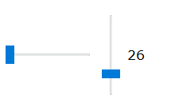

# 按钮类

## 按钮(button)

<h1>behavior:button</h1>
  
标准按钮行为。它可以应用到任何DOM元素上，并使该元素可聚焦和可点击(clickable，即可以接收到BUTTON_CLICK事件)。

  <h2>元素</h2>
  
默认情况下，应用了behavior:button行为的元素有:

  <ul>
    <li><code>&lt;button&gt;&lt;/button&gt;</code></li>
    <li><code>&lt;input type=button&gt;</code></li>
    <li><code>&lt;input type=reset&gt;</code></li>
    <li><code>&lt;input type=submit&gt;</code></li></ul>
  <h2>示例</h2>
  

  
<ClientOnly>
  <demo-block>
<input type=button value="button1" />

<code>&lt;input type=button value="button1"/&gt;</code>
</demo-block>
</ClientOnly>

  
  

  <h2>属性</h2>
  
该行为需要知道的属性:

  <ul>
    <li><code>value=&quot;string&quot;</code> - 按钮的标题，即&lt;input type=button&gt;按钮上应该出现的文字。</li>
    <li><code>name=&quot;name&quot;</code> - 标准的<em>name</em>属性 - from表单上一个input元素的名称。</li></ul>
  <h2>事件</h2>
  
除了标准事件集(鼠标、按键、聚焦)外，behavior:button行为还生成:

  <ul>
    <li>BUTTON_CLICK 事件, 当鼠标在按钮上按下/按起或当按钮聚焦时按下<code>空格</code>键时产生该事件。该事件为异步事件。</li>
    <li>BUTTON_PRESS 事件, 当鼠标在按钮上按下或当按钮聚焦时按下<code>空格</code>键时产生该事件。该事件为异步事件。</li></ul>
  <h2>方法</h2>
  
N/A - behavior:button没有引入任何特有的方法。

  <h2><code>value</code></h2>
  
true/false - 只读, 反映按钮是否按下的状态值。

  <h2>脚本中的按钮点击事件处理</h2>
  <h3><code>onClick</code>事件</h3>
  <pre><code>var btn = $(button#some);
btn.onClick = function() { ... 事件处理代码 ... }
</code></pre>
  <h3><code>on()</code>订阅</h3>
  <pre><code>var btn = $(button#some);
btn.on(&quot;click&quot;, function() { ... 事件处理代码 ... });
self.on(&quot;click&quot;, &quot;button#some&quot;, function() { ... 事件处理代码 ... });
</code></pre>
  <h3>decorators.tis 装饰器</h3>
  <pre><code>include &quot;decorators.tis&quot;;
@click @on &quot;button#some&quot; :: ... 事件处理代码 ...;
</code></pre>

## 可点击(clickable)

<h1>behavior:clickable</h1>
  
可点击但不聚焦的行为。一个轻量的按钮行为(在发生MOUSE_DOWN/UP事件时生成BUTTON_CLICK事件)。 

  <h2>元素</h2>
  
默认情况下，应用了behavior:clickable行为的元素有:

  <ul>
    <li><code>&lt;toolbar&gt;&lt;button&gt;&lt;/button&gt;&lt;/toolbar&gt;</code></li></ul>
  <h2>示例</h2>
  

    <ClientOnly>
    <demo-block>
<toolbar><button>button1</button></toolbar>

<code>&lt;toolbar&gt;&lt;button&gt;&lt;/button&gt;&lt;/toolbar&gt;</code>
</demo-block>
    </ClientOnly>
  

  <h2>属性</h2>
  
N/A

  <h2>事件</h2>
  
除了标准事件集(鼠标、按键、聚焦)外，behavior:clickable行为还生成:

  <ul>
    <li>BUTTON_CLICK 事件, 当鼠标在按钮上按下/按起或当按钮聚焦时按下<code>空格</code>键时产生该事件。该事件为异步事件。</li>
    <li>BUTTON_PRESS 事件, 当鼠标在按钮上按下或当按钮聚焦时按下<code>空格</code>键时产生该事件。该事件为异步事件。</li></ul>
  <h2>方法</h2>
  
N/A - behavior:clickable没有引入任何特有的方法。

  <h2>value</h2>
  
N/A

  <h2>脚本中的按钮点击事件处理</h2>
  <h3><code>onClick</code>事件</h3>
  <pre><code>var btn = $(button#some);
btn.onClick = function() { ... 事件处理代码 ... }
</code></pre>
  <h3><code>on()</code>订阅</h3>
  <pre><code>var btn = $(button#some);
btn.on(&quot;click&quot;, function() { ... 事件处理代码 ... });
self.on(&quot;click&quot;, &quot;button#some&quot;, function() { ... 事件处理代码 ... });
</code></pre>
  <h3>decorators.tis 装饰器</h3>
  <pre><code>include &quot;decorators.tis&quot;;
@click @on &quot;button#some&quot; :: ... 事件处理代码 ...;
</code></pre>

## 超链接(hyperlink)

<h1>behavior:hyperlink</h1>
  
标准的超链接行为。它可以应用到任何有<code>href</code>属性的DOM元素上。

  <h2>元素</h2>
  
默认情况下，应用了behavior:hyperlink行为的元素有:

  <ul>
    <li><code>&lt;a href=&quot;url&quot;&gt;...&lt;/a&gt;</code></li></ul>
  <h2>示例</h2>
  

  <ClientOnly>
    <demo-block>
<a href="http://www.baidu.com">百度</a>

<code>&lt;a href=&quot;http://www.baidu.com&quot;&gt;百度&lt;/a&gt;</code>
</demo-block>
    </ClientOnly>
  

  <h2>属性</h2>
  
该行为需要知道的属性:

  <ul>
    <li><code>href=&quot;url&quot;</code> - 超链接URL;</li>
    <li><code>target=&quot;ID&quot;</code> - 加载URL内容的frame元素的ID。</li></ul>
  <h2>事件</h2>
  
除了标准事件集(鼠标、按键、聚焦)外，behavior:hyperlink行为还生成:

  <ul>
    <li>HYPERLINK_CLICK 事件, 当鼠标在超链接上按下/按起或当超链接聚焦时按下<code>空格</code>键时产生该事件。该事件为异步事件。</li></ul>
  
如果这个事件用户没有处理掉，则最接近该链接的文档将会处理加载该URL。

  <h2>方法</h2>
  
N/A - behavior:hyperlink没有引入任何特有的方法。

  <h2>value</h2>
  
N/A.

  <h2>脚本中的超链接点击事件处理</h2>
  <h3><code>onClick</code> 事件</h3>
  <pre><code>var btn = $(a#some);
btn.onClick = function() { 事件处理代码 ...; 
                           return true; /*标明事件以被处理*/ }
</code></pre>
  <h3><code>on()</code> 订阅</h3>
  <pre><code>var btn = $(a#some);
btn.on(&quot;click&quot;, function() { ... 事件处理代码 ... });
self.on(&quot;click&quot;, &quot;button#some&quot;, function() { ... 事件处理代码 ... });
</code></pre>
  <h3>decorators.tis 装饰器</h3>
  <pre><code>include &quot;decorators.tis&quot;;
@click @on &quot;a#some&quot; :: ... 事件处理代码 ...;
</code></pre>

## 复选框(check)

<h1>behavior:check</h1>
  
标准的复选框行为。它可以应用到任何需要切换:checked状态的DOM元素上。

  <h2>元素</h2>
  
默认情况下，应用了该行为的元素有:

  <ul>
    <li><code>&lt;input type=&quot;checkbox&quot;&gt;</code> - 标准的HTML行内复选按钮;</li>
    <li><code>&lt;button type=&quot;checkbox&quot;&gt;</code> - Windows外观的复选按钮, 请这样使用它<code>&lt;button type=checkbox&gt;caption&lt;/button&gt;</code>.</li></ul>
  <h2>示例</h2>
  

  <ClientOnly>
    <demo-block>

    <button type="checkbox" >复选框1</button>
    <button type="checkbox" checked >复选框2</button> 
    <button type="checkbox" mixed >复选框3</button> 
    

    
<code>
    &lt;button type="checkbox" &gt;复选框1&lt;/button&gt; 
    &lt;button type="checkbox" checked &gt;复选框2&lt;/button&gt;  
    &lt;button type="checkbox" mixed &gt;复选框3&lt;/button&gt; 
    </code>
</demo-block>
    </ClientOnly>
  

  <h2>属性</h2>
  
该行为需要知道的属性:

  <ul>
    <li><code>checked</code> - 如果提供了该属性，则将会初始化元素的运行期状态添加<em>checked</em>标志。</li>
    <li><code>mixed</code> - 如果提供了该属性，则该元素将有三种状态：选中(true)、未选中(undefined)、部分选中(undefined)。</li>
    <li><code>name=&quot;name&quot;</code> - 标准的<em>name</em>属性 - from表单上一个input元素的名称。</li>
    <li><code>value=&quot;...&quot;</code> - 标准的value属性(用于<code>behavior:form</code>)。</li></ul>
  <h2>事件</h2>
  
除了标准事件集(鼠标、按键、聚焦)外，该行为还生成:

  <ul>
    <li>BUTTON_STATE_CHANGED 事件 - 当按钮修改了它的选中状态时生成该事件。该事件为异步事件。</li>
    <li>BUTTON_PRESS 事件 - 当鼠标在该按钮上按下或当按钮聚焦时按下<code>空格</code>键时产生该事件。该事件为异步事件。</li></ul>
  <h2>value</h2>
  
<code>true/false</code>, 反映按钮的当前状态是否包含<code>:checked</code>标志。

  <h2>方法</h2>
  
N/A - 该行为没有引入任何特有的方法。

  

## 单选框(radio)

<h1>behavior: radio</h1>
  
标准的单选框按钮行为。 可以应用到任何一组具有相同的名称来实现一组选择(checked)功能的元素。

  <h2>元素</h2>
  
默认情况下，应用了该行为的元素有:

  <ul>
    <li><code>&lt;input type=&quot;radio&quot;&gt;</code> - 标准的HTML行内单选按钮;</li>
    <li><code>&lt;button type=&quot;radio&quot;&gt;</code> - Windows外观的单选按钮, 请这样使用它<code>&lt;button|radio(group)&gt;first&lt;/button&gt;</code> <code>&lt;button|radio(group)&gt;second&lt;/button&gt;</code>.</li></ul>
  <h2>示例</h2>
  

  <ClientOnly>
    <demo-block>

    <button type="radio" name="group1" >单选框1</button> 
	  <button type="radio" name="group1" checked>单选框2</button> 
    

    
<code>
    &lt;button type="radio" name="group1" &gt;单选框1&lt;/button&gt;  
	  &lt;button type="radio" name="group1" checked&gt;单选框2&lt;/button&gt; 
    </code>
</demo-block>
    </ClientOnly>
  

  <h2>属性</h2>
  
该行为需要知道的属性:

  <ul>
    <li><code>checked</code> - 如果提供了该属性，则将会初始化元素的运行期状态添加<em>checked</em>标志。</li>
    <li><code>name=&quot;groupname&quot;</code> - 标准的<em>name</em>属性，但它有特殊的含义:拥有相同名称的复选框为一组。</li>
    <li><code>value=&quot;...&quot;</code> - 标准的value属性(用于<code>behavior:form</code>)。</li></ul>
  <h2>事件</h2>
  
除了标准事件集(鼠标、按键、聚焦)外，该行为还生成:

  <ul>
    <li>BUTTON_STATE_CHANGED 事件 - 当按钮修改了它的选中状态时生成该事件。该事件为异步事件。</li>
    <li>BUTTON_PRESS 事件 - 当鼠标在该按钮上按下或当按钮聚焦时按下<code>空格</code>键时产生该事件。该事件为异步事件。</li></ul>
  <h2>value</h2>
  
<code>true/false</code>, 反映按钮的当前状态是否包含<code>:checked</code>标志。

  
注意: behavior:form行为将一组中的所有单选框元素认为是一个值。

## 标签(label)

<h1>behavior:label</h1>
  
该行为将绑定了该行为的元素上的鼠标事件重定向到它标签指定的元素。因此，当鼠标在标签上点击时，会导致标签指定的元素获取焦点或生成点击事件。 

  <h2>元素</h2>
  
默认情况下，应用了该行为的元素有:

  <ul>
    <li><code>&lt;label&gt;</code></li>
    <li><code>&lt;label for=...&gt;</code></li></ul>
  <h2>属性</h2>
  
该行为需要知道的属性:

  <ul> 
    <li><code>for=&quot;id&quot;</code> - label标签指定的输入元素的ID。</li></ul>
  <h2>事件</h2>
  
N/A - 该行为没有引入任何特有的事件。

  <h2>方法</h2>
  
N/A - 该行为没有引入任何特有的方法。

  <h2>value</h2>
  
N/A

  <h2>示例</h2>
  
下面的标记: 

  <pre><code>&lt;label&gt;点我&lt;input|text&gt;&lt;/label&gt;
&lt;label for=&quot;buddy&quot;&gt;也点我&lt;/label&gt; &lt;input|text id=&quot;buddy&quot;&gt;
</code></pre>
  
将会生成两个绑定了标签的input元素。

## 滑块(slider)

<h1>behavior:slider</h1>
  
这种行为提供了滑块功能。

  <h2>元素</h2>
  
默认情况下，应用了该行为的元素有:

  <ul>
    <li><code>&lt;input|hslider&gt;</code> - 水平滑块;</li>
    <li><code>&lt;input|vslider&gt;</code> - 垂直滑块。</li></ul>
  <h2>示例</h2>
  

  <ClientOnly>
    <demo-block>

    
    

    
<code>
    &lt;input type="hslider" /&gt;  
    &lt;input type="vslider" buddy="vslidercaption" /&gt; 
	  &lt;span#vslidercaption&gt;&lt;/span&gt;
    </code>
</demo-block>
    </ClientOnly>
  

    
注意: 要使创建的slider支持浮点范围，元素必须至少定义min和max属性，且它们的值必须是浮点数，例如:  
    <code>&lt;input|hslider min=&quot;0.0&quot; max=&quot;1.0&quot; step=&quot;0.01&quot;&gt;</code>

  <h2>模型</h2>
  
该行为初始化时会生成下面的DOM元素结构:

  <pre><code>&lt;input type=hslider&gt;
  &lt;button.slider /&gt;
&lt;/input&gt;
</code></pre>
  
其中，<code>&lt;button.slider&gt;</code>是滑块中的&quot;旋钮&quot;。

  <h2>属性</h2>
  
该行为需要知道的属性:

  <dl>
    <dt>min</dt>
    <dd><em>integer|float</em>, 初始化滑块最小值;</dd>
    <dt>max</dt>
    <dd><em>integer|float</em>, 初始化滑块最大值;</dd>
    <dt>step</dt>
    <dd><em>integer|float</em>, 初始化步长值, 点击左/右侧的滑块是减/增的值。</dd>
    <dt>value</dt>
    <dd><em>integer|float</em>, 初始值</dd>
    <dt>buddy</dt>
    <dd>string, &quot;buddy&quot;元素的ID，通常是一些&lt;span&gt;元素来接收value值的文本表示。</dd>
    <h2>方法</h2>
    <dt>sliderMin</dt>
    <dd>() : <em>integer|float</em> 报告当前(运行时)的最小值。</dd>
    <dt>sliderMax</dt>
    <dd>() : <em>integer|float</em> 报告当前(运行时)的最大值。</dd>
    <dt>sliderStep</dt>
    <dd>() : <em>integer|float</em> 报告当前(运行时)的步长值。</dd>
    <dt>sliderRange</dt>
    <dd>(<strong>min</strong> : <em>integer|float</em>, <strong>max</strong> : <em>integer|float</em> [, <strong>step</strong> : <em>integer|float</em>])  设置滑块的范围，步长值参数可选。</dd>
    <h2>事件</h2>
    <dt>BUTTON_STATE_CHANGED</dt>
    <dd>- 当滑块的值被用户修改时生成该事件。该事件为异步事件。</dd>
    <dt>BUTTON_CLICK</dt>
    <dd>- 当用户完成编辑滑块时生成该事件。该事件为异步事件。</dd></dl>
  <h2>value</h2>
  
<em>integer|float</em>, 滑块的当前值，返回在[ min ... max ]之间。
