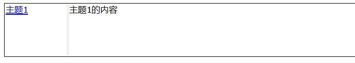

# 容器

## 表单(form)

<h1>behavior:form</h1>
  
该元素处理&lt;form&gt;元素的扩展功能。该行为适用于任何容器元素，该元素需要&quot;复合值&quot;。

  
behavior:form的主要应用场景: 

  <ul>
    <li>经典的web from应用场景 - 当<em>action</em>属性被定义，该行为会表单中的数据向该表单的URL发送HTTP/POST请求。</li>
    <li>复合值容器的应用场景 - form表单的值为表单中一个name/value的命名元素(有name属性的元素)的映射表。</li></ul>
  <h2>元素</h2>
  
默认情况下，应用了该行为的元素有:

  <ul>
    <li><code>&lt;form&gt;</code></li></ul>
  <h2>示例</h2>
  

    <ClientOnly>
    <demo-block>

      <form action="form_action.asp" method="get" style="border: 1px solid;padding: 2px;">
        
姓: <input type="text" name="fname" />

        
名: <input type="text" name="lname" />

        <input type="submit" value="提交" />
	      <input type="reset" value="重置" />
      </form>
    

    
<code>
      &lt;form action="form_action.asp" method="get" style="border: 1px solid;padding: 2px;"&gt; 
        &lt;p&gt;姓: &lt;input type="text" name="fname" /&gt;&lt;/p&gt; 
        &lt;p&gt;名: &lt;input type="text" name="lname" /&gt;&lt;/p&gt; 
        &lt;input type="submit" value="提交" /&gt; 
	      &lt;input type="reset" value="重置" /&gt; 
      &lt;/form&gt;
    </code>
</demo-block>
    </ClientOnly>
  

  <h2>模型</h2>
  
在form中的任何一个拥有<em>name</em>属性的DOM元素都会被认为是可提交的(submittable), 并且参与到from的值中。

  
form的值总是一个复合(聚合、映射)的JSON值。

  
示例, 下面是一个form:

  <pre><code>&lt;form&gt;
   First name: &lt;input|text name=&quot;first&quot; value=&quot;Foo&quot;&gt; 
   Last name: &lt;input|text name=&quot;last&quot; value=&quot;Bar&quot;&gt;
&lt;/form&gt;</code>
</pre>
  
的值是:

  <pre><code>{
  first: &quot;Foo&quot;,
  last: &quot;Bar&quot; 
}</code>
</pre>
  <h3>Radio组 和 check盒</h3>
  
一组radio元素有相同的名称(name)，一个组有一个值 - 该组中:checked状态的radio元素的value值。 

  
check元素的值是它们的value属性的内容。如果checkbox未选中则它的值为undefined。

  
因此form:

  <pre><code>&lt;form&gt;
   Name: &lt;input|text name=&quot;firstName&quot; value=&quot;Ivan&quot;&gt; 
   Male: &lt;input|radio name=&quot;sex&quot; value=&quot;male&quot; checked&gt;
   Female: &lt;input|radio name=&quot;sex&quot; value=&quot;female&quot;&gt;
   Adult: &lt;input|checkbox name=&quot;adult&quot; value=&quot;mature&quot; checked&gt;
   Owns Cadillac: &lt;input|checkbox name=&quot;ownsCadddilac&quot; value=&quot;yes&quot;&gt;
&lt;/form&gt;</code>
</pre>
  
的值为:

  <pre><code>{
  firstName:&quot;Ivan&quot;,
  sex: &quot;male&quot;,
  adult: &quot;mature&quot;,
  ownsCadddilac: undefined
}</code>
</pre>
  <h3>字段组(Field groups)</h3>
  
一些字段可以打包到一个表单命名容器中，在表单的值映射表中，它们打包成一个子对象:

  <pre><code>&lt;form&gt;
   &lt;div name=&quot;credentials&quot;&gt;
     User name: &lt;input|text name=&quot;un&quot; value=&quot;Ivan&quot;&gt;
     Password: &lt;input|password name=&quot;pwd&quot; value=&quot;12345&quot;&gt;
   &lt;/div&gt;    Save login: &lt;input|checkbox name=&quot;parsistLogin&quot; value=&quot;true&quot; checked&gt;
&lt;/form&gt;</code>
</pre>
  
生成的值为: 

  <pre><code>{  
   credentials: { 
     un: &quot;Ivan&quot;, 
     pwd: &quot;12345&quot; },
   persistLogin: true; 
}</code>
</pre>
  <h2>属性</h2>
  
下面的这些属性用于web form的情况:

  <ul>
    <li><code>action</code> - URL, 提交网页表单的URL，表单数据的接收者;</li>
    <li><code>target</code> - 可选参数, 目标框架(frame)的名称(name)或id，即action URL的响应者;</li>
    <li><code>method</code> - 浏览器提交表单使用的HTTP方法。可能的值有: &quot;post&quot;和&quot;get&quot;. 默认值: &quot;post&quot;</li>
    <li><code>enctype</code> - 当<code>method=&quot;post&quot;</code>时，定义提交的MIME格式，值可以为:</li>
    <ul>
      <li><code>&quot;application/x-www-form-urlencoded&quot;</code> - 如果该属性未指定时的默认值;</li>
      <li><code>&quot;multipart/form-data&quot;</code> - 用于当表单包含<code>&lt;input name=&quot;...&quot; type=&quot;file&quot;&gt;</code>元素时。</li></ul></ul>
  <h2>事件</h2>
  <ul>
    <li>FORM_RESET 事件 - 当点击表单中的&lt;button|reset&gt;按钮时生成该事件。如果该事件未被脚本处理，则表单将清空所有input元素的值，并将它们设置为它们定义的默认值; </li>
    <li>FORM_SUBMIT 事件 - 当点击表单中的&lt;button|submit&gt;按钮时生成该事件。如果该事件未被脚本处理，则该行为将会发生表单的值到<em>action</em>指定的URL; </li>
    <li>FORM_VALUE_CHANGED 事件 - 当表单中某个input发生&quot;change&quot;事件时生成。该事件被翻译成表单元素的&quot;change&quot;事件。</li></ul>
  <h2>方法</h2>
  <dl>
    <dt>submit</dt>
    <dd>() - 提交表单的内容，需要定义表单的<em>action</em>属性。</dd>
    <dt>reset</dt>
    <dd>() - 重置表单中的所有输入内容为它们的初始值。</dd></dl>
  <h2>value</h2>
  
name/value map - TIScript中的对象，该对象中每个属性的名称对应表单中DOM元素的name属性。

  <h2>脚本中的表单改变事件处理</h2>
  <h3><code>on()</code>订阅</h3>
  <pre><code>var frm = $(form#some);
frm.on(&quot;change&quot;, function() { var formValue = this.value; ... });
self.on(&quot;change&quot;, &quot;form#some&quot;, function() { var formValue = this.value; ... });
</code></pre>
  <h3>事件处理</h3>
  <pre><code>event change $(form#some) { ... 事件处理代码 ... }</code>
</pre>

## 框架(frame)

<h1>behavior:frame</h1>
  
该行为处理&lt;frame&gt;/&lt;iframe&gt;(宿主文档中的子文档容器)元素的扩展功能。

  
该行为可以应用到任何块级元素上, 如：&lt;div&gt;、&lt;section&gt;。

  <h2>元素</h2>
  
默认情况下，应用了该行为的元素有:

  <ul>
    <li><code>&lt;frame&gt;</code> - 块级文档容器;</li>
    <li><code>&lt;iframe&gt;</code> - 行内块文档容器。</li></ul>
  
Sciter中, <code>&lt;frame&gt;</code>是一个普通的DOM元素，它可以出现在任何其他块元素可出现的地方，而不仅仅是作为&lt;frameset&gt;的子元素。

  <h2>模型</h2>
  
&lt;frame&gt;元素初始时可以有任何子元素，这方面&lt;frame&gt;和&lt;div&gt;、&lt;section&gt;没有什么区别。

  <pre><code>&lt;frame&gt;
   &lt;p&gt;Select document to load&lt;/p&gt; 
&lt;/frame&gt;</code>
</pre>
  
在&lt;frame&gt;加载完子文档(由于<em>src</em>的处理 或 调用了<code>.load()</code>方法)后，frame将只有一个子元素 —— 加载文档根元素, 如&lt;html&gt;。

  
&lt;frame&gt;和加载的文档:

  <pre><code>&lt;frame&gt;
   &lt;html&gt;
     &lt;head&gt;...&lt;/head&gt;  
     &lt;body&gt;...&lt;/body&gt;  
   &lt;/html&gt;
&lt;/form&gt;</code>
</pre>
  
若脚本需要访问子文档，可以使用frame[0]来获取frame的第一个根元素 - 子文档的根元素:

  <pre><code>var frm = $(frame#main);
var childDoc = frm[0];
var someBtn = childDoc.$(&quot;button#some&quot;);
...</code>
</pre>
  <h2>属性</h2>
  
该行为需要知道的属性:

  <ul>
    <li><code>src=&quot;url&quot;</code> - 可选, 加载到frame的文档的URL;</li>
    <li><code>content-style=&quot;url&quot;</code> - 可选, 应用到加载文档的.css文件的URL。 该属性用于宿主文档需要给子文档应用一些特定样式时。</li></ul>
  <h2>状态标志</h2>
  <ul>
    <li><code>:busy</code> - 该标志表示文档正在加载。它可用于设置&quot;文档加载中...&quot;的样式。</li></ul>
  <h2>事件</h2>
  <ul>
    <li>DOCUMENT_CREATED 事件 - 该事件生成于文档加载的第一步骤。这一刻新文档已经存在但为空;</li>
    <li>DOCUMENT_COMPLETE 事件 - 该事件生成于文档完成加载时 ——DOM已经准备好，并且所有待处理资源请求已经处理完成。注意：该事件是Sciter特有的。</li></ul>
  <h2>方法</h2>
  <dl>
    <dt>load</dt>
    <dd>(url:string) - 从指定URL加载html文档;</dd>
    <dt>load</dt>
    <dd>(html:string, baseUrl: string) - 从<em>html</em>字符串加载html文档。baseUrl用于指定文档中的相对URL的根URL。</dd>
    <dt>clear</dt>
    <dd>() - 通过加载一个空文档来清除frame的内容。</dd>
    <dt>mediaVars</dt>
    <dd>() : object - 返回加载文档使用的媒体(media)变量的key/value映射表。</dd>
    <dt>mediaVars</dt>
    <dd>( map: object [,reset: true | false] ) - 设置map为加载文档的媒体变量，如果<em>reset</em>为true，将会应用该媒体。</dd></dl>
  <h2>value</h2>
  
N/A

  <h2>脚本中Frame事件的处理</h2>
  <pre><code>var frame = $(frame#some);
btn.onControlEvent = function(evt)
{
  switch(evt.type) {
    case Event.DOCUMENT_CREATED: /* evt.target 是一个文档 */ break;
    case Event.DOCUMENT_COMPLETE: /* evt.target 是一个文档 */ break;
  }
}</code>
</pre>
  <h3>事件处理</h3>
  <pre><code>event complete $(frame#some) { ... 事件处理代码 ... }</code>
</pre>

## 预览页面(pager)

<h1>behavior:pager</h1>
  
该行为处理&lt;frame|pager&gt;和&lt;frame type=pager&gt;元素的相关功能。

  
pager实现了打印和打印预览功能。

  
该行为可以被应用到任何块元素上。

  <h2>元素</h2>
  
默认情况下，拥有<em>behavior:pager</em>行为的元素有:

  <ul>
    <li><code>&lt;frame|pager&gt;</code> - 页面打印预览的容器;</li></ul>
  <h2>模型</h2>
  
在文档加载完成后，&lt;frame|pager&gt;元素将会有一些&lt;pagebox&gt;子元素，它们的数量由<code>cols</code>和<code>rows</code>属性定义:

  <pre><code>&lt;frame|pager cols=2&gt;
   &lt;pagebox/&gt;
   &lt;pagebox/&gt;
&lt;/frame&gt;</code>
</pre>
  
每个&lt;pagebox/&gt;元素渲染它自己要打印的页面的模板实例。

  <h2>属性</h2>
  
&lt;frame&gt;元素中有特定含义的属性:

  <ul>
    <li><code>src=&quot;url&quot;</code> - 可选, 加载到frame中的文档URL;</li>
    <li><code>page-template=&quot;url&quot;</code> - 可选, 页面模板文档的URL;</li>
    <li><code>cols=&quot;number&quot;</code> 和 <code>rows=&quot;number&quot;</code> - 者两个属性定义打印预览时的&lt;pagebox&gt;(页面盒)的数量。</li></ul>
  <h2>状态标识</h2>
  <ul>
    <li>N/A</li></ul>
  <h2>事件</h2>
  <ul>
    <li><code>&quot;paginationstart&quot;</code> 事件 - 在分页时的第一步触发事件。这时要打印的文档刚加载完成;</li>
    <li><code>&quot;paginationpage&quot;</code> 事件 - 在打印每个页面时触发该事件。event.reason是页号 - 1...N;</li>
    <li><code>&quot;paginationend&quot;</code> 事件 - 在分页时的最后一步触发事件。这时待打印页数已经知道，并且通过event.reason字段来报告。</li></ul>
  <h2>方法</h2>
  <dl>
    <dt>loadDocument</dt>
    <dd>([templateUrl:string], documentUrl:string) - 从给定的url加载文档和打印模板;</dd>
    <dt>pagesTotal</dt>
    <dd>() : integer, 返回找到的页数;</dd>
    <dt>pageNo</dt>
    <dd>() : integer, 返回视图中渲染的第一个页面的页号;</dd>
    <dt>pageNo</dt>
    <dd>(number: integer), 将视图导航到number指定的页面;</dd>
    <dt>selectPrinter</dt>
    <dd>() : 打开系统的选择打印机对话框来选择目标打印机, 然后自动配置的页面尺寸，可能启动分页操作。</dd>
    <dt>selectDefaultPrinter()</dt>
    <dd>() : 选择默认打印机作为打印目标, 可能启动分页操作。</dd>
    <dt>print</dt>
    <dd>() - 打印当前文档到目标打印机上。</dd></dl>
  <h2>值</h2>
  
N/A

  <h2>在脚本中处理Frame事件</h2>
  <pre><code>var pager = $(frame#pager);
pager.on(&quot;paginationstart&quot;, function() {...});
pager.on(&quot;paginationend&quot;, function(evt) { var npages = evt.reason; ...});
</code>
</pre>

## 框架集(frameset)

<h1>behavior:frame-set</h1>
  
该行为处理&lt;frameset&gt;元素的扩展功能 - 由所谓的&quot;分隔线(splitters)&quot;分隔的&quot;块面板&quot;容器，它允许调整容器中面板的尺寸。

  
该行为可以应用到任何块级容器上，如&lt;div&gt;、&lt;section&gt;等。

  <h2>元素</h2>
  
默认情况下，应用了该行为的元素有:

  <ul>
    <li><code>&lt;frameset&gt;</code> - 面板容器。</li></ul>
  <h2>示例</h2>
  

  <ClientOnly>
    <demo-block>

      
    

    
<code>
        &lt;frameset style="height:100px; padding:2px;border: 1px solid;" cols="120px,*"&gt; 
          &lt;div id="help-index"&gt; 
            &lt;a href="first-topic.htm" target="help-content"&gt;主题1&lt;/a&gt;  
          &lt;/div&gt; 
          &lt;splitter/&gt; 
          &lt;frame id="help-content"&gt;主题1的内容&lt;/frame&gt; 
        &lt;/frameset&gt;
    </code>
</demo-block>
    </ClientOnly>
  

  <h2>模型</h2>
  
在Sciter中，&lt;frameset&gt;元素可以包含&lt;frame&gt;元素，也可以包含其他块级元素(如 &lt;div&gt;、&lt;section&gt;等)来作为一个面板。

  
面板可以被&lt;splitter&gt;元素(可以指定splitter的特有样式)分隔。

  
示例, 一个典型的帮助窗口布局:

  <pre><code>&lt;frameset cols=&quot;120px,*&quot;&gt;
   &lt;div id=&quot;help-index&quot;&gt;
      &lt;a href=&quot;first-topic.htm&quot; target=&quot;help-content&quot;&gt;主题1&lt;/a&gt; 
   &lt;/div&gt;
   &lt;splitter/&gt;
   &lt;frame id=&quot;help-content&quot;&gt;主题1的内容&lt;/frame&gt;
&lt;/frameset&gt;</code>
</pre>
  
第一个面板是一个&lt;div&gt;元素，它用于静态的内容。&lt;frame&gt;是选择的主题元素的容器。&lt;splitter&gt;用于交互式的调整面板的尺寸。

  <h2>属性</h2>
  
该行为需要知道的属性:

  <ul>
    <li><code>cols=&quot;宽度列表&quot;</code> - 声明列布局，指定&lt;frameset&gt;中的列的初始宽度;</li>
    <li><code>rows=&quot;高度列表&quot;</code> - 声明行布局，指定&lt;frameset&gt;中的行的初始高度;</li></ul>
  
cols或rows属性必须定义其中一个，宽度/高度列表是一个以逗号分隔的Sciter长度单位: dips、px、mm等, 包括弹力单位(<code>*</code>)。

  <h2>事件</h2>
  
N/A - 该行为没有特有事件。

  <ul/>
  <h2>方法</h2>
  <dl>
    <dt>framesetState</dt>
    <dd>() : array - 返回一个长度(lengths)数组 - 当前frameset中面板宽度/高度数组;</dd>
    <dt>framesetState</dt>
    <dd>(lengths: array) - 应用列/行的长度到frameset中。</dd></dl>
  
uiState方法用于持久化frameset的UI状态。

  <h2>value</h2>
  
N/A

## 历史导航(history)

<h1>behavior:history</h1>
  
这个行为提供了对历史页面导航的支持, 类似于点击浏览器中的"前进"和"后退"按钮。

  <h2>元素</h2>
  
<code>&lt;frame history&gt;</code> - 标准的frame元素，只是多了一个history属性。

  <h2>模型</h2>
  
这个行为可以被应用到任何包含frame的元素上。比如，如果需要可以应用到&lt;frameset&gt;。

  <h2>属性</h2>
  
behavior:history没有使用任何特别的属性。

  <h2>方法</h2>
  <dl>
    <dt>canGoBack</dt>
    <dd><strong>(</strong> <strong>)</strong> : <em>true</em> | <em>false</em>, &nbsp;如果存在"历史页面"，并且goBack()方法将可以成功时，则返回true。</dd>
    <dt>canGoForward</dt>
    <dd><strong>(</strong> <strong>)</strong> : <em>true</em> | <em>false</em>, &nbsp;如果"向前"状态可用，并且goForward()方法将可以成功时，则返回true。</dd>
    <dt>goBack</dt>
    <dd><strong>(</strong> <strong>)</strong> : <em>true</em> | <em>false</em>, &nbsp;"向后/回退"导航栈，当导航成功时返回<em>true</em>。</dd>
    <dt>goForward</dt>
    <dd><strong>(</strong> <strong>)</strong> : <em>true</em> | <em>false</em>, &nbsp;"向前"导航栈，当导航成功时返回<em>true</em>。</dd></dl>
  <h2>状态</h2>
  
N/A

  <h2>事件</h2>
  
这个行为会生成以下事件:

  <dl>
    <dt>HISTORY_STATE_CHANGED</dt>
    <dd>- 当内部的导航栈状态被改变时触发。</dd></dl>
  
这个行为反应了以下事件:

  <dl>
    <dt>HISTORY_PUSH</dt>
    <dd>- 发生了超链接导航，并且behavior:frame元素加载了新的内容。</dd>
    <dt>HISTORY_PRIOR</dt>
    <dd>- 该行为将会调用goBack()方法来处理该事件。</dd>
    <dt>HISTORY_NEXT</dt>
    <dd>- 该行为将会调用goForward()方法来处理该事件。</dd></dl>
  <h2>值</h2>
  
N/A

  <h2>在脚本中历史状态改变的处理</h2>
  <code>onControlEvent</code>处理器：
  <pre><code>var edit = $(input#some);
edit.onControlEvent = function(evt)
{
  switch(evt.type) {
    case Event.HISTORY_STATE_CHANGED: 
       /* evt.target为该元素 */ 
       break;
  }
}</code>
</pre>
  <h3>decorators.tis处理器</h3>
  <pre><code>include &quot;decorators.tis&quot;;
@when Event.HISTORY_STATE_CHANGED @on &quot;frame#content&quot; 
   function() {
     ... 事件处理代码 ...;
   }</code>
</pre>