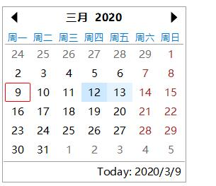

# 日期/时间输入

## 日历(calendar)

<h1>behavior: calendar</h1>
  
calendar是一个日期输入元素，它允许用户选择一个特定的日期。

  <h2>元素</h2>
  
默认情况下，应用了该行为的元素有:

  <ul>
    <li><code>&lt;input type=&quot;calendar&quot; /&gt;</code> - 行内日期输入元素</li></ul>
  <h2>示例</h2>
  

  <ClientOnly>
    <demo-block>

      
    

    
<code>
      &lt;input type="calendar" /&gt;
    </code>
</demo-block>
    </ClientOnly>
  

  <h2>模型</h2>
  
calendar有以下4种不同的视图模式:

  <ul>
    <li>十年视图 - 每个单元格为一个10年的时间段</li>
    <li>年视图   - 每个单元格为一年</li>
    <li>月视图   - 每个单元格为一个月</li>
    <li>日视图   - 每个单元格为一天</li></ul>
  
每种模式使用一个&lt;table&gt;来渲染视图的内容。如果使用DOM捡拾器(inspector)就会发现每个视图的DOM结构。如果你需要重定义calandar的内容样式时，可以在CSS中直接使用这些DOM元素。

  <h2>属性</h2>
  
该行为需要知道的属性:

  <ul>
    <li><code>value=&quot;YYYY-MM-DD&quot;</code> - 初始化日期, ISO 8601格式的字符串。</li></ul>
  <h2>事件</h2>
  
除了标准事件集(鼠标、按键、聚焦)外，该行为还生成:

  <ul>
    <li>SELECT_STATE_CHANGED 事件 - 当视图被改变(如月份被改变)时生成该事件，该事件为异步事件。</li>
    <li>SELECT_SELECTION_CHANGED 事件 - 当日期被改变时生成该事件，该事件为异步事件。</li></ul>
  <h2>value</h2>
  
Date值 或 undefined, 反应当前的选择内容。

  <h2>方法</h2>
  
N/A - 该行为没有引入任何特有的方法。

## 日期(date)

<h1>behavior: date</h1>
  
日期输入元素，它包含一个下拉日历。

  <h2>元素</h2>
  
默认情况下，应用了该行为的元素有:

  <ul>
    <li><code>&lt;input type=&quot;date&quot; /&gt;</code> - 行内日期输入元素</li></ul>
  <h2>示例</h2>
  

    <ClientOnly>
    <demo-block>

      <input type="date" />
      <input type="date" value="2015-03-25" />
    

    
<code>
      &lt;input type="date" /&gt; 
      &lt;input type="date" value="2015-03-25" /&gt;
    </code>
</demo-block>
    </ClientOnly>
  

  <h2>模型</h2>
  
初始化该行为时会创建下面的DOM结构:

  <pre><code>&lt;input&gt;
 <code> &lt;caption&gt;
    &lt;span.year&gt;
    &lt;span.month&gt;
    &lt;span.day&gt;
  &lt;/caption&gt;
  &lt;button&gt;
</code>&lt;/input&gt;
</code></pre>
  
其中，<code>&lt;caption&gt;</code>拥有<code>behavior:masked</code>行为。<code>&lt;button&gt;</code>按钮触发弹出下拉日历。

  <h2>属性</h2>
  
该行为需要知道的属性:

  <ul>
    <li><code>value=&quot;YYYY-MM-DD&quot;</code> - input元素的初始日期</li></ul>
  <h2>事件</h2>
  
除了标准事件集(鼠标、按键、聚焦)外，该行为还生成:

  <ul>
    <li>SELECT_SELECTION_CHANGED 事件 - 当元素(date)的value值由于用户操作被修改时生成该事件。该事件为异步事件。</li></ul>
  <h2>value</h2>
  
Date 或 undefined, 反应内部编辑缓存区的当前状态。

  <h2>方法</h2>
  <dl>
    <dt>showPopup()</dt>
    <dd>- 显示日历弹窗。</dd>
		<dt>today()</dt>
		<dd>- 设置为当前日期。</dd>
  </dl>

## 时间(time)

<h1>behavior: time</h1>
  
时间输入元素。

  <h2>元素</h2>
  
默认情况下，应用了该行为的元素有:

  <ul>
    <li><code>&lt;input type=&quot;time&quot; /&gt;</code> - 行内时间输入元素</li></ul>
  <h2>示例</h2>
  

    <ClientOnly>
    <demo-block>

      <input type="time" />
      <input type="time" />
    

    
<code>
      &lt;input type="time" /&gt; 
      &lt;input type="time" /&gt;
    </code>
</demo-block>
    </ClientOnly>
  

  <h2>模型</h2>
  
初始化该行为时会创建下面的DOM结构:

  <pre><code>&lt;input&gt;
 <code> &lt;caption&gt;
    &lt;span.hour&gt;
    &lt;span.minute&gt;
    &lt;span.second&gt;
    &lt;span.ampm&gt;
  &lt;/caption&gt;
  &lt;button.plus&gt;
  &lt;button.minus&gt;
</code>&lt;/input&gt;
</code></pre>
  
<code>&lt;span.ampm&gt;</code>是可选的 - 它只出现在当前区域(语言)需要它时。

  
<code>&lt;caption&gt;</code>拥有<code>behavior:masked</code>行为。
  <code>&lt;button.plus&gt;</code>和<code>&lt;button.minus&gt;</code>触发对当前的子字段的递增/减。

  <h2>属性</h2>
  
该行为需要知道的属性:

  <ul>
    <li><code>value=&quot;HH:MM:SS&quot;</code> - time, 输入元素的初始化值。ISO 8601格式的时间部分。</li></ul>
  <h2>事件</h2>
  
除了标准事件集(鼠标、按键、聚焦)外，该行为还生成:

  <ul>
    <li>EDIT_VALUE_CHANGED 事件 - 当元素(time)的value值由于用户操作被修改时生成该事件。该事件为异步事件。</li></ul>
  <h2>value</h2>
  
Date 或 undefined, 反应内部编辑缓存区的当前状态。Date只有时间部分是有效的。

  <h2>方法</h2>
  
N/A - 该行为没有引入任何特有的方法，不过&lt;caption&gt;子元素有<code>behavior:masked</code>行为的特有方法。

  <dl></dl>