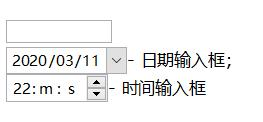

# 编辑器类

## 编辑框(edit)

<h1>behavior: edit</h1>
  
标准的单行输入文本框行为。该行为可以应用到任何拥有<code>flow:text</code>和<code>white-space:pre</code>模型的元素上。

  <h2>元素</h2>
  
默认情况下，应用了该行为的元素有:

  <ul>
    <li><code>&lt;input type=&quot;text&quot; /&gt;</code> - 行内元素，单行文本框</li></ul>
  <h2>示例</h2>
  

  <ClientOnly>
    <demo-block>

      <input type="text" placeholder="请输入文本" /> 
	    <input type="text" placeholder="请输入文本" /> 
    

    
<code>
      &lt;input type="text" novalue="请输入文本" /&gt; 
	    &lt;input type="text" novalue="请输入文本" /&gt; 
    </code>
</demo-block>
    </ClientOnly>
  

  <h2>属性</h2>
  
该行为需要知道的属性:

  <ul>
    <li><code>value=&quot;text&quot;</code> - 元素的初始值。</li>
    <li><code>size=integer</code> - 决定元素的宽度值(内在值和默认值)。</li>
    <li><code>maxlength=integer</code> - 元素可以接受的最大字符数量。</li>
    <li><code>filter=&quot;filter-expr&quot;</code> - 限制元素允许输入的字符集。<code>filter-expr</code>字符串接受单个字符后字符范围。示例: &quot;.@0~9a~zA~Z&quot; - 所有字母、数字、'.'、'@'字符。 如果你只是想排除一些字符，你只需在过滤字符串前加'^'字符即可。 所以这个<code>filter=&quot;^.,-&quot;</code>过滤器允许输入除'.'、','、'-'以外的字符。</li>
    <li><code>novalue=&quot;text&quot;</code> - 当输入框为空时显示的文本。你可以使用CSS选择器<code>:empty</code>来设置这个状态时的样式。</li>
    <li><code>readonly</code> - 声明该元素是只读的。</li>
    <li><code>spellcheck=&quot;yes&quot;</code> - 是否启用拼写检查。</li></ul>
  <h2>事件</h2>
  
除了标准事件集(鼠标、按键、聚焦)外，该行为还生成:

  <ul>
    <li>EDIT_VALUE_CHANGED 事件 - 当元素的值被用户修改时产生该事件。该事件为异步事件。</li>
    <li>EDIT_VALUE_CHANGING 事件 - 当任何修改该元素的值时发生该事件。通过该事件你可以在字符插入到文本框前过滤一些字符。该事件为同步事件。其中:</li>
    <ul>
      <li>event.reason 为以下值之一: </li></ul>
    <ul>
      <ul>
        <li>const BY_INS_CHAR  = 3; // 因输入单个字符引起的事件。</li>
        <li>const BY_INS_CHARS = 4; // 从剪切板粘贴引起的事件。</li>
        <li>const BY_DEL_CHAR  = 5; // 由DELETE/BACKSPACE按键引起的事件。</li>
        <li>const BY_DEL_CHARS = 6; // 由删除选择内容引起的事件。</li></ul>
      <li>event.data - string, 读/写。 如果reason为BY_INS_***值，则包含插入的字符;</li></ul></ul>
  <h2>value</h2>
  
string, 反应内部输入缓冲区的当前状态。

  <h2>特有组合键</h2>
  <ul>
    <li>LEFT, CTRL+LEFT, SHIFT+LEFT, CTRL+SHIFT+LEFT</li>
    <li>RIGHT, CTRL+RIGHT, SHIFT+RIGHT, CTRL+SHIFT+RIGHT</li>
    <li>HOME, SHIFT+HOME</li>
    <li>END, SHIFT+END</li>
    <li>BACKSPACE, ALT+BACKSPACE, CTRL+BACKSPACE</li>
    <li>CTRL+A</li>
    <li>DELETE, SHIFT+DELETE, CTRL+DELETE</li>
    <li>INSERT, SHIFT+INSERT, CTRL+INSERT</li>
    <li>CTRL+X</li>
    <li>CTRL+V</li>
    <li>CTRL+Z</li>
    <li>CTRL+(LEFT)SHIFT 和 CTRL+(RIGHT)SHIFT - 如果form表单上有<code>dir</code>属性时，这个组合键用来在<code>dir=&quot;ltr&quot;</code>和切换<code>dir=&quot;rtl&quot;</code>间切换。</li></ul>
  <h2>方法</h2>
  <dl>
    <dt><code>canUndo</code></dt>
    <dd><code>(): true|false</code> - 如果撤消缓冲区不为空则返回true。</dd>
    <dt><code>doUndo</code></dt>
    <dd><code>(): true|false</code> - 丢弃编辑框中的最后一次修改，如果有修改则返回true。</dd>
    <dt><code>canRedo</code></dt>
    <dd><code>(): true|false</code> - 如果重做缓冲区不为空则返回true。</dd>
    <dt><code>doRedo</code></dt>
    <dd><code>(): true|false</code> - 应用最后一次修改，如果有修改则返回true。</dd>
    <dt><code>canCut</code></dt>
    <dd><code>(): true|false</code> - 如果有选择内容且该元素不为只读则返回true。</dd>
    <dt><code>doCut</code></dt>
    <dd><code>(): true|false</code> - 移除选择内容，并将它添加到剪切板中。如果有修改则返回true。</dd>
    <dt><code>canCopy</code></dt>
    <dd><code>(): true|false</code> - 如果存在选择内容则返回true。</dd>
    <dt><code>doCopy</code></dt>
    <dd><code>(): true|false</code> - 复制选择的内容到剪切板，如果有修改则返回true。</dd>
    <dt><code>canPaste</code></dt>
    <dd><code>(): true|false</code> - 如果剪切板包含文本则返回true。</dd>
    <dt><code>doPaste</code></dt>
    <dd><code>(): true|false</code> - 将剪切板中的字符插入到当前光标位置处。如果有修改则返回true。</dd>
    <dt><code>canSelectAll</code></dt>
    <dd><code>(): true|false</code> - 如果元素不为空则返回true。</dd>
    <dt><code>doSelectAll</code></dt>
    <dd><code>(): true|false</code> - 选择编辑框中的所有字符，如果有修改则返回true。</dd>
    <dt><code>selectionStart</code></dt>
    <dd><code>(): integer</code> - 返回选择内容的起始位置，如果没有选择内容则返回光标位置。</dd>
    <dt><code>selectionEnd</code></dt>
    <dd><code>(): integer</code> - 返回选择内容的结束位置，如果没有选择内容则返回光标位置。</dd>
    <dt><code>selectionText</code></dt>
    <dd><code>(): string</code> - 返回选择文本，如果没有选择内容则返回空字符串。</dd>
    <dt><code>setSelection</code></dt>
    <dd><code>(anchorPos: integer, caretPos: integer)</code> - 选择编辑框中的文本。如果<code>anchorPos == caretPos</code>，则编辑框不会包含任何选择内容，并且光标会设置在该位置。</dd>
    <dt><code>insertText</code></dt>
    <dd><code>(text:string)</code> - 在当前光标位置处插入text文本，移动光标到text的结尾处。</dd>
    <dt><code>appendText</code></dt>
    <dd><code>(text:string)</code> - 在编辑框中的当前文本后面添加text文本，移动光标到末尾处。</dd></dl>

## 掩码编辑框

<h1>behavior:masked-edit</h1>
  
该行为提供了掩码输入框的功能。

  <h2>元素</h2>
  
默认情况下，应用了该行为的元素有:

  <ul>
    <li><code>&lt;input type=&quot;masked&quot;&gt;</code></li>
    <li><code>&lt;input|masked&gt;</code></li>
		<li><code>&lt;input|date&gt;/&lt;caption&gt;</code> - on caption sub-element of date input;</li>
		<li><code>&lt;input|time&gt;/&lt;caption&gt;</code> - on caption sub-element of time input;</li></ul>
   <h2>示例</h2>
   <ClientOnly>
    <demo-block>

      
    

    
<code>
	    &lt;input type="masked" style="width:100px"&gt; 
      &lt;input|date&gt; - 日期输入框; 
      &lt;input|time&gt; - 时间输入框
    </code>
</demo-block>
    </ClientOnly>
  <h2>模型</h2>
  
上面的输入框的初始结构为:

  <pre><code>&lt;input|masked&gt;
  &lt;span&gt;editable&lt;/span&gt;
  separator
  &lt;span&gt;editable&lt;/span&gt;
  separator
  ...
&lt;/input&gt;
</code></pre>
  
<code>&lt;span&gt;</code> elements represent editable text and text nodes represent static separators.

	
Current editable span will&nbsp;have <code>:current</code> state flag. Numeric span with invalid value (more than <i>max</i> or less than <i>min</i>) is marked by  <code>:invalid</code> flag.

  <h2>Attributes</h2>
  <ul><li> <code>value=&quot;text&quot;</code> -  initial text value;</li>
		<li><code>mask=&quot;mask&quot;</code> - definition of mask that is a text that may contain special characters:<ul><li> <code>_</code> (underscore) - allows input of any alphanumeric character at this position;</li>
				<li><code>@</code> -&nbsp;allows input of any alpha&nbsp;character at this position;</li>
				<li><code>#</code> - allows input of any numeric character at this position;</li>
				<li><code>0</code> - numeric input, the field will be zero padded  on set;</li>
				<li>all other character in the mask will be rendered as a static separator text.</li></ul></li>
		</ul>
  <dl>
    <h2>Methods</h2>
    
		<dl><dt>copy(exec:bool):bool</dt>
			<dd>- if <i>exec</i> is <i>true</i> copies current content to clipboard else checks if the input field is filled in full - returns true in this case.</dd>
			<dt>paste(exec:bool):bool</dt>
			<dd>- if <i>true</i> makes an attempt to paste clipboard content into the input. Returns <i>true</i> on success.</dd>
			<dt>selectAll(exec:bool)</dt>
			<dd>- if&nbsp;<i>exec</i> is <i>true</i> selects all editable fields in the input.</dd>
			<dt>mask(array of field definitions)&nbsp;</dt>
			<dd> 
- allows to define structure of masked input &quot;manually&quot; and with more control.

           
Mask definition is an array of strings (rendered as static separators) and objects. Each object defines editable regions and may have following fields:

				<ul><li><code>type: #integer | #text | #enum </code> - defines type of the region, mandatory;</li>
					<li><code>width: integer</code> - defines length of the region in characters, mandatory;</li>
					<li><code>class: string | symbol</code> - defines CSS class of generated span element, optional;</li>
					<li><code>min,max,step : integer</code> - define min/max/step values for type:#integer, optional;</li>
					<li><code>leading-zero : true | false</code> - if true then this&nbsp;type:#integer&nbsp;field is prefixed by zeros&nbsp;</li>
					<li><code>items:[&quot;case1&quot;,&quot;case2&quot;,...]</code> - defines list of enumerable cases for type: #enum - this region allows to input only those predefined cases. Mandatory for type:#enum fields.</li>
					<li><code>filter: &quot;a~z&quot;</code> - defines filter of allowed characters in this type:#text field, optional.</li>
					</ul>
				</dd>
      <dt>mask() : array</dt>
			<dd>returns array of field definitions as the above.</dd></dl>
    
<h2>Events</h2>
    <dt>EDIT_VALUE_CHANGED / event change</dt>
    <dd>- posted when value is changed.</dd>
		<dt>UI_STATE_CHANGED / event statechange</dt>
		<dd>- posted when editor will highlight other editable group.</dd></dl>
  <h2>Value</h2>
  
	
Is either <code>string</code>  or <code>array of values</code>  whe mask was defined by <code>this.mask([definitions])</code> call.

  <h2>Examples</h2>
  
Declaration of IP4 address input field:
<pre><code>&lt;input|masked mask=&quot;000.000.000.000&quot;&gt;
</code></pre>
  
	
More precise declaration of IP4 address input field using aspect function for initialization, markup:

	
	<pre><code>&lt;input|masked.ip4 mask=&quot;000.000.000.000&quot;&gt;</code></pre>
CSS:

	
	<pre><code>input.ip4 { aspect:IP4 }</code></pre>
Script:

	
	
	
	<pre><code>function IP4() {
  const ipmask = [
            { type:&quot;integer&quot;, width:3, min:0, max:255, leading-zero:true }, &quot;.&quot;,
            { type:&quot;integer&quot;, width:3, min:0, max:255, leading-zero:true }, &quot;.&quot;,
            { type:&quot;integer&quot;, width:3, min:0, max:255, leading-zero:true }, &quot;.&quot;,
            { type:&quot;integer&quot;, width:3, min:0, max:255, leading-zero:true } ];
  this.mask(ipmask); // initialization of fields and separators
}</code></pre>
## 密码框(password)

<h1>behavior: password</h1>
  
标准的单行输入文本(密码)框行为。该行为可以应用到任何拥有<code>flow:text</code>和<code>white-space:pre</code>模型的元素上。

  <h2>元素</h2>
  
默认情况下，应用了该行为的元素有:

  <ul>
    <li><code>&lt;input type=&quot;password&quot; /&gt;</code> - 行内元素，单行密码框</li></ul>
  <h2>示例</h2>
  

  <ClientOnly>
    <demo-block>

      <input type="password" placeholder="请输入密码" /> 
	    <input type="password" placeholder="请输入密码" /> 
    

    
<code>
    &lt;input type="password" novalue="请输入密码" /&gt;   
	  &lt;input type="password" novalue="请输入密码" /&gt;  
    </code>
</demo-block>
    </ClientOnly>
  

  <h2>属性</h2>
  
该行为需要知道的属性:

  <ul>
    <li><code>value=&quot;text&quot;</code> - 元素的初始值。</li>
    <li><code>size=integer</code> - 决定元素的宽度值(内在值和默认值)。</li>
    <li><code>maxlength=integer</code> - 元素可以接受的最大字符数量。</li>
    <li><code>filter=&quot;filter-expr&quot;</code> - 限制元素允许输入的字符集。<code>filter-expr</code>字符串接受单个字符后字符范围。示例: &quot;.@0~9a~zA~Z&quot; - 所有字母、数字、'.'、'@'字符。 如果你只是想排除一些字符，你只需在过滤字符串前天就'^'字符即可。 所以这个<code>filter=&quot;^.,-&quot;</code>过滤器允许输入除'.'、','、'-'以外的字符。</li>
    <li><code>novalue=&quot;text&quot;</code> - 当输入框为空时显示的文本。你可以使用CSS选择器<code>:empty</code>来设置这个状态时的样式。</li>
    <li><code>readonly</code> - 声明该元素是只读的。</li>
    <li><code>password-char=&quot;*&quot;</code> - 密码字符占位符。</li></ul>
  <h2>事件</h2>
  
除了标准事件集(鼠标、按键、聚焦)外，该行为还生成:

  <ul>
    <li>EDIT_VALUE_CHANGED 事件 - 当元素的值被用户修改时产生该事件。该事件为异步事件。</li>
    <li>EDIT_VALUE_CHANGING 事件 - 当任何修改该元素的值时发生该事件。通过该事件你可以在字符插入到文本框前过滤一些字符。该事件为同步事件。其中:</li>
    <ul>
      <li>event.reason 为以下值之一: </li></ul>
    <ul>
      <ul>
        <li>const BY_INS_CHAR  = 3; // 因输入单个字符引起的事件。</li>
        <li>const BY_INS_CHARS = 4; // 从剪切板粘贴引起的事件。</li>
        <li>const BY_DEL_CHAR  = 5; // 由DELETE/BACKSPACE按键引起的事件。</li>
        <li>const BY_DEL_CHARS = 6; // 由删除选择内容引起的事件。</li></ul>
      <li>event.data - string, 读/写。 如果reason为BY_INS_***值，则包含插入的字符;</li></ul></ul>
  <h2>value</h2>
  
string, 反应内部输入缓冲区的当前状态。

  <h2>特有组合键</h2>
  <ul>
    <li>LEFT, CTRL+LEFT, SHIFT+LEFT, CTRL+SHIFT+LEFT</li>
    <li>RIGHT, CTRL+RIGHT, SHIFT+RIGHT, CTRL+SHIFT+RIGHT</li>
    <li>HOME, SHIFT+HOME</li>
    <li>END, SHIFT+END</li>
    <li>BACKSPACE, ALT+BACKSPACE, CTRL+BACKSPACE</li>
    <li>CTRL+A</li>
    <li>DELETE, SHIFT+DELETE, CTRL+DELETE</li>
    <li>INSERT, SHIFT+INSERT, CTRL+INSERT</li>
    <li>CTRL+X</li>
    <li>CTRL+V</li>
    <li>CTRL+Z</li>
    <li>CTRL+(LEFT)SHIFT 和 CTRL+(RIGHT)SHIFT - 如果form表单上有<code>dir</code>属性时，这个组合键用来在<code>dir=&quot;ltr&quot;</code>和切换<code>dir=&quot;rtl&quot;</code>间切换。</li></ul>
  <h2>方法</h2>
  <dl>
    <dt><code>canUndo</code></dt>
    <dd><code>(): true|false</code> - 如果撤消缓冲区不为空则返回true。</dd>
    <dt><code>doUndo</code></dt>
    <dd><code>(): true|false</code> - 丢弃编辑框中的最后一次修改，如果有修改则返回true。</dd>
    <dt><code>canRedo</code></dt>
    <dd><code>(): true|false</code> - 如果重做缓冲区不为空则返回true。</dd>
    <dt><code>doRedo</code></dt>
    <dd><code>(): true|false</code> - 应用最后一次修改，如果有修改则返回true。</dd>
    <dt><code>canCut</code></dt>
    <dd><code>(): true|false</code> - 如果有选择内容且该元素不为只读则返回true。</dd>
    <dt><code>doCut</code></dt>
    <dd><code>(): true|false</code> - 移除选择内容，并将它添加到剪切板中。如果有修改则返回true。</dd>
    <dt><code>canCopy</code></dt>
    <dd><code>(): true|false</code> - 如果存在选择内容则返回true。</dd>
    <dt><code>doCopy</code></dt>
    <dd><code>(): true|false</code> - 复制选择的内容到剪切板，如果有修改则返回true。</dd>
    <dt><code>canPaste</code></dt>
    <dd><code>(): true|false</code> - 如果剪切板包含文本则返回true。</dd>
    <dt><code>doPaste</code></dt>
    <dd><code>(): true|false</code> - 将剪切板中的字符插入到当前光标位置处。如果有修改则返回true。</dd>
    <dt><code>canSelectAll</code></dt>
    <dd><code>(): true|false</code> - 如果元素不为空则返回true。</dd>
    <dt><code>doSelectAll</code></dt>
    <dd><code>(): true|false</code> - 选择编辑框中的所有字符，如果有修改则返回true。</dd>
    <dt><code>selectionStart</code></dt>
    <dd><code>(): integer</code> - 返回选择内容的起始位置，如果没有选择内容则返回光标位置。</dd>
    <dt><code>selectionEnd</code></dt>
    <dd><code>(): integer</code> - 返回选择内容的结束位置，如果没有选择内容则返回光标位置。</dd>
    <dt><code>selectionText</code></dt>
    <dd><code>(): string</code> - 返回选择文本，如果没有选择内容则返回空字符串。</dd>
    <dt><code>setSelection</code></dt>
    <dd><code>(anchorPos: integer, caretPos: integer)</code> - 选择编辑框中的文本。如果<code>anchorPos == caretPos</code>，则编辑框不会包含任何选择内容，并且光标会设置在该位置。</dd>
    <dt><code>insertText</code></dt>
    <dd><code>(text:string)</code> - 在当前光标位置处插入text文本，移动光标到text的结尾处。</dd>
    <dt><code>appendText</code></dt>
    <dd><code>(text:string)</code> - 在编辑框中的当前文本后面添加text文本，移动光标到末尾处。</dd></dl>

## 整数输入框(integer)

<h1>behavior: integer</h1>
  
整数(integer)数字输入元素行为。该行为可以被应用到任何合适的元素。

  <h2>元素</h2>
  
默认情况下，应用了该行为的元素有:

  <ul>
    <li><code>&lt;input type=&quot;integer&quot; /&gt;</code> - 行内整数(integer)类型输入元素</li></ul>
  <h2>示例</h2>
  

  <ClientOnly>
    <demo-block>

      <input type="integer" placeholder="请输入整数" />
	    <input type="integer" placeholder="请输入整数" />
    

    
<code>
    &lt;input type="integer" novalue="请输入整数" /&gt;   
	  &lt;input type="integer" novalue="请输入整数" /&gt;  
    </code>
</demo-block>
    </ClientOnly>
  

  <h2>模型</h2>
  
初始化该行为时会创建下面的DOM结构:

  <pre><code>&lt;input&gt;
  <code>&lt;caption&gt; 
  &lt;button.plus&gt;
  &lt;button.minus&gt;
</code>&lt;/input&gt;
</code></pre>
  
其中，&lt;caption&gt;将拥有相应过滤器的<code>behavior:edit</code>行为。如果input定义了<code>step</code>属性，则将会创建<code>&lt;button.plus&gt;</code>/<code>&lt;button.minus&gt;</code>子元素。

  
所有的子元素将拥有<code>:synthetic</code>状态标志。

  <h2>属性</h2>
  
该行为需要知道的属性:

  <ul>
    <li><code>value=integer</code> - 元素的初始值。</li>
    <li><code>min=integer</code> - 允许的最小值，注：Sciter并不会限制输入的大小，当value小于min时，输入框会处于:invalid状态。</li>
    <li><code>max=integer</code> - 允许的最大值，注：Sciter并不会限制输入的大小，当value大于max时，输入框会处于:invalid状态。</li>
    <li><code>step=integer</code> - 递增/减的步长。如果该属性被定义，该行为将会创建 -/+ 按钮。</li>
    <li><code>novalue=&quot;text&quot;</code> - 当输入框为空时显示的文本。你可以使用CSS选择器<code>:empty</code>来设置这个状态时的样式。</li>
    <li><code>readonly</code> - 声明该元素是只读的。</li></ul>
  <h2>事件</h2>
  
除了标准事件集(鼠标、按键、聚焦)外，该行为还生成:

  <ul>
    <li>EDIT_VALUE_CHANGED 事件 - 当元素的值被用户修改时产生该事件。该事件为异步事件。</li>
    <li>EDIT_VALUE_CHANGING 事件 - 当任何修改该元素的值时发生该事件。通过该事件你可以在字符插入到文本框前过滤一些字符。该事件为同步事件。其中:</li>
    <ul>
      <li>event.reason 为以下值之一: </li></ul>
    <ul>
      <ul>
        <li>const BY_INS_CHAR  = 3; // 因输入单个字符引起的事件。</li>
        <li>const BY_INS_CHARS = 4; // 从剪切板粘贴引起的事件。</li>
        <li>const BY_DEL_CHAR  = 5; // 由DELETE/BACKSPACE按键引起的事件。</li>
        <li>const BY_DEL_CHARS = 6; // 由删除选择内容引起的事件。</li></ul>
      <li>event.data - string, 读/写。 如果reason为BY_INS_***值，则包含插入的字符;</li></ul></ul>
  <h2>value</h2>
  
integer or undefined, 反应内部输入缓冲区的当前状态。

  <h2>特有组合键</h2>
  <ul>
    <li>LEFT, CTRL+LEFT, SHIFT+LEFT, CTRL+SHIFT+LEFT</li>
    <li>RIGHT, CTRL+RIGHT, SHIFT+RIGHT, CTRL+SHIFT+RIGHT</li>
    <li>HOME, SHIFT+HOME</li>
    <li>END, SHIFT+END</li>
    <li>BACKSPACE, ALT+BACKSPACE, CTRL+BACKSPACE</li>
    <li>CTRL+A</li>
    <li>DELETE, SHIFT+DELETE, CTRL+DELETE</li>
    <li>INSERT, SHIFT+INSERT, CTRL+INSERT</li>
    <li>CTRL+X</li>
    <li>CTRL+V</li>
    <li>CTRL+Z</li>
    <li>CTRL+(LEFT)SHIFT 和 CTRL+(RIGHT)SHIFT - 如果form表单上有<code>dir</code>属性时，这个组合键用来在<code>dir=&quot;ltr&quot;</code>和切换<code>dir=&quot;rtl&quot;</code>间切换。</li></ul>
  <h2>方法</h2>
  
N/A - 该行为没有引入任何特有的方法，但是&lt;caption&gt;子元素拥有behavior:edit行为的特有方法。

  <dl>
    <dt></dt></dl>

## 浮点数输入框(decimal)

<h1>behavior: decimal</h1>
  
浮点(float)数字输入元素行为。该行为可以被应用到任何合适的元素。

  <h2>元素</h2>
  
默认情况下，应用了该行为的元素有:

  <ul>
    <li><code>&lt;input type=&quot;decimal&quot; /&gt;</code> - 行内浮点(float)类型输入元素</li></ul>
  <h2>示例</h2>
  

  <ClientOnly>
    <demo-block>

      <input type="decimal" placeholder="请输入浮点数" />
	    <input type="decimal" placeholder="请输入浮点数" />
    

    
<code>
    &lt;input type="decimal" novalue="请输入浮点数" /&gt;   
	  &lt;input type="decimal" novalue="请输入浮点数" /&gt;  
    </code>
</demo-block>
    </ClientOnly>
  

  <h2>模型</h2>
  
初始化该行为时会创建下面的DOM结构:

  <pre><code>&lt;input&gt;
  <code>&lt;caption&gt;
  &lt;button.plus&gt;
  &lt;button.minus&gt;
</code>&lt;/input&gt;
</code></pre>
  
其中，&lt;caption&gt;将拥有相应过滤器的<code>behavior:edit</code>行为。如果input定义了<code>step</code>属性，则将会创建<code>&lt;button.plus&gt;</code>/<code>&lt;button.minus&gt;</code>子元素。

  
所有的子元素将拥有<code>:synthetic</code>状态标志。

  <h2>属性</h2>
  
该行为需要知道的属性:

  <ul>
    <li><code>value=float</code> - 元素的初始值。</li>
    <li><code>min=float</code> - 允许的最小值，注：Sciter并不会限制输入的大小，当value小于min时，输入框会处于:invalid状态。</li>
    <li><code>max=float</code> - 允许的最大值，注：Sciter并不会限制输入的大小，当value小于min时，输入框会处于:invalid状态。</li>
    <li><code>step=float</code> - 递增/减的步长。如果该属性被定义，该行为将会创建 -/+ 按钮。</li>
    <li><code>novalue=&quot;text&quot;</code> - 当输入框为空时显示的文本。你可以使用CSS选择器<code>:empty</code>来设置这个状态时的样式。</li>
    <li><code>readonly</code> - 声明该元素是只读的。</li></ul>
  <h2>事件</h2>
  
除了标准事件集(鼠标、按键、聚焦)外，该行为还生成:

  <ul>
    <li>EDIT_VALUE_CHANGED 事件 - 当元素的值被用户修改时产生该事件。该事件为异步事件。</li>
    <li>EDIT_VALUE_CHANGING 事件 - 当任何修改该元素的值时发生该事件。通过该事件你可以在字符插入到文本框前过滤一些字符。该事件为同步事件。其中:</li>
    <ul>
      <li>event.reason 为以下值之一: </li></ul>
    <ul>
      <ul>
        <li>const BY_INS_CHAR  = 3; // 因输入单个字符引起的事件。</li>
        <li>const BY_INS_CHARS = 4; // 从剪切板粘贴引起的事件。</li>
        <li>const BY_DEL_CHAR  = 5; // 由DELETE/BACKSPACE按键引起的事件。</li>
        <li>const BY_DEL_CHARS = 6; // 由删除选择内容引起的事件。</li></ul>
      <li>event.data - string, 读/写。 如果reason为BY_INS_***值，则包含插入的字符;</li></ul></ul>
  <h2>value</h2>
  
float or undefined, 反应内部输入缓冲区的当前状态。

  <h2>特有组合键</h2>
  <ul>
    <li>LEFT, CTRL+LEFT, SHIFT+LEFT, CTRL+SHIFT+LEFT</li>
    <li>RIGHT, CTRL+RIGHT, SHIFT+RIGHT, CTRL+SHIFT+RIGHT</li>
    <li>HOME, SHIFT+HOME</li>
    <li>END, SHIFT+END</li>
    <li>BACKSPACE, ALT+BACKSPACE, CTRL+BACKSPACE</li>
    <li>CTRL+A</li>
    <li>DELETE, SHIFT+DELETE, CTRL+DELETE</li>
    <li>INSERT, SHIFT+INSERT, CTRL+INSERT</li>
    <li>CTRL+X</li>
    <li>CTRL+V</li>
    <li>CTRL+Z</li>
    <li>CTRL+(LEFT)SHIFT 和 CTRL+(RIGHT)SHIFT - 如果form表单上有<code>dir</code>属性时，这个组合键用来在<code>dir=&quot;ltr&quot;</code>和切换<code>dir=&quot;rtl&quot;</code>间切换。</li></ul>
  <h2>方法</h2>
  
N/A - 该行为没有引入任何特有的方法，但是&lt;caption&gt;子元素拥有behavior:edit行为的特有方法。

  <dl></dl>

## 数字输入框(number)

<h1>behavior: number</h1>
  
整数(integer)或浮点(float)数字输入元素行为。该行为可以被应用到任何合适的元素。

  <h2>元素</h2>
  
默认情况下，应用了该行为的元素有:

  <ul>
    <li><code>&lt;input type=&quot;number&quot; /&gt;</code> - 行内整数(integer)或浮点(float)类型输入元素</li></ul>
  <h2>示例</h2>
  

  <ClientOnly>
    <demo-block>

      <input type="number" placeholder="请输入一个数" />
	    <input type="number" placeholder="请输入一个数" />
    

    
<code>
    &lt;input type="number" novalue="请输入一个数" /&gt;   
	  &lt;input type="number" novalue="请输入一个数" /&gt;  
    </code>
</demo-block>
    </ClientOnly>
  

  <h2>模型</h2>
  
初始化该行为时会创建下面的DOM结构:

  <pre><code>&lt;input&gt;
  <code>&lt;caption&gt;
  &lt;button.plus&gt;
  &lt;button.minus&gt;
</code>&lt;/input&gt;
</code></pre>
  
其中，&lt;caption&gt;将拥有相应过滤器的<code>behavior:edit</code>行为。如果input定义了<code>step</code>属性，则将会创建<code>&lt;button.plus&gt;</code>/<code>&lt;button.minus&gt;</code>子元素。

  
所有的子元素将拥有<code>:synthetic</code>状态标志。

  <h2>属性</h2>
  
该行为需要知道的属性:

  <ul>
    <li><code>value=numeric</code> - 元素的初始值。</li>
    <li><code>min=numeric</code> - 允许的最小值，注：Sciter并不会限制输入的大小，当value小于min时，输入框会处于:invalid状态。</li>
    <li><code>max=numeric</code> - 允许的最大值，注：Sciter并不会限制输入的大小，当value大于max时，输入框会处于:invalid状态。</li>
    <li><code>step=numeric</code> - 递增/减的步长。如果该属性被定义，该行为将会创建 -/+ 按钮。</li>
    <li><code>novalue=&quot;text&quot;</code> - 当输入框为空时显示的文本。你可以使用CSS选择器<code>:empty</code>来设置这个状态时的样式。</li>
    <li><code>readonly</code> - 声明该元素是只读的。</li></ul>
  <h2>事件</h2>
  
除了标准事件集(鼠标、按键、聚焦)外，该行为还生成:

  <ul>
    <li>EDIT_VALUE_CHANGED 事件 - 当元素的值被用户修改时产生该事件。该事件为异步事件。</li>
    <li>EDIT_VALUE_CHANGING 事件 - 当任何修改该元素的值时发生该事件。通过该事件你可以在字符插入到文本框前过滤一些字符。该事件为同步事件。其中:</li>
    <ul>
      <li>event.reason 为以下值之一: </li></ul>
    <ul>
      <ul>
        <li>const BY_INS_CHAR  = 3; // 因输入单个字符引起的事件。</li>
        <li>const BY_INS_CHARS = 4; // 从剪切板粘贴引起的事件。</li>
        <li>const BY_DEL_CHAR  = 5; // 由DELETE/BACKSPACE按键引起的事件。</li>
        <li>const BY_DEL_CHARS = 6; // 由删除选择内容引起的事件。</li></ul>
      <li>event.data - string, 读/写。 如果reason为BY_INS_***值，则包含插入的字符;</li></ul></ul>
  <h2>value</h2>
  
float or integer or undefined, 反应内部输入缓冲区的当前状态。

  <h2>特有组合键</h2>
  <ul>
    <li>LEFT, CTRL+LEFT, SHIFT+LEFT, CTRL+SHIFT+LEFT</li>
    <li>RIGHT, CTRL+RIGHT, SHIFT+RIGHT, CTRL+SHIFT+RIGHT</li>
    <li>HOME, SHIFT+HOME</li>
    <li>END, SHIFT+END</li>
    <li>BACKSPACE, ALT+BACKSPACE, CTRL+BACKSPACE</li>
    <li>CTRL+A</li>
    <li>DELETE, SHIFT+DELETE, CTRL+DELETE</li>
    <li>INSERT, SHIFT+INSERT, CTRL+INSERT</li>
    <li>CTRL+X</li>
    <li>CTRL+V</li>
    <li>CTRL+Z</li>
    <li>CTRL+(LEFT)SHIFT 和 CTRL+(RIGHT)SHIFT - 如果form表单上有<code>dir</code>属性时，这个组合键用来在<code>dir=&quot;ltr&quot;</code>和切换<code>dir=&quot;rtl&quot;</code>间切换。</li></ul>
  <h2>方法</h2>
  
N/A - 该行为没有引入任何特有的方法，但是&lt;caption&gt;子元素拥有behavior:edit行为的特有方法。

  <dl></dl>

## 文本块(textarea)

<h1>behavior: textarea</h1>
  
标准的多行输入文本框行为。该行为可以应用到任何拥有<code>flow:text</code>和<code>white-space:pre</code>模型的元素上。

  <h2>元素</h2>
  
默认情况下，应用了该行为的元素有:

  <ul>
    <li><code>&lt;textarea&gt;...&lt;/textarea&gt;</code> - display:inline-block编辑器;</li></ul>
  <h2>示例</h2>
  

  <ClientOnly>
    <demo-block>

    <textarea placeholder="请输入文本"></textarea>
    

    
<code>
	  &lt;textarea novalue="请输入文本"&gt;&lt;/textarea&gt;
    </code>
</demo-block>
    </ClientOnly>
  

  <h2>属性</h2>
  
该行为需要知道的属性:

  <ul>
    <li><code>value=&quot;text&quot;</code> - 元素的初始值。</li>
    <li><code>maxlength=integer</code> - 元素可以接受的最大字符数量。</li>
    <li><code>filter=&quot;filter-expr&quot;</code> - 限制元素允许输入的字符集。<code>filter-expr</code>字符串接受单个字符后字符范围。示例: &quot;.@0~9a~zA~Z&quot; - 所有字母、数字、'.'、'@'字符。 如果你只是想排除一些字符，你只需在过滤字符串前天就'^'字符即可。 所以这个<code>filter=&quot;^.,-&quot;</code>过滤器允许输入除'.'、','、'-'以外的字符。</li>
    <li><code>novalue=&quot;text&quot;</code> - 当输入框为空时显示的文本。你可以使用CSS选择器<code>:empty</code>来设置这个状态时的样式。</li>
    <li><code>readonly</code> - 声明该元素是只读的。</li>
    <li><code>spellcheck=&quot;no&quot;</code> - 是否启用拼写检查, 默认情况下拼写检查是启用状态。</li></ul>
  <h2>事件</h2>
  
除了标准事件集(鼠标、按键、聚焦)外，该行为还生成:

  <ul>
    <li>EDIT_VALUE_CHANGED 事件 - 当元素的值被用户修改时产生该事件。该事件为异步事件。</li>
    <li>EDIT_VALUE_CHANGING 事件 - 当任何修改该元素的值时发生该事件。通过该事件你可以在字符插入到文本框前过滤一些字符。该事件为同步事件。其中:</li>
    <ul>
      <li>event.reason 为以下值之一: </li></ul>
    <ul>
      <ul>
        <li>const BY_INS_CHAR  = 3; // 因输入单个字符引起的事件。</li>
        <li>const BY_INS_CHARS = 4; // 从剪切板粘贴引起的事件。</li>
        <li>const BY_DEL_CHAR  = 5; // 由DELETE/BACKSPACE按键引起的事件。</li>
        <li>const BY_DEL_CHARS = 6; // 由删除选择内容引起的事件。</li></ul>
      <li>event.data - string, 读/写。 如果reason为BY_INS_***值，则包含插入的字符;</li></ul></ul>
  <h2>value</h2>
  
string, 反应内部输入缓冲区的当前状态。

  <h2>特有组合键</h2>
  <ul>
    <li>LEFT, CTRL+LEFT, SHIFT+LEFT, CTRL+SHIFT+LEFT</li>
    <li>RIGHT, CTRL+RIGHT, SHIFT+RIGHT, CTRL+SHIFT+RIGHT</li>
    <li>HOME, SHIFT+HOME</li>
    <li>END, SHIFT+END</li>
    <li>BACKSPACE, ALT+BACKSPACE, CTRL+BACKSPACE</li>
    <li>CTRL+A</li>
    <li>DELETE, SHIFT+DELETE, CTRL+DELETE</li>
    <li>INSERT, SHIFT+INSERT, CTRL+INSERT</li>
    <li>CTRL+X</li>
    <li>CTRL+V</li>
    <li>CTRL+Z</li>
    <li>CTRL+(LEFT)SHIFT 和 CTRL+(RIGHT)SHIFT - 如果form表单上有<code>dir</code>属性时，这个组合键用来在<code>dir=&quot;ltr&quot;</code>和切换<code>dir=&quot;rtl&quot;</code>间切换。</li></ul>
  <h2>方法</h2>
  <dl>
    <dt><code>canUndo</code></dt>
    <dd><code>(): true|false</code> - 如果撤消缓冲区不为空则返回true。</dd>
    <dt><code>doUndo</code></dt>
    <dd><code>(): true|false</code> - 丢弃编辑框中的最后一次修改，如果有修改则返回true。</dd>
    <dt><code>canRedo</code></dt>
    <dd><code>(): true|false</code> - 如果重做缓冲区不为空则返回true。</dd>
    <dt><code>doRedo</code></dt>
    <dd><code>(): true|false</code> - 应用最后一次修改，如果有修改则返回true。</dd>
    <dt><code>canCut</code></dt>
    <dd><code>(): true|false</code> - 如果有选择内容且该元素不为只读则返回true。</dd>
    <dt><code>doCut</code></dt>
    <dd><code>(): true|false</code> - 移除选择内容，并将它添加到剪切板中。如果有修改则返回true。</dd>
    <dt><code>canCopy</code></dt>
    <dd><code>(): true|false</code> - 如果存在选择内容则返回true。</dd>
    <dt><code>doCopy</code></dt>
    <dd><code>(): true|false</code> - 复制选择的内容到剪切板，如果有修改则返回true。</dd>
    <dt><code>canPaste</code></dt>
    <dd><code>(): true|false</code> - 如果剪切板包含文本则返回true。</dd>
    <dt><code>doPaste</code></dt>
    <dd><code>(): true|false</code> - 将剪切板中的字符插入到当前光标位置处。如果有修改则返回true。</dd>
    <dt><code>canSelectAll</code></dt>
    <dd><code>(): true|false</code> - 如果元素不为空则返回true。</dd>
    <dt><code>doSelectAll</code></dt>
    <dd><code>(): true|false</code> - 选择编辑框中的所有字符，如果有修改则返回true。</dd>
    <dt><code>selectionStart</code></dt>
    <dd><code>(): integer</code> - 返回选择内容的起始位置，如果没有选择内容则返回光标位置。</dd>
    <dt><code>selectionEnd</code></dt>
    <dd><code>(): integer</code> - 返回选择内容的结束位置，如果没有选择内容则返回光标位置。</dd>
    <dt><code>selectionText</code></dt>
    <dd><code>(): string</code> - 返回选择文本，如果没有选择内容则返回空字符串。</dd>
    <dt><code>setSelection</code></dt>
    <dd><code>(anchorPos: integer, caretPos: integer)</code> - 选择编辑框中的文本。如果<code>anchorPos == caretPos</code>，则编辑框不会包含任何选择内容，并且光标会设置在该位置。</dd>
    <dt><code>clearSelection</code></dt>
    <dd><code>()</code> - 清除选择内容(如果存在的话)。</dd>
    <dt><code>insertText</code></dt>
    <dd><code>(text:string)</code> - 在当前光标位置处插入text文本，移动光标到text的结尾处。</dd>
    <dt><code>appendText</code></dt>
    <dd><code>(text:string)</code> - 在编辑框中的当前文本后面添加text文本，移动光标到末尾处。</dd></dl>

## 纯文本(plaintext)

<h1>behavior: plaintext</h1>
  
多行可编辑文本框行为。该行为优化了对大文本(上千行的文本)的处理。 

  <h2>元素</h2>
  
默认情况下，应用了该行为的元素有:

  <ul>
    <li><code>&lt;plaintext&gt;...&lt;/plaintext&gt;</code> display:block编辑器;</li></ul>
  <h2>示例</h2>
  

    <ClientOnly>
    <demo-block>

      <plaintext style="height:100;">请输入文本</plaintext>
    

    
<code>
	    &lt;plaintext style="height:100;"&gt;请输入文本&lt;/plaintext&gt;
    </code>
</demo-block>
    </ClientOnly>
  

  <h2>属性</h2>
  
该行为需要知道的属性:

  <ul>
    <li><code>readonly</code> - 声明该元素是只读的。</li></ul>
  <h2>模型</h2>
  
Plaintext解析每行文本到&lt;text&gt;元素中: 

  <pre><code>&lt;plaintext&gt;
   &lt;text&gt;Line 1&lt;/text&gt;
   &lt;text&gt;Line 2&lt;/text&gt;
   &lt;text&gt;Line 3&lt;/text&gt;
&lt;/plaintext&gt;</code></pre>
  <h2>事件</h2>
  
除了标准事件集(鼠标、按键、聚焦)外，该行为还生成:

  <ul>
    <li>EDIT_VALUE_CHANGED 事件 - 当元素的值被用户修改时产生该事件。该事件为异步事件。</li>
    <li>EDIT_VALUE_CHANGING 事件 - 当任何修改该元素的值时发生该事件。通过该事件你可以在字符插入到文本框前过滤一些字符。该事件为同步事件。其中:</li>
    <ul>
      <li>event.reason 为以下值之一: </li></ul>
    <ul>
      <ul>
        <li>const BY_INS_CHAR  = 3; // 因输入单个字符引起的事件。</li>
        <li>const BY_INS_CHARS = 4; // 从剪切板粘贴引起的事件。</li>
        <li>const BY_DEL_CHAR  = 5; // 由DELETE/BACKSPACE按键引起的事件。</li>
        <li>const BY_DEL_CHARS = 6; // 由删除选择内容引起的事件。</li></ul>
      <li>event.data - string, 读/写。 如果reason为BY_INS_***值，则包含插入的字符;</li></ul></ul>
  <h2>value</h2>
  
string, 反应内部输入缓冲区的当前状态。

  <h2>特有组合键</h2>
  <ul>
    <li>LEFT, CTRL+LEFT, SHIFT+LEFT, CTRL+SHIFT+LEFT</li>
    <li>RIGHT, CTRL+RIGHT, SHIFT+RIGHT, CTRL+SHIFT+RIGHT</li>
    <li>HOME, SHIFT+HOME</li>
    <li>END, SHIFT+END</li>
    <li>BACKSPACE, ALT+BACKSPACE, CTRL+BACKSPACE</li>
    <li>CTRL+A</li>
    <li>DELETE, SHIFT+DELETE, CTRL+DELETE</li>
    <li>INSERT, SHIFT+INSERT, CTRL+INSERT</li>
    <li>CTRL+X</li>
    <li>CTRL+V</li>
    <li>CTRL+Z</li>
    <li>CTRL+(LEFT)SHIFT 和 CTRL+(RIGHT)SHIFT - 如果form表单上有<code>dir</code>属性时，这个组合键用来在<code>dir=&quot;ltr&quot;</code>和切换<code>dir=&quot;rtl&quot;</code>间切换。</li></ul>
    <h2>命令</h2>
    
支持<code>Element.execCommand()</code> and <code>Element.queryMethods()</code>命令:

    <ul>
      <li><code>&quot;edit:cut&quot;</code> - 剪切选择内容 - 复制选择内容到剪切板，并移除它;</li>
      <li><code>&quot;edit:copy&quot;</code> - 复制选择内容到剪切板;</li>
      <li><code>&quot;edit:paste&quot;</code> - 粘贴剪切板中的内容到content;</li>
      <li><code>&quot;edit:selectall&quot;</code> - 选择元素中的所有内容;</li>
      <li><code>&quot;edit:undo&quot;</code> - 撤销最近一起的编辑操作;</li>
      <li><code>&quot;edit:redo&quot;</code> - 重做最近被撤销的操作;</li>
      <li><code>&quot;edit:delete-next&quot;</code> - 如果有选择内容则删除它，否则删除下一个字符;</li>
      <li><code>&quot;edit:delete-prev&quot;</code> - 如果有选择内容则删除它，否则删除上一个字符;</li>
      <li><code>&quot;edit:delete-word-next&quot;</code> - 如果有选择内容则删除它，否则删除下一个单词;</li>
      <li><code>&quot;edit:delete-word-prev&quot;</code> - 如果有选择内容则删除它，否则删除上一个单词;</li>
    </ul>
  <h2>方法</h2>
  <dl>
    <dt><code>loadDocument</code></dt>
    <dd><code>(url:string): true|false</code> 
      
从URL加载文件到编辑器中;
</dd>
    <dt><code>saveDocument</code></dt>
    <dd><code>(url:string): true|false</code> 
      
保存content到文件中;
</dd>
    <dt><code>setContent</code></dt>
    <dd><code>(text:string):&nbsp;true|false</code>
      
将text字符串设置到content中;
</dd>
    <dt><code>setContent</code></dt>
    <dd><code>(text:string, selStart:integer, selEnd:integer):&nbsp;true|false</code>
      
将<i>text</i>字符串设置到content中，并且根据<i>selStart</i>和<i>selEnd</i>设置选择范围;

    </dd>
    <dt><code>getContent</code></dt>
    <dd>
      <code>() : [string, integer, integer] </code>
      
返回一个有3个元素的数组，包括content和选择范围;

    </dd>
  </dl>

## 富文本(richtext)

<h1>behavior: htmlarea</h1>
  
HTML WYSIWYG(所见即所得) 行为。

  
该行为支持类似于&lt;frame&gt;/behavior:frame的文档容器模式 - 它支持加载完整的&lt;html&gt;...&lt;/html&gt;文档到它的内部。

  <h2>元素</h2>
  
默认情况下，应用了该行为的元素有:

  <ul>
    <li><code>&lt;htmlarea&gt;...&lt;/htmlarea&gt;</code> 编辑器;</li></ul>
  <h2>属性</h2>
  
该行为需要知道的属性:

  <ul>
    <li><code>readonly</code> - bool, 声明改元素是只读的;</li>
		<li><code>content-style</code> - string, 一个应用到编辑器内容的.css文件的URL。 在你需要为编辑内容设置特有样式时可以使用该属性。</li></ul>
  <h2>模型</h2>
  
富文本支持两种内容模型。HTML片段: 

  <pre><code>&lt;htmlarea&gt;
   &lt;h2&gt;Some HTML content&lt;/h2&gt;
   &lt;p&gt;Line 2&lt;/p&gt;
   &lt;p&gt;Line 3&lt;/p&gt;
&lt;/htmlarea&gt;
</code></pre>
	
以及全文档。在这种场景中，<code>&lt;htmlarea&gt;</code>的行为类似与一个包含了文档的<code>&lt;frame&gt;</code>:

	<pre><code>&lt;htmlarea&gt;
   &lt;html&gt;
      &lt;body&gt;
        &lt;h2&gt;Some HTML content&lt;/h2&gt;
        &lt;p&gt;Line 2&lt;/p&gt;
        &lt;p&gt;Line 3&lt;/p&gt;
      &lt;/body&gt;
   &lt;/html&gt;
&lt;/htmlarea&gt;</code></pre> 
内容模型取决于加载到编辑器中的文档类型。

<h2>事件</h2>
  
除了标准的事件集(mouse, keyboard, focus)外， <em>behavior: htmlarea</em>还生成:

  <ul>
    <li>EDIT_VALUE_CHANGED 事件 - 由于用户的操作导致元素的值被改变事件。异步事件。</li>
    <li>EDIT_VALUE_CHANGING 事件 - 当元素的值将要改变之前被触发。同步事件。</li></ul>
  <h2>值</h2>
  
string, 反应DOM内容的当前状态- value可以获取/设置当前HTML的内容; 对于富文本DOM元素，<i>value</i>属性是<i>html</i>属性的别名。

  <h2>特有的快捷键组合</h2>
  <ul>
    <li>LEFT, CTRL+LEFT, SHIFT+LEFT, CTRL+SHIFT+LEFT</li>
    <li>RIGHT, CTRL+RIGHT, SHIFT+RIGHT, CTRL+SHIFT+RIGHT</li>
    <li>HOME, SHIFT+HOME</li>
    <li>END, SHIFT+END</li>
    <li>BACKSPACE, ALT+BACKSPACE, CTRL+BACKSPACE</li>
    <li>CTRL+A</li>
    <li>DELETE, SHIFT+DELETE, CTRL+DELETE</li>
    <li>INSERT, SHIFT+INSERT, CTRL+INSERT</li>
    <li>CTRL+X</li>
    <li>CTRL+V</li>
    <li>CTRL+Z</li>
    <li>CTRL+(LEFT)SHIFT 和 CTRL+(RIGHT)SHIFT - 这两个快捷键在形式上相当于在<code>dir</code>属性上切换<code>dir=&quot;ltr&quot;</code>和<code>dir=&quot;rtl&quot;</code>。</li></ul>
		
格式化命令:

		<li><code>CTRL+D</code> - 封装当前文本块到<code>&lt;code&gt;text&lt;/code&gt;</code>;</li>
    <li><code>CTRL+NUMPAD1...6</code> - 封装当前文本块到<code>&lt;h1&gt;</code>...<code>&lt;h6&gt;</code>;</li>
		<li><code>CTRL+NUMPAD7</code>&nbsp;- 封装当前文本或块到<code>&lt;pre&gt;</code>;</li>
		<li><code>CTRL+NUMPAD0 </code>- 封装当前文本或块到<code>&lt;p&gt;</code>;</li>
		<li><code>CTRL+NUMPAD+</code> - 缩进当前选择内容;</li>
		<li><code>CTRL+NUMPAD-</code> - 反缩进当前选择内容;</li>
		<li><code>CTRL+NUMPAD.</code> - 转换当前选择内容到顺序列表&nbsp;<code>&lt;ol&gt;</code><code>/&lt;li&gt;</code>;</li>
		<li><code>CTRL+NUMPAD*</code> - 转换当前选择内容到无序列表&nbsp;<code>&lt;ul&gt;</code><code>/&lt;li&gt;</code>;</li>
		<li><code>CTRL+NUMPAD/</code> - 转换当前选择内容到无限列表&nbsp;<code>&lt;dl&gt;</code><code>/&lt;dt&gt;/&lt;dd&gt;</code>;</li>
		</ul>
	<h2>命令</h2>
	
<code>htmlarea.execCommand(command,attributes)</code>麻烦执行科撤销的编辑命令。<em>command</em>参数指示要执行的命令。

  
编辑命令对所有可编辑元素都是通用的( &lt;input|text&gt;, &lt;textarea&gt;, &lt;plaintext&gt;, &lt;htmlarea&gt; ):

  <ul>
    <li><code>&quot;edit:cut&quot;</code> - 剪切选择内容 - 复制选择内容到剪切板并移除它;</li>
    <li><code>&quot;edit:copy&quot;</code> - 复制选择内容到剪切板;</li>
    <li><code>&quot;edit:paste&quot;</code> - 粘贴剪切板中的内容;</li>
    <li><code>&quot;edit:selectall&quot;</code> - 选择当前元素的所有内容;</li>
    <li><code>&quot;edit:undo&quot;</code> - 撤销最近一次编辑操作;</li>
    <li><code>&quot;edit:redo&quot;</code> - 重做最近一次撤销的操作;</li>
    <li><code>&quot;edit:delete-next&quot;</code> - 如果有选择内容，则删除选择内容, 否则删除下一个字符;</li>
    <li><code>&quot;edit:delete-prev&quot;</code> - 如果有选择内容，则删除选择内容, 否则删除上一个字符;</li>
    <li><code>&quot;edit:delete-word-next&quot;</code> - 如果有选择内容，则删除选择内容, 否则删除下一个单词;</li>
    <li><code>&quot;edit:delete-word-prev&quot;</code> - 如果有选择内容，则删除选择内容, 否则删除上一个单词;</li>
  </ul>
  
<code>behavior:richtext</code> ( <code>&lt;htmlarea&gt;</code> )特有的命令:

  <ul>
    <li><code>&quot;edit:insert-break&quot;</code> - 本质上它是一个&quot;ENTER&quot; (VK_RETURN) 命令, 具体的DOM操作取决于上下文;</li>
    <li><code>&quot;edit:insert-soft-break&quot;</code> - &quot;SHIFT+ENTER&quot;命令, 插入一个<code>&lt;br&gt;</code>分隔符，并且具体的DOM操作取决于上下文;</li>
    <li><code>&quot;format:apply-span:{tag-list}&quot;</code> - 包装选择内容到一个span元素中, 如果选择内容包含以下标签，则它们将被移除：
    <ul>
        <li><code>{tag-list}</code>时一个以管道符(<code>|</code>)分隔的标签名列表。比如: 
            <code>execCommand(&quot;format:apply-span:b|strong&quot;)</code> - 将包装选择内容到<code>&lt;b&gt;...&lt;/b&gt;</code>，并且从选择内容中移除所有的<code>&lt;b&gt;</code>和<code>&lt;strong&gt;</code>元素。</li>
        <li>另外可以添加一个参数用来包含添加到包装元素上的属性映射表, 比如: 
            <code>execCommand(&quot;format:apply-span:font&quot;,{color:&quot;#F00&quot;})</code> - 将包装选择内容到<code>&lt;font color=&quot;#F00&quot;&gt;...&lt;/font&gt;</code>元素上。</li>
      </ul>
    </li>
    <li><code>&quot;format:toggle-span:{tag-list}&quot;</code> - 如果选择内容包含tag-list中的标签则移除它, 否则它相当于做了<code>&quot;format:apply-span:...&quot;</code>命令。</li>
    <li><code>&quot;format:toggle-list:{list-tag}&quot;</code> - 转换选择内容中的段落到一个列表中。如果选择内容已经是一个指定的列表类型，则列表中的项将转换成一个简单的段落。
        <ul>
          <li><code>{list-tag}</code>可以是<code>ul</code>, <code>ol</code> 或 <code>dl</code>。</li>
        </ul>
    </li>
    <li><code>&quot;format:toggle-pre&quot;</code> - 转换选择内容到<code>&lt;pre&gt;</code>块中，或移除<code>&lt;pre&gt;</code>。</li>
    <li><code>&quot;format:indent&quot;</code> - 保存选择的段落到<code>&lt;blockquote&gt;</code> 或 sub-list。</li>
    <li><code>&quot;format:unindent&quot;</code> - 将选择内容从<code>&lt;blockquote&gt;</code>中卸载，或移动子列表到上一层级。</li>
    <li><code>&quot;format:morph-block:{tag}&quot;</code> - 改变选择块内容的标签。比如可以通过它将当前的<code>&lt;blockquote&gt;</code>标签改成<code>&lt;div&gt;</code>。仅块元素(且不包含其他<code>display:block</code>元素)可以被morphed。</li>
    <li><code>&quot;format:unwrap-element:{tag}&quot;</code> - 将元素的内容移到它的父元素中，并且从DOM中移除该元素。</li>
  </ul>
	
表格编辑操作。下面这些操作仅在选择内容在一个表格中时才有效:

	<ul>
    <li><code>edit:insert-table-row:{before|after}</code> - 在选择单元格后面一行之前插入一行;</li>
		<li><code>edit:insert-table-column:{before|after}</code> - 在选择单元格后面一列之前插入一列;</li>
		<li><code>edit:merge-table-cells</code> - 将选择的单元格范围合并成一个单元格(将为单元格添加rowspan/colspan);</li>
		<li><code>edit:delete-table-rows</code> - 删除选择的行;</li>
		<li><code>edit:delete-table-columns</code> - 删除选择的列;</li>
		<li><code>edit:split-table-cells</code> - 拆分已合并的单元格。</li>
  </ul>
  <h2>方法</h2>
  <dl>
    <dt><code>loadDocument</code></dt>
    <dd><code>(url:string): true|false</code> 
      
从URL加载文件到编辑器中;
</dd>
    <dt><code>saveDocument</code></dt>
    <dd><code>(url:string): true|false</code> 
      
保存content到文件中;
</dd>
    <dt><code>emptyDocument</code></dt>
    <dd><code>(text:string):&nbsp;true|false</code>
      
初始化编辑器为一个空文档;
</dd>
    <dt><code>sourceToContent</code></dt>
    <dd><code>(html:string, url:string, selStart:integer, selEnd:integer):&nbsp;true|false</code>
      
将<i>text</i>字符串设置到content中，并且根据<i>selStart</i>和<i>selEnd</i>设置选择范围;

       
这个方法将<i>html</i>字符串设置到content中，并且根据<i>selStart</i>和<i>selEnd</i>设置选择内容。

			
这个方法增量更新内容 - 该方法用于从可选的撤销/重做栈中从使用HTML源代码更新时使用;
</dd>
    <dt><code>contentToSource</code></dt>
    <dd>
      <code>() : [html:string, selStart:integer, selEnd:integer] </code>
      
返回一个有3个元素的数组，包括content和选择范围;

    </dd>
  </dl>