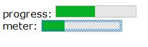

# 输出

## 输出(output)

<h1>behavior:output</h1>
  
格式化的输出行为。该行为可以被应用到任何文本容器上，如&lt;span&gt;、&lt;em&gt;等。

  <h2>元素</h2>
  
默认情况下，应用了该行为的元素有:

  <ul>
    <li><code>&lt;output type=..&gt;</code> - 只读输出元素;</li>
    <li><code>&lt;(name)&gt;</code> - Sciter特有的短格式语法，相当于<code>&lt;output name=&quot;name&quot;&gt;</code>.</li></ul>
  
注意：在Sciter中你可以使用output的短格式语句。所以下面3个声明是等价的:

  <pre><code>&lt;output name=&quot;first&quot; type=&quot;text&quot; /&gt;
&lt;output|text(first)/&gt;
&lt;(first)|text&gt;</code>
</pre>
  <h2>示例</h2>
  

    <ClientOnly>
    <demo-block>

      输出内容1   输出内容1
    

    
<code>
      &lt;output name="first" type="text" >输出内容1&lt;/output&gt; 
      &lt;output|text(first)&gt;输出内容1&lt;/output&gt; 
      &lt;(first)|text&gt;
    </code>
</demo-block>
    </ClientOnly>
  

  <h2>属性</h2>
  <ul>
    <li><code>type</code> - 格式化的类型，可以为以下值之一:</li>
    <ul>
      <li><code>&quot;text&quot;</code> - 输出纯文本, value值等同于toString()后的呈现;</li>
      <li><code>&quot;integer&quot;</code> - 输出整数;</li>
      <li><code>&quot;decimal&quot;</code> - 输出浮点数，值的格式基于当前地区(语言)的规则;</li>
      <li><code>&quot;currency&quot;</code> &nbsp;- 输出金额， 值的格式基于当前地区(语言)的规则;</li>
      <li><code>&quot;date&quot;</code> - 输出日期，值为UTC日期值，格式基于当前地区(语言)的规则;</li>
      <li><code>&quot;date-local&quot;</code> - 输出日期，值为当前时区的日期值，格式基于当前地区(语言)的规则;</li>
      <li><code>&quot;time&quot;</code> - 输出时间，值为UTC时间值，格式基于当前地区(语言)的规则;</li>
      <li><code>&quot;time-local&quot;</code> - 输出时间，值为当前时区的的时间值，格式基于当前地区(语言)的规则;</li></ul>
    <li><code>name=&quot;name&quot;</code> - 标准的<em>name</em>属性 - from表单上一个input元素的名称。</li>
    <li><code>value=&quot;...&quot;</code> - 标准的<em>value</em>属性。该值的的显示格式基于type属性的定义。</li>
    <li><code>novalue=&quot;no value text&quot;</code> - 当output没有输出内容时显示的文本。</li></ul>
  
如果value无法转换为声明的类型，则该元素会被设置<code>:invalid</code>状态标志;

  
如果value是数字类型，且是一个负数，则该元素会有一个<code>negative</code>属性，这样你可以通过该属性改变该元素的样式，如<code>output[negative] { color:red; }</code>

  <h2>事件</h2>
  
N/A - 该行为没有特有的事件。

  <h2>value</h2>
  
<code>any</code> value, 该值应该匹配type属性声明的类型。

  <h2>方法</h2>
  
N/A - 该行为没有引入任何特有的方法。

## 进度条(progress)

<h1>behavior:progress</h1>
  
进度条行为。

  <h2>元素</h2>
  
默认情况下，应用了该行为的元素有:

  <ul>
    <li><code>&lt;progress&gt;</code>;</li>
    <li><code>&lt;meter&gt;</code>.</li></ul>
  <h2>示例</h2>
  

    <ClientOnly>
    <demo-block>

      
    

    
<code>
      progress: &lt;progress value=0.5 /&gt;
	     
	    meter: &lt;meter value=0.3 /&gt;
    </code>
</demo-block>
    </ClientOnly>
  

  <h2>属性</h2>
  
该行为需要知道的属性:

  <ul>
    <li><code>max=float</code> - 最大值, 默认为1.0;</li>
    <li><code>value=float</code> - 进度值, 该值在<code>0.0 ... max</code>范围间。</li>
    <li><code>name=&quot;name&quot;</code> - 标准的<em>name</em>属性 - 该元素的名称。</li></ul>
  <h2>事件</h2>
  
N/A - 没有特有方法.

  <h2>value</h2>
  
<code>float</code>, 进度值，该值在<code>0.0 ... max</code>范围间。

  <h2>方法</h2>
  
N/A - 没引入特有方法。

## 视频(video)

<h1><a name="behaviorradio" id="behaviorradio">behavior:video</a></h1>
  
该行为提供视频播放功能。

  <h2><a name="elements" id="elements">元素</a></h2>
  
默认情况下，应用了behavior:button行为的元素有:

  <ul>
    <li><code>&lt;video&gt;</code> - video元素;</li></ul>
  <h2><a name="attributes" id="attributes">属性</a></h2>
  
该行为需要知道的属性:

  <dl>
    <dt>src</dt>
    <dd>- string, 视频的url。如果提供了该属性，该行为会在加载完成后立即播放该视频。</dd>
    <dt>sizing</dt>
    <dd>- string, 值为&quot;<em>cover</em>&quot;或&quot;<em>contain</em>&quot;(默认)。框架盒尺寸模式: <em>contain</em> - video的frame总是全部可以看到，<em>cover</em> - frame总是遮盖内容区，frame的一些部分可以被裁剪掉。</dd>
    <h2>方法</h2>
    <dt>videoIsPlaying</dt>
    <dd>() : <em>true</em> | <em>false</em> 报告播放状态。当前如果视频在播放着返回<em>true</em>。</dd>
    <dt>videoIsEnded</dt>
    <dd>() : <em>true</em> | <em>false</em> 如果视频播放已经结束，则返回<em>true</em>。</dd>
    <dt>videoDuration</dt>
    <dd>() : <em>duration</em> (float) 报告视频持续的时间(秒)。如果duration不可用，它返回0。</dd>
    <dt>videoPosition</dt>
    <dd>() : duration (float) 报告当前的播放位置(秒)。</dd>
    <dt>videoPosition</dt>
    <dd>( <strong>time</strong> : duration | float ) : duration 设置当前播放位置(秒)。</dd>
    <dt>videoHeight</dt>
    <dd>() : integer (pixels)  返回视频的自然高度。</dd>
    <dt>videoWidth</dt>
    <dd>() : integer (pixels) 返回视频的自然宽度。</dd>
    <dt>videoBox</dt>
    <dd>() : [x,y,width,height] 返回视频相对于元素内容区的矩形(像素)。注意：如果<em>sizing</em>属性是&quot;cover&quot;时<em>x</em>、<em>y</em>可能是负值。</dd>
    <dt>videoLoad</dt>
    <dd>(<strong>movieUrl</strong> : string) : <em>true</em> | <em>false</em> 
	  加载视频文件到播放器。该方法不会自动启动播放视频。</dd>
    <dt>videoUnload</dt>
    <dd>() 停止视频播放，并且卸载视频。</dd>
    <dt>videoPlay</dt>
    <dd>( [<strong>position</strong>:duration] ) : <em>true</em> | <em>false</em> 
	在<em>position</em>位置或当前位置(如果position未指定)启动视频播放。</dd>
    <dt>videoStop</dt>
    <dd>() 停止播放。</dd>
    <dt>audioVolume</dt>
    <dd>() : float (0.0...1.0) 
	报告当前音频轨道的音量。1.0对应于0dB，0.0(静音)对应100dB。</dd>
    <dt>audioVolume</dt>
    <dd>( <strong>vol</strong> : float ) 设置当前音频轨道的音量。1.0对应于0dB，0.0(静音)对应100dB。</dd>
    <dt>audioBalance</dt>
    <dd>() : float ( -1.0 ... +1.0 ) 报告当前的立体声平衡。</dd>
    <dt>audioBalance</dt>
    <dd>( <strong>balance</strong>: float ) 为当前的立体声平衡设置新值。</dd>
    <h2><a name="events" id="events">事件</a></h2>
    
除了标准事件集(鼠标、按键、聚焦)外，该行为还生成以下事件(这些事件会传递到onControlEvent回调函数中):

    <dt>VIDEO_INITIALIZED</dt>
    <dd>- 视频加载成功，此时的videoWidth/Height、videoDuration属性是有效的。</dd>
    <dt>VIDEO_STARTED</dt>
    <dd>- 视频刚刚开始，第一帧刚刚渲染完成。</dd>
    <dt>VIDEO_STOPED</dt>
    <dd>- 视频停止播放。</dd></dl>
  <h2><a name="value" id="value">值</a></h2>
  
N/A, 该行为没有实现value值。
