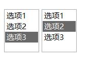
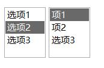
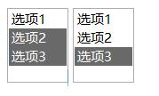
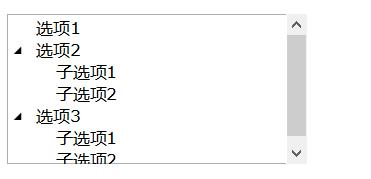
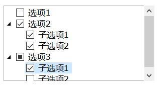
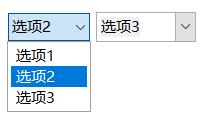

# 选择器类

## 单选列表(select)

<h1>behavior:select</h1>
  
标准选择列表&lt;select&gt;行为。原则上它可以被应用到任何元素上。

  <h2>元素</h2>
  
默认情况下，应用了该行为的元素有:

  <ul>
    <li><code>&lt;select size=&quot;2...N&quot;&gt;&lt;/select&gt;</code></li>
    <li><code>&lt;select|list&gt;&lt;/select&gt;</code></li></ul>
  <h2>示例</h2>
  

  <ClientOnly>
    <demo-block>

      
    

    
<code>
      &lt;select|list novalue="无选择项"&gt; 
        &lt;option&gt;选项1&lt;/option&gt; 
        &lt;option&gt;选项2&lt;/option&gt; 
        &lt;option&gt;选项3&lt;/option&gt; 
      &lt;/select&gt; 
	    &lt;select|list novalue="无选择项"&gt; 
        &lt;option&gt;选项1&lt;/option&gt; 
        &lt;option&gt;选项2&lt;/option&gt; 
        &lt;option&gt;选项3&lt;/option&gt; 
      &lt;/select&gt;
    </code>
</demo-block>
    </ClientOnly>
  

  <h2>模型</h2>
  
<code>&lt;select&gt;</code>可能包含<code>&lt;option&gt;</code>元素。<code>&lt;option&gt;</code>元素可以包含在任何html标签内。

  
该行为将&lt;option&gt;或任何包含<code>role=&quot;option&quot;</code>属性的元素当做一个可选择实体。

  
被选中的option将会设置<code>:current</code>状态标志。

  
示例, 一个简单的选择列表:

  <pre><code>&lt;select&gt;
  &lt;option value=&quot;#ff0000&quot; selected&gt;Red&lt;/option&gt;
  &lt;option value=&quot;#00ff00&quot;&gt;Green&lt;/option&gt;
  &lt;option value=&quot;#0000ff&quot;&gt;Blue&lt;/option&gt;
&lt;/select&gt;
</code></pre>
  
将&lt;table&gt;元素当做一个选择列表:

  <pre><code>&lt;style&gt;
  table.select { behavior:select; }
  table.select &gt; tr:current { color:white; background:blue; }
&lt;/style&gt;
&lt;table.select&gt;
  &lt;tr role=option value=&quot;#ff0000&quot;&gt;&lt;td&gt;Red&lt;/td&gt;&lt;td&gt;#FF0000&lt;td&gt;&lt;/tr&gt;
  &lt;tr role=option value=&quot;#00ff00&quot;&gt;&lt;td&gt;Green&lt;/td&gt;&lt;td&gt;#00FF00&lt;td&gt;&lt;/tr&gt;
  &lt;tr role=option value=&quot;#0000ff&quot;&gt;&lt;td&gt;Blue&lt;/td&gt;&lt;td&gt;#0000FF&lt;td&gt;&lt;/tr&gt;
&lt;/table&gt;
</code></pre>
  <h2>属性</h2>
  
该行为需要知道的属性:

  <ul>
    <li><code>size=integer</code> - 列表中可见元素的数量。注意：select元素的高度可以被CSS覆盖掉。</li>
    <li><code>name=&quot;name&quot;</code> - 标准的<em>name</em>属性 - from表单上一个input元素的名称。</li>
    <li><code>novalue=&quot;text&quot;</code> - 如果select中没有使用<code>&lt;option selected&gt;</code>初始化它，则将会使用该显示该文本。</li>
    <li><code>options</code> - 一个<code>&lt;option&gt;</code>列表的引用, 在这种场景中，this是元素本身。</li>
		<li><code>as=&quot;type&quot;</code> - 定义<code>&lt;option value=&quot;...&quot;&gt;</code>的解析规则，接收:
      <ul>
        <li><code>as=&quot;auto&quot;</code>, 默认值, 尝试翻译option的 value值为integer、float、boolean或length值。如果解析失败，则将value作为字符串。</li>
				<li><code>as=&quot;integer&quot;</code>, 尝试翻译option的value值为integer。如果解析失败，则将value作为字符串。</li>
				<li><code>as=&quot;float&quot;</code>, 尝试翻译option的value值为float。如果解析失败，则将value作为字符串。</li>
				<li><code>as=&quot;numeric&quot;</code>, 尝试翻译option的value值为integer或float。如果解析失败，则将value作为字符串。</li>
				<li><code>as=&quot;string&quot;</code>, 不解析option的value。将value作为字符串返回。</li>
      </ul>
    </li>
	</ul>
  <h2>事件</h2>
  
除了标准事件集(鼠标、按键、聚焦)外，该行为还生成:

  <ul>
    <li><code>SELECT_SELECTION_CHANGED</code> event, 当修改select中的选择项(在一个option上点击)时产生该事件。该事件为异步事件。</li>
    <li><code>SELECT_SELECTION_CHANGING</code> event, 当选择项将要改变时生成该事件。该事件为同步事件。</li></ul>
  <h2>方法</h2>
  
N/A - 该行为没有引入任何特有的方法。

	<h2>命令</h2>
	
注意: 命令时通过调用<code>element.execCommand(&quot;cmd-name&quot;[,params])</code>方法执行的。

	<ul><li><b>&quot;set-current&quot;</b> - 当该命令发送给一个select内部的<code>&lt;option&gt;</code>元素时，该option将被设置为当前元素;</li></ul>
  <h2>value</h2>
  
any, 读/写属性。选择项(option)的值(value)。option的值是它的value属性或它的文本内容(如果未定义value属性时)。

  <h2>在脚本中选择项修改的处理</h2>
  <h3><code>onValueChanged</code>事件</h3>
  <pre><code>var btn = $(select#some);
btn.onValueChanged = function() { var v = this.value; ... }
</code></pre>
  <h3><code>on()</code> 订阅</h3>
  <pre><code>var btn = $(select#some);
btn.on(&quot;change&quot;, function() { ... 事件处理代码 ... });
self.on(&quot;change&quot;, &quot;select#some&quot;, function() { ... 事件处理代码 ... });
</code></pre>
  <h3>decorators.tis 装饰器</h3>
  <pre><code>include &quot;decorators.tis&quot;;
@change @on &quot;select#some&quot; :: ... 事件处理代码 ...;
</code></pre>

## 多选列表(select-multiple)

<h1>behavior:select-multiple</h1>
  
多选列表(&lt;select multiple&gt;)的行为(当按照ctrl键时可以进行多选)。原则上它可以被应用到任何元素上。

  <h2>元素</h2>
  
默认情况下，应用了该行为的元素有:

  <ul>
    <li><code>&lt;select size=&quot;2...N&quot; multiple&gt;&lt;/select&gt;</code></li>
    <li><code>&lt;select|list multiple&gt;&lt;/select&gt;</code></li></ul>
  <h2>示例</h2>
  

    <ClientOnly>
      <demo-block>

        
      

      
<code>
      &lt;select|list multiple novalue="无选择项"&gt; 
      &lt;option&gt;选项1&lt;/option&gt; 
      &lt;option&gt;选项2&lt;/option&gt; 
      &lt;option&gt;选项3&lt;/option&gt; 
    &lt;/select&gt; 
	&lt;select|list multiple novalue="无选择项"&gt; 
      &lt;option&gt;选项1&lt;/option&gt; 
      &lt;option&gt;选项2&lt;/option&gt; 
      &lt;option&gt;选项3&lt;/option&gt; 
    &lt;/select&gt;
      </code>
</demo-block>
    </ClientOnly>
  

  <h2>模型</h2>
  
于behavior:select行为相同。

  
被选择项被设置了<code>:checked</code>状态标志，因此可以在CSS中使用:checked伪类来设置选择状态项的样式:

  <pre><code>select &gt; option:checked { background-image: url(my-checkmark.png); }
</code></pre>
  <h2>属性</h2>
  
该行为需要知道的属性:

  <ul>
    <li><code>size=integer</code> - 列表中可见元素的数量。注意：select元素的高度可以被CSS覆盖掉。</li>
    <li><code>name=&quot;name&quot;</code> - 标准的<em>name</em>属性 - from表单上一个input元素的名称。</li>
    <li><code>novalue=&quot;text&quot;</code> -如果select中没有使用<code>&lt;option selected&gt;</code>初始化它，则将会使用该显示该文本。</li></ul>
  <h2>事件</h2>
  
除了标准事件集(鼠标、按键、聚焦)外，该行为还生成:

  <ul>
    <li>SELECT_SELECTION_CHANGED event, 当修改select中的选择项(在一个option上点击)时产生该事件。该事件为异步事件。</li>
    <li>SELECT_SELECTION_CHANGING event, 当选择项将要改变时生成该事件。该事件为同步事件。</li></ul>
  <h2>方法</h2>
  
N/A - 该行为没有引入任何特有的方法。

  <h2>value</h2>
  
value数组, 读/写属性, 选择项的列表。 

  <h2>在脚本中处理选择项的修改</h2>
  <h3><code>onValueChanged</code>事件</h3>
  <pre><code>var btn = $(select#some);
btn.onValueChanged = function() { var v = this.value; ... }
</code></pre>
  <h3><code>on()</code> 订阅</h3>
  <pre><code>var btn = $(select#some);
btn.on(&quot;change&quot;, function() { ... 事件处理代码 ... });
self.on(&quot;change&quot;, &quot;select#some&quot;, function() { ... 事件处理代码 ... });
</code></pre>
  <h3>decorators.tis 装饰器</h3>
  <pre><code>include &quot;decorators.tis&quot;;
@change @on &quot;select#some&quot; :: ... 事件处理代码 ...;
</code></pre>

## 复选框列表(select-checkmarks)

<h1>behavior:select-checkmarks</h1>
  
有复选状态的&lt;select multiple&gt;列表。原则上它可以被应用到任何元素上。

  <h2>元素</h2>
  
默认情况下，应用了该行为的元素有:

  <ul>
    <li><code>&lt;select size=&quot;2...N&quot; multiple=&quot;checkmarks&quot;&gt;&lt;/select&gt;</code></li>
    <li><code>&lt;select|list multiple=&quot;checkmarks&quot;&gt;&lt;/select&gt;</code></li></ul>
  <h2>示例</h2>
  

  <ClientOnly>
      <demo-block>

        
      

      
<code>
      &lt;select|list multiple="checkmarks" novalue="无选择项"&gt; 
      &lt;option&gt;选项1&lt;/option&gt; 
      &lt;option&gt;选项2&lt;/option&gt; 
      &lt;option&gt;选项3&lt;/option&gt; 
    &lt;/select&gt; 
	&lt;select|list multiple="checkmarks" novalue="无选择项"&gt; 
      &lt;option&gt;选项1&lt;/option&gt; 
      &lt;option&gt;选项2&lt;/option&gt; 
      &lt;option&gt;选项3&lt;/option&gt; 
    &lt;/select&gt;
      </code>
</demo-block>
    </ClientOnly>
  

  <h2>模型</h2>
  
与behavior:select行为相同。

  
被选择项被设置了<code>:checked</code>状态标志，因此可以在CSS中使用:checked伪类来设置选择状态项的样式:

  <pre><code>select &gt; option:checked { background-image: url(my-checkmark.png); }
</code></pre>
  
当用户在选择option元素的标记(foreground-image)上点击时behavior:select-checkmarks行为切换option的:checked状态。

  <h2>属性</h2>
  
该行为需要知道的属性:

  <ul>
    <li><code>size=integer</code> - 列表中可见元素的数量。注意：select元素的高度可以被CSS覆盖掉。</li>
    <li><code>name=&quot;name&quot;</code> - 标准的<em>name</em>属性 - from表单上一个input元素的名称。</li>
    <li><code>novalue=&quot;text&quot;</code> - 如果select中没有使用<code>&lt;option selected&gt;</code>初始化它，则将会使用该显示该文本。</li></ul>
  <h2>事件</h2>
  
除了标准事件集(鼠标、按键、聚焦)外，该行为还生成:

  <ul>
    <li>SELECT_SELECTION_CHANGED event, 当修改select中的选择项(在一个option上点击)时产生该事件。该事件为异步事件。</li>
    <li>SELECT_SELECTION_CHANGING event, 当选择项将要改变时生成该事件。该事件为同步事件。</li></ul>
  <h2>方法</h2>
  
N/A - 该行为没有引入任何特有的方法。

  <h2>value</h2>
  
value数组, 读/写属性, 选择项的列表。 

  <h2>在脚本中处理选择项的修改</h2>
  <h3><code>onValueChanged</code>事件</h3>
  <pre><code>var btn = $(select#some);
btn.onValueChanged = function() { var v = this.value; ... }
</code></pre>
  <h3><code>on()</code>订阅</h3>
  <pre><code>var btn = $(select#some);
btn.on(&quot;change&quot;, function() { ... 事件处理代码 ... });
self.on(&quot;change&quot;, &quot;select#some&quot;, function() { ... 事件处理代码 ... });
</code></pre>
  <h3>decorators.tis装饰器</h3>
  <pre><code>include &quot;decorators.tis&quot;;
@change @on &quot;select#some&quot; :: ... 事件处理代码 ...;
</code></pre>

## 树视图(tree-view)

<h1>behavior:tree-view</h1>
  
树状结构的&lt;select&gt;列表行为。该行为可以被应用到任何块级容器元素上。

  <h2>元素</h2>
  
默认情况下，应用了该行为的元素有:

  <ul>
    <li><code>&lt;select|tree&gt;&lt;/select&gt;</code></li></ul>
  <h2>示例</h2>
  

  <ClientOnly>
      <demo-block>

        
      

      
<code>
      &lt;select|tree &gt; 
      &lt;option&gt;选项1&lt;/option&gt; 
      &lt;option&gt; 
	    &lt;caption&gt;选项2&lt;/caption&gt; 
        &lt;option&gt;子选项1&lt;/option&gt; 
		&lt;option&gt;子选项2&lt;/option&gt; 
	  &lt;/option&gt; 
      &lt;option expanded&gt; 
	    选项3 
        &lt;option&gt;子选项1&lt;/option&gt; 
		&lt;option&gt;子选项2&lt;/option&gt; 
	  &lt;/option&gt; 
    &lt;/select&gt;
      </code>
</demo-block>
    </ClientOnly>
  

  <h2>模型</h2>
  
该行为识别两种类型的&lt;option&gt;:

  <ul>
    <li>&quot;叶(Leaf)&quot; &lt;option&gt; 指不包含子&lt;option&gt;的元素。</li>
    <li>&quot;节点(Node)&quot; &lt;option&gt; 指包含子&lt;option&gt;的元素。</li></ul>
  <pre><code>&lt;option&gt;
    &lt;caption&gt;Node标题&lt;/caption&gt;
    &lt;option&gt;Leaf 1&lt;/option&gt;
    &lt;option&gt;Leaf 2&lt;/option&gt;
&lt;/option&gt;
</code></pre>
  
被选择项会被设置<code>:current</code>状态标志。

  
节点&lt;option&gt;在运行期会被设置<code>:node</code>标志(在CSS中可以使用:node伪类)。因此下面的CSS选择器:

  <ul>
    <li><code>option:node</code> - 匹配所有节点option;</li>
    <li><code>option:not(:node)</code> - 匹配所有的叶option.</li></ul>
  
<code>option:node</code>在响应UI事件(鼠标和键盘事件)时可能包含<code>:expanded</code>或<code>:collapsed</code>运行时状态标志。

  
该行为支持&quot;虚拟树&quot;模式。初始时，该树的所有节点option可能都是折叠的，并且是空的。这些节点option只有当接收到ELEMENT_EXPANDED事件时才填充。并且在ELEMENT_COLLAPSED事件中清除以便用最小的内存展示树。见<u>sdk/samples/ideas/virtual-tree/</u>示例。

  <h2>属性</h2>
  <ul>
    <li>&lt;option&gt;的<code>expanded</code>属性 - &lt;option expanded&gt;将会为该元素默认设置<code>:expanded</code>状态。</li></ul>
  <h2>事件</h2>
  
除了标准事件集(鼠标、按键、聚焦)外，该行为还生成:

  <ul>
    <li>SELECT_SELECTION_CHANGED 事件, 当修改select中的选择项(在一个option上点击)时产生该事件。该事件为异步事件。</li>
    <li>SELECT_SELECTION_CHANGING 事件, 当选择项将要改变时生成该事件。该事件为同步事件。</li>
    <li>ELEMENT_EXPANDED 事件, 当节点option展开时会向该option发生该事件。</li>
    <li>ELEMENT_COLLAPSED 事件, 当节点option折叠时会向该option发生该事件。</li></ul>
  <h2>方法</h2>
  
N/A - 该行为没有引入任何特有的方法。

  <h2>value</h2>
  
any, 读/写属性。被选择项(option)的值。选择项(option)的值(value)。option的值是它的value属性或它的文本内容(如果未定义value属性时)。

  <h2>在脚本中树事件的处理</h2>
  <h3><code>onControlEvent</code>事件</h3>
  <pre><code>var btn = $(select#some);
btn.onControlEvent = function(evt)
{
  switch(evt.type) {
    case Event.SELECT_SELECTION_CHANGED: /* 当前option被改变 */ break;
    case Event.ELEMENT_EXPANDED: /* evt.target 为展开的元素 */ break;
    case Event.ELEMENT_COLLAPSED: /* evt.target 为折叠的元素 */ break;   }
}
</code></pre>
  <h3><code>on()</code>订阅</h3>
  <pre><code>var sel = $(select#some);
sel.on(&quot;change&quot;, function() { ... 事件处理代码 ... });
sel.on(&quot;expand&quot;, &quot;option&quot;, function() { ... 事件处理代码 ... });
sel.on(&quot;collapse&quot;, &quot;option&quot;, function() { ... 事件处理代码 ... });
</code></pre>
  <h3>decorators.tis 装饰器</h3>
  <pre><code>include &quot;decorators.tis&quot;;
@when Event.ELEMENT_EXPANDED @on &quot;select#some&quot; :: ... 事件处理代码 ...;
@when Event.ELEMENT_COLLAPSED @on &quot;select#some&quot; :: ... 事件处理代码 ...;
</code></pre>

## 复选框树(tree-checkmarks)

<h1>behavior:tree-checkmarks</h1>
  
有复选状态的树状结构的&lt;select&gt;列表行为。该行为可以被应用到任何块级容器元素上。

  <h2>元素</h2>
  
默认情况下，应用了该行为的元素有:

  <ul>
    <li><code>&lt;select|tree multiple=checkmarks&gt;&lt;/select&gt;</code></li></ul>
  <h2>示例</h2>
  

  <ClientOnly>
      <demo-block>

        
      

      
<code>
      &lt;select|tree multiple=checkmarks &gt; 
      &lt;option&gt;选项1&lt;/option&gt; 
      &lt;option&gt; 
	    &lt;caption&gt;选项2&lt;/caption&gt; 
        &lt;option&gt;子选项1&lt;/option&gt; 
		&lt;option&gt;子选项2&lt;/option&gt; 
	  &lt;/option&gt; 
      &lt;option expanded&gt; 
	    选项3 
        &lt;option&gt;子选项1&lt;/option&gt; 
		&lt;option&gt;子选项2&lt;/option&gt; 
	  &lt;/option&gt; 
    &lt;/select&gt;
      </code>
</demo-block>
    </ClientOnly>
  

  <h2>模型</h2>
  
该行为识别两种类型的&lt;option&gt;:

  <ul>
    <li>&quot;叶(Leaf)&quot; &lt;option&gt; 指不包含子&lt;option&gt;的元素。</li>
    <li>&quot;节点(Node)&quot; &lt;option&gt; 指包含子&lt;option&gt;的元素。</li></ul>
  <pre><code>&lt;option&gt;
    &lt;caption&gt;Node标题&lt;/caption&gt;
    &lt;option&gt;Leaf 1&lt;/option&gt;
    &lt;option&gt;Leaf 2&lt;/option&gt;
&lt;/option&gt;
</code></pre>
  
被选择项会被设置<code>:current</code>状态标志。

  
节点&lt;option&gt;在运行期会被设置<code>:node</code>标志(在CSS中可以使用:node伪类)。因此下面的CSS选择器:

  <ul>
    <li><code>option:node</code> - 匹配所有节点option;</li>
    <li><code>option:not(:node)</code> - 匹配所有的叶option.</li></ul>
  
每个叶元素可以被标记<code>:checked</code>状态，而每个节点元素可以有以下状态值:

  <ul>
    <li><code>option:node:incomplete</code> - 指该节点的子元素中混合了<code>:checked</code>和<code>:not(:checked)</code>状态的叶元素。</li>
    <li><code>option:node:checked</code> - 该节点仅包含<code>:checked</code>状态的叶元素。</li>
    <li><code>option:node:not(:checked)</code> - 该节点仅包含<code>:not(:checked</code>)状态的叶元素。</li></ul>
  
<code>option:node</code>在响应UI事件(鼠标和键盘事件)时可能包含<code>:expanded</code>或<code>:collapsed</code>运行时状态标志。

  
该行为支持&quot;虚拟树&quot;模式。初始时，该树的所有节点option可能都是折叠的，并且是空的。这些节点option只有当接收到ELEMENT_EXPANDED事件时才填充。并且在ELEMENT_COLLAPSED事件中清除以便用最小的内存展示树。见<u>sdk/samples/ideas/virtual-tree/</u>示例。

  <h2>属性</h2>
  <ul>
    <li>&lt;option&gt;的<code>expanded</code>属性 - &lt;option expanded&gt;将会为该元素默认设置<code>:expanded</code>状态。</li></ul>
  <h2>事件</h2>
  
除了标准事件集(鼠标、按键、聚焦)外，该行为还生成:

  <ul>
    <li>SELECT_SELECTION_CHANGED 事件, 当修改select中的选择项(在一个option上点击)时产生该事件。该事件为异步事件。</li>
    <li>SELECT_SELECTION_CHANGING 事件, 当选择项将要改变时生成该事件。该事件为同步事件。</li>
    <li>SELECT_STATE_CHANGED 事件, 一些option的:checked状态被用户改变时生成该事件。</li>
    <li>ELEMENT_EXPANDED 事件, 当节点option展开时会向该option发生该事件。</li>
    <li>ELEMENT_COLLAPSED 事件, 当节点option折叠时会向该option发生该事件。</li></ul>
  <h2>方法</h2>
  
N/A - 该行为没有引入任何特有的方法。

  <h2>value</h2>
  
any, 读/写属性。被选择项(option)的值。选择项(option)的值(value)。option的值是它的value属性或它的文本内容(如果未定义value属性时)。

  <h2>在脚本中树事件的处理</h2>
  <h3><code>onControlEvent</code>事件</h3>
  <pre><code>var btn = $(select#some);
btn.onControlEvent = function(evt)
{
  switch(evt.type) {
    case Event.SELECT_SELECTION_CHANGED: /* 当前option被改变 */ break;
    case Event.ELEMENT_EXPANDED: /* evt.target 为展开的元素 */ break;
    case Event.ELEMENT_COLLAPSED: /* evt.target 为折叠的元素 */ break;   }
}
</code></pre>
  <h3><code>on()</code>订阅</h3>
  <pre><code>var sel = $(select#some);
sel.on(&quot;change&quot;, function() { ... 事件处理代码 ... });
sel.on(&quot;expand&quot;, &quot;option&quot;, function() { ... 事件处理代码 ... });
sel.on(&quot;collapse&quot;, &quot;option&quot;, function() { ... 事件处理代码 ... });
</code></pre>
  <h3>decorators.tis 装饰器</h3>
  <pre><code>include &quot;decorators.tis&quot;;
@when Event.ELEMENT_EXPANDED @on &quot;select#some&quot; :: ... 事件处理代码 ...;
@when Event.ELEMENT_COLLAPSED @on &quot;select#some&quot; :: ... 事件处理代码 ...;
</code></pre>

## 下拉选择列表(dropdown-select)

<h1>behavior:dropdown-select</h1>
  
标准的下拉选择列表&lt;select&gt;行为。

  <h2>元素</h2>
  
默认情况下，应用了该行为的元素有:

  <ul>
    <li><code>&lt;select size=&quot;1&quot;&gt;&lt;/select&gt;</code></li>
    <li><code>&lt;select|dropdown&gt;&lt;/select&gt;</code></li></ul>
  <h2>示例</h2>
  

  <ClientOnly>
      <demo-block>

        
      

      
<code>
      &lt;select|dropdown novalue="无选择项"&gt; 
      &lt;option&gt;选项1&lt;/option&gt; 
      &lt;option&gt;选项2&lt;/option&gt; 
      &lt;option&gt;选项3&lt;/option&gt; 
    &lt;/select&gt; 
	&lt;select|dropdown editable novalue="无选择项" style="width:100;"&gt; 
      &lt;option&gt;选项1&lt;/option&gt; 
      &lt;option&gt;选项2&lt;/option&gt; 
      &lt;option&gt;选项3&lt;/option&gt; 
    &lt;/select&gt;
      </code>
</demo-block>
    </ClientOnly>
  

  <h2>模型</h2>
  
该行为会将下面的select代码:

  <pre><code>&lt;select&gt;
  &lt;option value=&quot;#ff0000&quot; selected&gt;Red&lt;/option&gt;
  &lt;option value=&quot;#00ff00&quot;&gt;Green&lt;/option&gt;
  &lt;option value=&quot;#0000ff&quot;&gt;Blue&lt;/option&gt;
&lt;/select&gt;
</code></pre>
  
转换成

  <pre><code>&lt;select&gt;
  &lt;caption&gt;Red&lt;/caption&gt;
  &lt;button /&gt;
  &lt;popup&gt;
    &lt;option value=&quot;#ff0000&quot; selected&gt;Red&lt;/option&gt;
    &lt;option value=&quot;#00ff00&quot;&gt;Green&lt;/option&gt;
    &lt;option value=&quot;#0000ff&quot;&gt;Blue&lt;/option&gt;
  &lt;/popup&gt;
&lt;/select&gt;
</code></pre>
  
这些部分的元素默认使用master.css中的样式，不过你可以在宿主文档里使用CSS重定义它们的样式。

  <h2>属性</h2>
  
该行为需要知道的属性:

  <ul>
    <li><code>size=integer</code> - 列表中可见元素的数量。注意：select元素的高度可以被CSS覆盖掉。</li>
    <li><code>name=&quot;name&quot;</code> - 标准的<em>name</em>属性 - from表单上一个input元素的名称。</li>
    <li><code>novalue=&quot;text&quot;</code> - 如果select中没有使用<code>&lt;option selected&gt;</code>初始化它，则将会使用该显示该文本。novalue属性使select可为空(<strong>nullable</strong>)，即如果没有选项被选择，则该select的value值为<em>undefined</em>。</li>
    <li><code>editable</code> - 该属性会将<code>behavior:edit</code>行为应用到<code>&lt;caption&gt;</code>元素上，使它可编辑。</li>
    <li><code>as=&quot;type&quot;</code> - 定义<code>&lt;option value=&quot;...&quot;&gt;</code>的解析规则，接收:
      <ul>
        <li><code>as=&quot;auto&quot;</code>, 默认值, 尝试翻译option的 value值为integer、float、boolean或length值。如果解析失败，则将value作为字符串。</li>
				<li><code>as=&quot;integer&quot;</code>, 尝试翻译option的value值为integer。如果解析失败，则将value作为字符串。</li>
				<li><code>as=&quot;float&quot;</code>, 尝试翻译option的value值为float。如果解析失败，则将value作为字符串。</li>
				<li><code>as=&quot;numeric&quot;</code>, 尝试翻译option的value值为integer或float。如果解析失败，则将value作为字符串。</li>
				<li><code>as=&quot;string&quot;</code>, 不解析option的value。将value作为字符串返回。</li>
      </ul>
    </li>
  </ul>
  <h2>事件</h2>
  
除了标准事件集(鼠标、按键、聚焦)外，该行为还生成:

  <ul>
    <li>SELECT_SELECTION_CHANGED 事件, 当修改select中的选择项(在一个option上点击)时产生该事件。该事件为异步事件。</li>
    <li>SELECT_SELECTION_CHANGING 事件, 当选择项将要改变时生成该事件。该事件为同步事件。</li></ul>
	<h2>命令</h2>
	
注意: 命令时通过调用<code>element.execCommand(&quot;cmd-name&quot;[,params])</code>方法执行的。

	<ul><li><b>&quot;set-current&quot;</b> - 当该命令发送给一个select内部的<code>&lt;option&gt;</code>元素时，该option将被设置为当前元素;</li></ul>
  <h2>方法</h2>
  <dl>
    <dt>showPopup()</dt>
    <dd>- 显示列表弹窗。</dd>
   </dl>
  <h2>value</h2>
  <ul>
    <li>editable select - string, 读/写 - &lt;caption&gt;的内容</li>
    <li>nullable select - any | undefined, 读/写 - 被选择项的value值。option的值是它的value属性或它的文本内容(如果未定义value属性时)。在用户做任何选择之前，该select的值为<em>undefined</em>。</li>
    <li>normal select - any, 读/写 - 被选择项的value值。 ption的值是它的value属性或它的文本内容(如果未定义value属性时)。 
	  如果没有&lt;option selected&gt;项，则select的值为它的第一个&lt;option&gt;元素的值。</li></ul>
 <h2>在脚本中选择项修改的处理</h2>
  <h3><code>onValueChanged</code>事件</h3>
  <pre><code>var btn = $(select#some);
btn.onValueChanged = function() { var v = this.value; ... }
</code></pre>
  <h3><code>on()</code> 订阅</h3>
  <pre><code>var btn = $(select#some);
btn.on(&quot;change&quot;, function() { ... 事件处理代码 ... });
self.on(&quot;change&quot;, &quot;select#some&quot;, function() { ... 事件处理代码 ... });
</code></pre>
  <h3>decorators.tis 装饰器</h3>
  <pre><code>include &quot;decorators.tis&quot;;
@change @on &quot;select#some&quot; :: ... 事件处理代码 ...;
</code></pre>